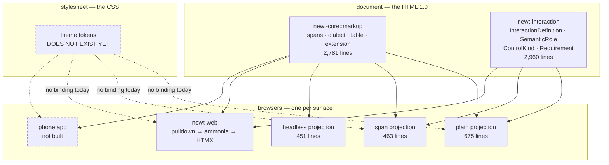
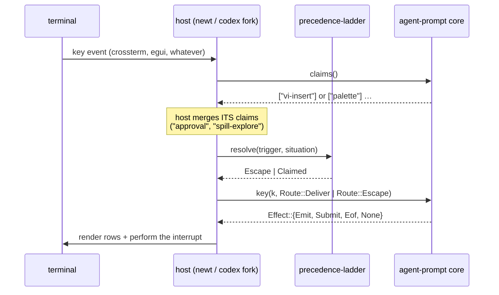
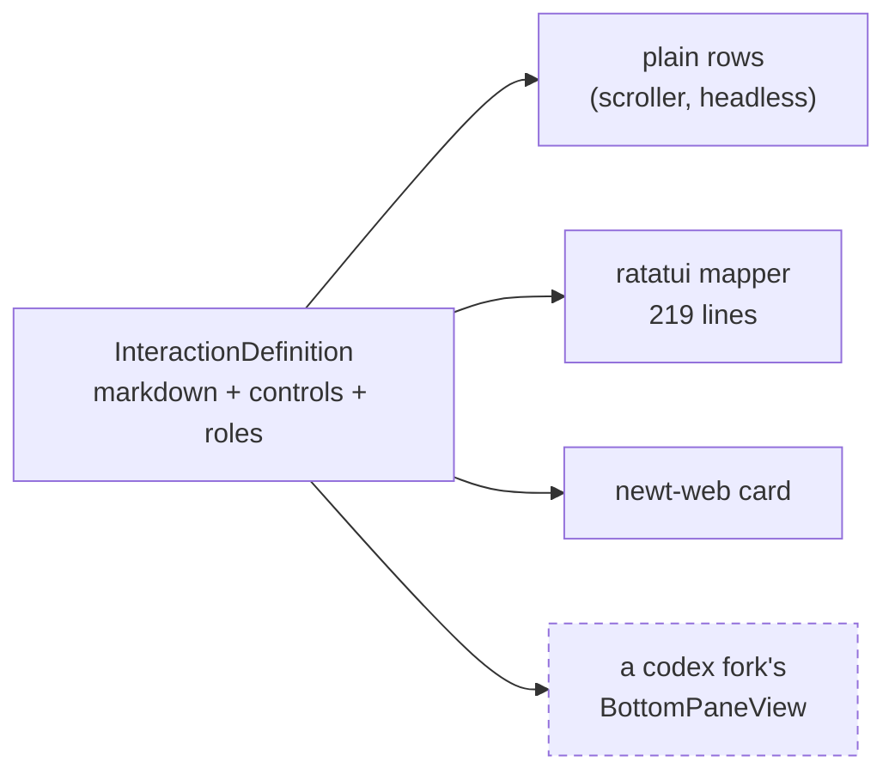

# Decision: the component architecture — Markdown as HTML 1.0

**Status:** proposed, for discussion. Nothing here is implemented by this PR.
**Date:** 2026-09-01
**Answers:** #510 *"Crate and PyO3 decomposition and reusability — Newt Parts
for the world!"*, which asks verbatim *"can we export our vi, emac, and nano
TUI components to share ... a agent-prompt crate?"* and *"can we export our
context and attention management tools? an agent-context-manager crate?"*
**Related:** `agent_line_architecture.md` (authoritative on wyvern ≤ newt ≤
gilamonster), `esc_and_vi_contract.md`, `key_ladder_crate.md`,
`conversation_context_architecture.md`, `plain_scroller_tui.md`,
`newt_web_htmx.md`.

---

## 1. The thesis

From the operator, verbatim:

> We're turning Markdown into a kind of HTMX surface. The Markdown becomes
> essentially the equivalent of HTML 1.0 that is rendered by "browsers" into
> basic form interactions — a TUI, an HTMX, a Phone app. The equivalent of a
> CSS can re-theme the core system. Very much like the old "Zen of CSS" books.

That is not a metaphor for how the code feels. It is a description of four
layers, three of which already exist and one of which does not.

**Why this framing earns its place:** it corrects a carve we would otherwise
have made wrong. Markdown *renderers* were assessed and correctly left alone —
`termimad`, `tui-markdown`, `ratskin` and `comrak` all ship, and we have five
implementations across three different `pulldown-cmark` majors. But a renderer
**is a browser**, and browsers are per-surface by nature. What is shareable is
the **document model** and the **stylesheet**. "Extract the widgets" was the
wrong question; "publish the document, the forms and the sheet, and let each
surface keep its own browser" is the right one.

### The acceptance test — Zen Garden

> Take one `InteractionDefinition`, swap **only** the stylesheet, and get a
> different presentation **on the same surface**, with the document and the
> renderer untouched.

If that cannot be demonstrated, the layers are not separated, whatever the
module boundaries claim. Today it demonstrably cannot: there is no sheet to
swap, and colours are hardcoded per renderer across `newt-tui/`'s `brand.rs`,
`splash.rs`, `config_panel.rs`, `transcript_pager.rs` and `live_spill.rs`.

---

## 2. Where the seams are, and which ones hold

A seam counts as **real** only when something on both sides of it already
compiles against it. Measured at `be5647e5`:

| Seam | What crosses | State |
|---|---|---|
| `TurnDriver` | `submit` · `poll` · `cancel` · `submit_observation` | real |
| `InteractionDefinition` | one typed form → plain, rich TUI, and web | real |
| `Caveats` | attenuation-only authority, never amplification | real |
| `AdmittedServer` | MCP admission as a type witness | real |
| `RegionLease` | terminal rows as a capability | real |
| `precedence-ladder` | which claimant owns a key right now | real, published `0.1.0-rc.1` |
| card → family | typed metadata into the effort dials, never the model name | real |
| `CompactionSpan` | derived context provably tied to its source | real |
| **context manager** | **no summarizer, store, or cross-turn state on cowork drives** | **partial** |
| **`newt-tui` exports** | **`run_code`, and nothing else** | **broken** |
| **`newt-cli` dispatch** | **public, and unconsumed** | **broken** |
| theme tokens | — | does not exist |

The three broken rows are not architectural failures; they are **missing
exports**. The layering is sound and the foundation crates are published. What
is absent is the `pub`.

### A seam can be bypassed as easily as it can be missing

That framing was half the picture, and #2019 supplied the other half within a
day of this document being written.

`/settings` and `/crew edit` — both on the *converged* typed path, both built
on the seam this document praises — had each acquired their **own** prompt
window through `Terminal::suspend_for_prompt()` while the cockpit still had a
chat editor mounted below. One private console path beside a seam that already
existed. Three operator-visible defects fell out of it: two chevrons painted in
the live accent with nothing on screen saying which owned the keyboard; a modal
with no rows reserved for it, through which the mounted header kept repainting
its clock every 250 ms; and a corrupted surface afterwards.

The provenance matters more than the bug. That call was introduced by #1994 —
the `/settings` consolidation — reviewed and merged as correct wiring. The
seam was published, documented, and used by the very code that walked around
it.

**So exporting a seam does not establish it.** A published API is an
invitation, not a constraint, and the failure mode is not "nobody could reach
the seam" but "a new surface reached past it." The ownership table in §3
already assigns row arbitration to the host; #2019 is what ignoring that row
costs.

**The mechanism that does establish a seam is a conformance check**, and this
repository already has one working example: the Esc ladder's two-way
reachability test fails the build when a rung has no live accessor *and* when
an accessor has no rung. Nothing equivalent guards terminal acquisition, and
`suspend_for_prompt()` currently has **17 non-test call sites**. Whether that
warrants a call-site ratchet — the way the region ratchet counts inline
viewport constructions — is left open in §8, but the asymmetry is worth
stating: we guard *which claimant owns a key* far more strictly than *which
surface owns the terminal*.

---

## 3. Example seam — the prompt component

The operator's ask: header, body and footer as three regions with
host-registered callbacks; vi, emacs and nano; the Esc handler included; and a
component a fork of codex or DeepSeek-TUI could adopt.

The answer that survived adversarial review is a **render-free core**: it owns
the buffer, the editors and the claim accessors, and owns nothing else.

**The core never resolves Esc; it only names its claims.** This is the one
seam defect reviewers judged fatal in two of three candidate designs: a core
that resolves internally *and* exposes `claims()` lets a host claimant which
outranks `vi-insert` discover it won only *after* Esc has already left insert
mode. Naming claims and resolving in the host makes that unrepresentable.

Two consequences fall out for free:

- The core takes **no dependency on `precedence-ladder`**, so it does not
  inherit that crate's frozen MSRV 1.88 — which unblocks `monitor-agent` at
  1.80. The risk is deleted rather than mitigated.
- The footer hint becomes a **host closure**. A hint the core derives from a
  claim set it assembled alone is wrong exactly when a host modal is open.

### The ownership boundary, stated

| Concern | Owner |
|---|---|
| terminal, raw mode, event loop, key decoding, the clock, layout | **host** |
| buffer, cursor, undo, kill store, wrap, display width | **core** |
| mode state machines (vi / emacs / nano) as keymap **data** | **core** |
| Esc **claims** | **core** |
| Esc **resolution**, interrupt delivery, press tiering | **host** |
| "does Enter submit?", what `Eof` means | **host** |
| header / footer content, model / endpoint / session vars | **host** (callbacks) |
| rows above the prompt while a turn streams | **host** (`Effect::Emit`) |
| row arbitration under a modal (`RegionLease`) | **host** — deliberately not extracted |

`RegionLease` stays in `newt-core` on purpose: that crate carries `age`,
`ignore`, `regex` and `content-addressable`, and shipping an encryption crate
to someone who wants a vi prompt is not a seam.

### Honest gaps, because a component that overpromises is worse than a small one

Emacs and nano are **not real today**. `Edit::is_modeless()` is true for both,
both route to `tui-textarea`'s default map, and the entire emacs-specific
state in `rich_input.rs`'s 4,618 lines is one `cx_pending: bool`. That
borrowed map is **readline, not emacs**: `C-u` is undo rather than
unix-line-discard, `C-r` is redo rather than reverse-search, `C-w` has the
wrong deletion semantics.

The rule this yields, and it governs the crate:

> **Never bind a canonical key of a named editor to different semantics.**
> nano's `^W` is Where-Is; binding it to delete-word under the name "nano" is
> worse than leaving it unbound, because it destroys text under a key that
> promises search.

Unimplemented canonical keys are **unbound**, enumerated in a per-editor
`KNOWN_GAPS` list whose count may only go down, and excluded from generated
help. Nothing publishes until emacs and nano are real.

Also absent at 0.1: text objects (`ciw`, `da(`) — codex has eight object
types, so a codex fork trades down; search (`/`, `?`, nano `^W`); macros,
registers, visual block. And the core **cannot guarantee Ctrl-C reaches it**:
`cfmakeraw` clears `ISIG`, so a host in cooked mode turns `0x03` into a signal
the core never sees. That is a front-page precondition, not something types
can enforce.

### Getting to "really real" by version bump

Stated by the operator as a requirement, not an aspiration:

> We'll want to MAKE the emacs / nano support "really real" over time in such
> a way that the newt-agent, gilamonster-agent, etc. can just take version
> bumps to get the new features.

That is a compatibility contract, and it is what makes keymaps-as-**data**
load-bearing rather than stylistic. Filling a gap is a data change, so it can
be additive by construction:

| Change | Semver | Why |
|---|---|---|
| a `KNOWN_GAPS` key becomes bound to its **canonical** semantics | **minor** | the key was unbound; nothing that worked stops working |
| a bound key changes semantics | **major** | forbidden in practice by the canonical-key rule above |
| a new editor mode is added | minor | additive |
| a keymap **table** gains a row | minor | data, not API |
| `Effect` or `Key` gains a variant | major unless `#[non_exhaustive]` | so both are `#[non_exhaustive]` from 0.1 |

**The hazard this must not create: a newly-bound editor key silently stealing
a host's binding.** A host that bound `^W` for itself while the crate left it
unbound must not lose it when we implement Where-Is. So the precedence is
fixed and stated:

> **A host binding always outranks an editor binding, in every version.**
> The crate consults the host's map first and only then its own table.

With that rule, filling a gap can never take a key away from a consumer — it
can only light up a key nobody was using. A version bump is then genuinely
safe, which is the operator's requirement discharged mechanically rather than
by care.

**The gap list is the changelog.** `KNOWN_GAPS` is machine-readable, its count
may only go down, and each release's notes are the diff — so
`gilamonster-agent` learns what a bump bought it by reading a generated table,
not a prose summary. The same list generates the help text, so help cannot
advertise a key the version does not implement.

---

## 4. Example seam — dialogs, and why this one ships first

`newt-interaction` is already severable: no `ratatui`, no `crossterm`, no
`newt-*` dependency, with `tests/guard.rs` walking the resolved dependency
closure to prove it — each half carrying an anti-vacuous twin. Identity is a
`ContentId` over canonical DAG-CBOR. It ships published JSON Schemas and a
656-line stdlib-only Python conformance consumer with golden vectors.

Against the Agent SDK's settled vocabulary there are four gaps each way — we
lack `header`, `multiSelect`, per-option `description` and the automatic
"Other" escape; the SDK lacks our `role`, `key`, `aliases` and `Requirement`.
That is a widening job, not a rewrite. And the interactive renderer for
`canUseTool` / `allow|deny|ask` is **unclaimed work**: no harness in the
Anthropic cookbook has one.

**Why it crosses forks when a widget crate cannot:** codex pins a *forked*
ratatui, DeepSeek-TUI is on 0.30, newt and monitor-agent are on 0.29. Any API
naming a ratatui type is dead on arrival across that gap. This one returns
plain data.

---

## 5. The two layers still being designed

**The context manager — and the design came back "no", correctly.**

Two corrections to earlier drafts of this document, verified at source:

1. **Cowork drives are not running bare.** `compress_state: None` falls back
   to a per-turn local (`agentic/mod.rs:2025`, `None => &mut
   local_compress_state`); trigger, prune, boundary and assembly all run.
   What is lost is the **summarizer, the compaction store, and cross-turn
   state** — a real gap, but a narrower one than "no context management".
2. **A pluggable context manager already exists, one layer up.**
   `MemoryProvider` (`newt-core/src/memory.rs`) is `Send + Sync`,
   `#[async_trait]`, config-selected by `[memory] provider`, with three
   shipping kinds — `RollingWindow`, `TokenBudget`, `Summarizing` — and a
   composition root in `newt-tui/src/chat.rs`. Only `Summarizing` writes
   compaction back into durable history.

The layer proposals kept trying to seam — `compress()` — is the **per-turn
emergency fit guard**, whose output is dropped at turn end. A plugin there is
a plugin for the fit guard, not for context management. And no credible second
strategy exists at that layer: `AppendOnly`, cited by every proposal as the
alternative that proves the seam, is a harness-wide **invariant** read at
three sites, two of which are not compaction stages at all.

So the recommendation is: wire what exists, fix the bugs beneath it, and build
the seam when a fourth strategy is actually worth writing — the zero-LLM
family (sliding window, clear-tool-results, dedupe-file-reads, clamp-oversized)
is the honest candidate. Preconditions and the boundary, recorded so the next
attempt does not re-derive them, are in the context-manager decision doc.

One confinement finding is worth carrying here because it generalizes: "the
stage is synchronous and holds no store handle, therefore it cannot reach the
filesystem or network" is **false in Rust** — a sync `fn` in the same binary
has `std::fs`, `std::process::Command` and blocking sockets. The only
confinement that survives a hostile stage is **output-side validation by the
host**. Any boundary this line ships must be described that way or not
described at all.

**The theme layer.** The missing stylesheet. Semantic tokens rather than
literals, degradation from truecolor through 256 and 16 to `NO_COLOR`, and a
glyph budget that respects the three fill glyphs verified present in the
`Uni2-Terminus16` PSF console font — because air-gapped lab machines are
exactly where a real console lives. **Design in flight; this document will be
amended.**

---

## 6. What is deliberately NOT extracted

| Candidate | Verdict | Reason |
|---|---|---|
| markdown **renderers** | leave | five live crates upstream; five impls here across three `pulldown` majors |
| focus management | leave | newt has no focus model; the reusable half already shipped as `precedence-ladder` |
| settings form | fold into dialogs | its 1,000 lines are newt's own knob vocabulary; the *pattern* is `InteractionDefinition` |
| monty chart widgets | leave, delete locally | `ratatui` ships `Sparkline`/`Gauge`/`Scrollbar`/`Tabs`; ours are lower-fidelity copies |
| the butterfly meter | offer upstream | genuinely novel, but the audience is at `tui-widgets`, not here |
| `config_panel` / `backend_panel` | leave | 3,589 lines of unconverged legacy already slated for deletion |

---

## 7. Audience, stated without inflation

Measured, not assumed: the Claw repos (NemoClaw, openclaw, MiMo-Code) are
TypeScript with zero Rust. `wyvern-agent` is 713 lines and charter-bound to
strip the TUI. `drake-agent` is 67 lines. `gilamonster-agent` is already
downstream by git rev, so it inherits rather than adopts.

**Real Rust adopters: `monitor-agent`, a `codex` fork, a `DeepSeek-TUI` fork.
Three.** The TypeScript repos can consume the **wire format** — the JSON
Schemas and conformance vectors — even though they can never consume the
crate, which is the only thing in this architecture that reaches them.

That thin audience is the strongest argument for shipping **one** thing well
rather than four adequately. It is worth doing only because `newt-interaction`
is severable at close to zero marginal cost: the work is `cargo publish`, a
README, and cutting `precedence-ladder` 0.1.0 — which is already blocking
`cargo publish -p newt-tui` regardless.

---

## 8. Open questions for the operator

1. **Crate names.** `agent-prompt` and `newt-interaction` as-is, or renamed for
   a stranger's search? Recommendation: keep `newt-interaction` (it is
   published-shaped and the name is unclaimed) and take `agent-prompt`.
2. **Does the theme layer gate the prompt component?** A prompt that hardcodes
   colours would immediately violate §1. Recommendation: ship the prompt core
   render-free (it emits rows and spans, never colours), so the sheet lands
   independently without blocking it.
3. **Text objects before or after 0.1?** They decide whether a codex fork
   adopts. Recommendation: after — but say so on the front page.
4. **Does `newt-tui` publish at all**, or only export? Recommendation: export
   first; publishing is blocked on `precedence-ladder` 0.1.0 and buys little
   until a second consumer exists.
5. **Where does the phone browser live** — this line, or someone else's?
   Recommendation: defer until the sheet exists; it is the layer that makes a
   third browser cheap.
6. **Should terminal acquisition get a conformance guard?** `suspend_for_prompt()`
   has 17 non-test call sites and no ratchet; #2019 shows one of them was wrong
   for a day without any check noticing. Recommendation: yes, but as a
   *registration* check rather than a count — a surface that takes the terminal
   declares itself, and a taker with no declaration fails the build. A bare
   count would have passed #2019 unchanged, since the call site already
   existed.
