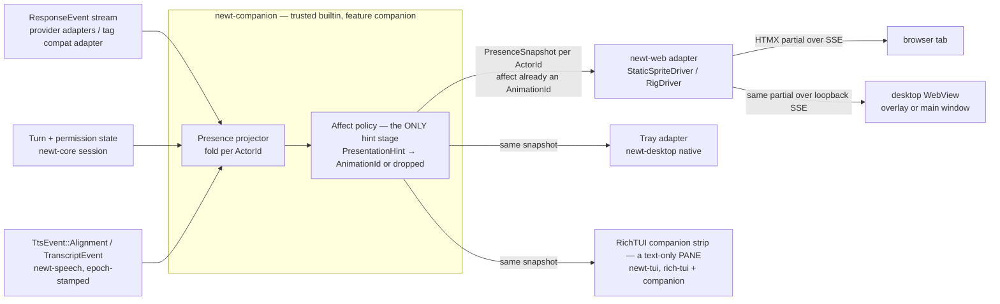
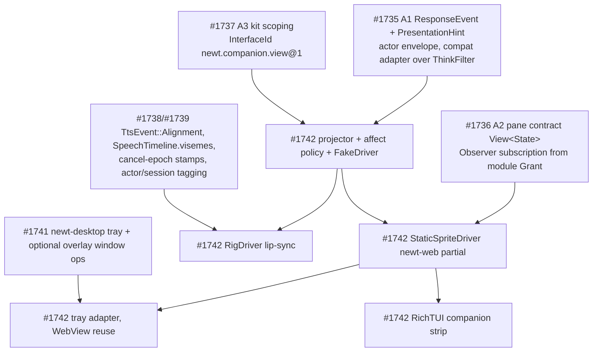

# Feature Proposal: Animated Companion

> **Status:** Draft — proposal, not normative · **Owner:** hartsock · **Last review:** 2026-08-16 · **Builds on:** `docs/decisions/agentic_object_capability_security.md`, `docs/decisions/ocap_confinement_model.md`, `docs/decisions/plain_scroller_tui.md`, `docs/decisions/newt_web_htmx.md`, `docs/decisions/newt_web_docking.md`, `newt-core/src/session.rs` (`OutputStream`, `AttachRole`), `newt-core/src/reasoning.rs` (`ThinkFilter`), `newt-identity`, [streaming-response-categoriser.md](streaming-response-categoriser.md), [speech-pipeline.md](speech-pipeline.md), [tui-panel-system.md](tui-panel-system.md), [kit-system.md](kit-system.md), [module-scopes.md](module-scopes.md), [desktop-shell.md](desktop-shell.md) · **Supersedes/Superseded by:** —

Tracking issue: **#1742** (D — companion), under the companion-train epic
**#1734**. Index: [companion-roadmap.md](companion-roadmap.md).

## Overview

An animated 2D on-screen character for the agent — a layered rig driven by
bone/mesh deformation rather than frame sprites (open rig format TBD;
Inochi2D (BSD-2) is the leading open candidate; the Live2D Cubism and Spine
runtimes are proprietary — out) — that reflects what the agent is doing and
lip-syncs to TTS output. The
character is a **`View`**: `newt-companion` folds canonical events into a
per-actor `PresenceSnapshot`, and each host projects that snapshot into its
own medium — a `newt-web` pane (server-rendered HTMX + SSE), the desktop
shell's WebView and tray, and a one-line RichTUI strip. Nothing in the
character is a source of truth for agent status, speech, or identity.

**Feature gate: `companion`** — a Cargo feature on `newt-tui` and `newt-cli`,
absent from the default feature set and never on the LEAN or wyvern paths;
`newt-web` and `newt-desktop` (workspace-excluded crates) enable
`newt-companion` in their own lockfiles. The plain-scroller rule
(`docs/decisions/plain_scroller_tui.md`) is untouched.

**Naming.** "Presence" is already taken by the WebAuthn `PresenceCaveats`
(`docs/design/human-presence-capabilities.md`), and "companion" is also the
name of the wyvern sortie responder (#1658). This doc says **companion
presence snapshot** (`PresenceSnapshot`) for the character's projected state
and never bare "presence"; where the sortie responder is meant, it says
"wyvern sortie companion". `PanelOutcome` already exists twice
(`newt-scheduler/src/panel.rs`, `newt-tui/src/config_panel.rs`) — the UI
surface is a **pane**. **`ActorId` is an alias of `PrincipalId`** — the
`newt-identity` `AgentKey`'s id ([module-scopes.md](module-scopes.md)); this
doc uses "actor" because the character *portrays* one. **"Bridle Grant"** (or
just *Grant*) means the host-minted granted `Caveats` a module runs under
(kit-system.md / module-scopes.md) — nothing else.

## Motivation

A status line or spinner tells you the agent is "thinking." An animated
character makes that legible at a glance and gives voice output a visual
anchor. This is strictly a **presentation-layer projection**: it consumes
canonical state that other crates already produce (the normalized
`ResponseEvent` stream, turn state, the speech timeline) and never becomes
a second source of truth for agent status, speech content, or identity.

## Design

### Position in the stack



The companion is **rigorously downstream**: nothing flows from an adapter
back into agent state. The only upstream-looking edges are the desktop
shell's two overlay window operations (`SetOverlayVisible`,
`SetOverlayPosition` — the only overlay `BridgeCall`s desktop-shell.md
defines; click-through and always-on-top are creation-time window properties
the shell sets from config, not bridge calls), and those are host-shell
concerns carried by the Tauri bridge, not agent-state concerns.

**Exactly one policy stage.** The raw, model-supplied `PresentationHint` is
consumed *inside* `newt-companion` and nowhere else. What leaves the crate —
to any adapter, host, or wire — is a `PresenceSnapshot` whose `affect` is
already an approved `Option<AnimationId>`. No host re-runs a policy table on
a free-form string, and no free-form string reaches a browser, WebView, tray,
or terminal.

### `PresenceSnapshot`: orthogonal dimensions, per actor

A single exclusive `Idle | Listening | Thinking | Speaking` enum would
collapse things that happen simultaneously (the agent can be *speaking* a
summary while a tool is *running* and the user is *talking* over it) and has
no notion of *who* is being shown when several agents share a session (crews,
dispatched sub-agents, a remote pilot). The state is therefore a snapshot of
independent dimensions keyed by actor:

| Dimension | Values (illustrative) | Canonical source |
|-----------|-----------------------|------------------|
| `actor` | `ActorId` (= `PrincipalId`, the `newt-identity` `AgentKey`'s id); display name is a label, not the key | `ResponseEnvelope.actor`; session attach |
| `cognition` | `Idle`, `Reasoning`, `Generating`, `WaitingOnTool` | `ResponseEvent::Reasoning` / `Text` / `ToolCall` / `ToolResult` / `Done` |
| `input` | `Silent`, `UserTyping`, `UserSpeaking { partial: bool }` — **session-scoped**, see below | input surface, STT `TranscriptEvent::Partial` / `TranscriptEvent::Final` |
| `output` | `Quiet`, `Streaming`, `Speaking { epoch, media_time }` | `ResponseEvent::Text` deltas; `TtsEvent::Alignment(AlignmentEvent)` / `TtsEvent::Done` |
| `activity` | `None`, `Tool { name }`, `Diff`, `Delegating { child: ActorId }` | `ResponseEvent::ToolCall` / `Artifact` in-process; over the wire, whatever the projection table in streaming-response-categoriser.md yields |
| `attention` | `Focused`, `AwaitingUser`, `Blocked { on: PermissionPrompt }` | turn state, `PermissionGate` prompt lifecycle |
| `affect` | `Option<AnimationId>` — **post-policy**; the raw hint never appears here | affect policy applied to `ResponseEvent::PresentationHint` (shape defined once in streaming-response-categoriser.md: `{ kind: HintKind, value, attrs, span, source: PrincipalId }`) |

```rust
// sketch — illustrative, not compiled
/// What leaves newt-companion. Everything in it is presentable as-is.
pub type ActorId = PrincipalId;         // module-scopes.md; the AgentKey's id

pub struct PresenceSnapshot {
    pub actor: ActorId,                 // newt-identity principal
    pub cognition: Cognition,
    pub input: InputState,              // copied from the session, not owned by the actor
    pub output: OutputState,
    pub activity: Activity,
    pub attention: Attention,
    pub affect: Option<AnimationId>,    // already mapped by policy; None = neutral
    pub since: Instant,                 // adapters diff and time transitions off this
}

/// Projector-private. Never leaves the crate.
struct ActorFold {
    snapshot: PresenceSnapshot,
    pending_hint: Option<PresentationHint>,   // raw, untrusted; resolved by the policy on emit
    speech_epoch: CancelEpoch,                // current TTS cancel epoch for this actor (speech-pipeline.md)
}
```

**Actors and the human.** The fold is `HashMap<ActorId, ActorFold>` per
session; a multi-agent view (crew dashboard, `gilamonster-agent`) is many
snapshots selected by `ActorId`, a single-agent shell shows one. The human is
**not** an `ActorId` in this model: `input` is a property of the *session*
(who is typing/speaking into it), so the projector holds one `InputState`
per session and copies it into every actor snapshot for that session; a
multi-actor view renders it once, not per character.

**Attribution is a dependency, not an assumption.** Today only the proposed
`ResponseEvent` envelope carries `actor`; `OutputChunk`, turn/permission
events, `TranscriptEvent`, and `TtsEvent` do not. This proposal changes
none of them; it *depends* on #1735 (`ResponseEvent` envelope with `actor`)
and #1738/#1739 (turn, permission and speech events tagged with the
originating principal or the session they belong to). Until those land the
projector runs single-actor.

The projector is a pure fold:
`(ActorFold, ResponseEvent | TurnState | TranscriptEvent | TtsEvent) -> ActorFold`
(`TurnState` is the session's agent-turn state, sketched in
tui-panel-system.md and owned by `newt-core`; speech-pipeline.md's
`VoiceTurnEvent` — the *human's spoken* turn — reaches the projector only
indirectly, as `TranscriptEvent`s),
emitting a `PresenceSnapshot` when anything presentable changed. It is
unit-tested by replaying recorded event fixtures (the same fixtures #1506
proposes for behaviour detection) and asserting snapshots — no renderer
involved.

### Affect is a hint, not a command

Model-emitted expression markup (`<expr name="happy">`, or a provider's
native equivalent) reaches the companion only as
`ResponseEvent::PresentationHint`, produced by the provider adapter or by
the tag-parser compatibility adapter (the `ThinkFilter` lineage — see
[streaming-response-categoriser.md](streaming-response-categoriser.md)).
It is **untrusted content**: the model does not get to pick animations,
assets, or anything with side effects.

```
model says PresentationHint { kind: Affect, value: "happy", .. }  ─┐ inside newt-companion only
      │                                                           │
      ▼  affect policy (TOML; per theme / per persona)            │
      │  "happy"    → AnimationId("smile_soft")  allowed           │
      │  "furious"  → (unmapped)              dropped              │
      │  "<any>" while attention = Blocked  suppressed             │
      ▼                                                           ─┘
PresenceSnapshot.affect = Some(AnimationId("smile_soft"))  → adapters / hosts / wire
```

Rules:

- Only hints present in the policy map produce an `AnimationId`; unknown
  hints are dropped. Free-form hint strings never leave the projector.
- The map is data (three-Cs): a theme or persona pack ships its own
  `[companion.affect]` table; the code has no hardcoded emotion list.
- Malformed or unclosed hint markup follows the categoriser's fail-closed
  rule — buffered, never rendered as text and never mapped.
- Hosts key their *asset* tables (sprite file, rig animation, tray icon,
  terminal glyph) by `AnimationId`. That is a rendering lookup, not a second
  affect policy; a host with no asset for an id shows neutral.
- Persona and voice of the character come from the existing
  `PersonaStore` / `RoleProfile` ([coaching-persona.md](coaching-persona.md));
  this doc adds no second persona config.

### `CompanionDriver` trait: host adapter, not a renderer

`newt-companion` owns the projector and the affect policy; it never draws
and links no UI toolkit. A `CompanionDriver` is a **host adapter** in the
sense of [tui-panel-system.md](tui-panel-system.md) Option A: it turns a
`PresenceSnapshot` (and viseme samples) into the host's presentation medium.
Both browser-based hosts render in a browser engine that `newt-web` feeds
with server-authored HTML, so no driver in this plan rasterizes pixels in
Rust — a driver emits partials/events; the browser engine (or the terminal,
or the tray) draws.

```rust
// sketch — illustrative, not compiled
pub trait CompanionDriver: Send + Sync {
    /// Whole-snapshot update; affect is already an AnimationId. Drivers diff
    /// against their last snapshot (via `since`) to time transitions.
    fn on_snapshot(&mut self, snapshot: &PresenceSnapshot);
    /// One viseme sample. Drivers MUST drop samples whose `epoch` is
    /// older than the latest `Speaking { epoch, .. }` they have seen,
    /// and close the mouth when `output` returns to `Quiet`.
    fn on_viseme(&mut self, sample: VisemeSample);
}

/// Companion-side type derived from `SpeechTimeline.visemes: Vec<Span<VisemeId>>`
/// plus the playback clock (AudioFrame sequence/timestamp), not a speech-pipeline type.
pub struct VisemeSample {
    pub actor: ActorId,
    pub epoch: CancelEpoch,  // TTS cancel epoch (speech-pipeline.md)
    pub media_time: MediaTime, // playback clock position, for sync
    pub viseme: VisemeId,
}
```

There is no separate `play(AnimationId)`: an approved affect is a field of
the snapshot, so it travels the same path as every other dimension and
cannot be delivered without its policy stage.

Drivers, in delivery order:

| Driver | Medium | What it needs | Notes |
|--------|--------|---------------|-------|
| `FakeDriver` (test only) | none | nothing | records calls; the unit-tier oracle for snapshots, affect and epoch dropping |
| `StaticSpriteDriver` | `newt-web` HTMX partial: an `` swap keyed by (`cognition`, `output`, `affect`) | a handful of PNGs from a configured path | **no JS**; ships something usable first; the RichTUI strip and tray are the same idea with glyphs/icons |
| `RigDriver` (open rig format TBD; Inochi2D is the leading open candidate) | `newt-web` progressive enhancement: a **pinned, locally-served** rig runtime (canvas/WebGL) under the existing CSP nonce/SRI, per `newt_web_htmx.md`; snapshot + `VisemeSample`s reach it as SSE events | rig file path, viseme layer | behind `companion`; falls back to `StaticSpriteDriver` when the enrichment is absent (the Markdown/plain-fallback rule) |
| VRM/3D | — | — | out of scope; a possible future driver |

Where the rig runtime executes: **in the browser engine**, as a pinned
enrichment served by `newt-web` — the same class as the mermaid runtime.
No native (in-process, `dlopen`'d) rig runtime is planned; if a Rust-native
rig library is ever adopted it is a trusted built-in dependency of the
adapter and must never load third-party native code at run time (see Trust
below).

Lip-sync consumes the **visemes layer of `SpeechTimeline`**
(`{words, phonemes, visemes, markers}` — [speech-pipeline.md](speech-pipeline.md)),
delivered incrementally as `TtsEvent::Alignment(AlignmentEvent)` and finally
in `TtsEvent::Done { timeline }`, where an aligner fills missing layers. The
companion does not compute visemes itself and works without speech at all
(the layer is simply absent, `output` never becomes `Speaking`).

**Barge-in / cancel.** Every `TtsEvent`, alignment update and derived
`VisemeSample` is epoch-stamped. When the TTS scheduler bumps the cancel
epoch (user interrupt, reply changed, higher-priority intent) the
projector sets `output = Quiet` for that actor, and every driver drops
queued samples from the stale epoch — a stale mouth shape is as wrong
as a stale sentence. Sync uses the playback clock (`AudioFrame`
sequence/timestamp) carried as `media_time`, not arrival order.

### Kit, module, interface

| Layer | Companion answer |
|-------|------------------|
| Kit (what code/interface exists) | `newt-companion` is a **trusted built-in kit** (workspace crate, no UI deps) exporting `newt.companion.view@1 = View<PresenceSnapshot>` ([kit-system.md](kit-system.md)); a "companion pack" (sprites/rig + `[companion.affect]` table) is a **config/asset payload, not a kit** — loaded like a persona pack (`PersonaStore` lineage), it exports nothing and runs no code. kit-system.md's `KitManifest` is export-centric and has no asset-only form; whether one is wanted is an open question for #1737 (below) |
| Interface | `newt.companion.view@1` is its own interface, not a pane model. A host that wants it *as a pane* wraps it: the pane's `PaneModel` (`newt.ui.pane@1 = View<PaneModel>`) is derived from the snapshot by the host adapter ([tui-panel-system.md](tui-panel-system.md) Option A). The RichTUI companion strip is exactly such a pane — text-only, not the animated character |
| Module (who runs it, with what Grant) | the projector runs in the **host's** module (`newt-web`, `newt-desktop`, or `newt-tui` RichTUI); the host mints a scoped `Subscription<PresenceSnapshot>` from that module's Bridle Grant, backed by an `AttachRole::Observer` attachment to the session — read-only by construction ([module-scopes.md](module-scopes.md)) |
| Authority | none new — the companion holds one Observer-role subscription handle and no callables; hints never carry authority; the Bridle `Caveats` vocabulary is not extended |
| Execution class | trusted built-in Rust behind the `companion` Cargo feature (`newt-tui` / `newt-cli`; `newt-tui` only together with `rich-tui`); `newt-web` / `newt-desktop` are workspace-excluded crates that depend on `newt-companion` directly |

### Trust model

| Component | Class | Why |
|-----------|-------|-----|
| `newt-companion` projector + affect policy | trusted built-in Rust | in-process; the single place the untrusted hint is handled |
| Host adapters (`StaticSpriteDriver`, `RigDriver`, tray, RichTUI strip) | trusted built-in Rust | emit partials/events only |
| Browser-side rig runtime | pinned, locally-served enrichment (CSP nonce/SRI, strict mode) | same class as the mermaid enrichment in `newt_web_htmx.md`; never fetched remotely |
| Rig / sprite files, `[companion.affect]` tables | **untrusted data** parsed by trusted code | size limits, fuzzed parsers, no code paths; a bad pack degrades to neutral, never executes |
| Third-party companion packs | untrusted data (config/asset payloads, not kits) | a pack that wants to ship a *driver* is not a pack — it would be a kit: native ⇒ trusted-only (no capability sandbox after `dlopen`, so **not accepted**); WASM ⇒ constrained, possible later behind the kit-system WASM execution class |
| Native rig runtime (Inochi2D C/D bindings etc.) | trusted-only | not planned; if ever adopted, a build-time dependency of the adapter, never `dlopen`'d at run time |

### Hosting

| Host | How the snapshot is presented | Boundary |
|------|-------------------------------|----------|
| [`newt-web`](tui-panel-system.md) | a pane wrapping `newt.companion.view@1`; `StaticSpriteDriver` = HTMX `` swap over the existing SSE stream (no JS); `RigDriver` = pinned local runtime as progressive enhancement, sprite fallback | Observer-role `Subscription<PresenceSnapshot>` minted from the `newt-web` module's Grant — no ambient bus; the wire carries `PresenceSnapshot`/`VisemeSample` (AnimationId, never hints) |
| [Desktop shell](desktop-shell.md) — WebView | **the `newt-web` adapter, verbatim**: the WebView (main window or, optionally, a transparent overlay window) renders the same HTMX partial over the loopback SSE; snapshots never cross the Tauri bridge | bridge carries **window ops only**: the two overlay `BridgeCall`s desktop-shell.md defines — `SetOverlayVisible`, `SetOverlayPosition` — each a named command in the checked-in Tauri capability file (desktop-shell.md acceptance); click-through / always-on-top are the overlay's creation-time properties (shell config), not bridge calls |
| [Desktop shell](desktop-shell.md) — tray | the **primary** desktop `View<PresenceSnapshot>` adapter (desktop-shell.md §Tray): native icon lookup keyed by (`cognition`, `attention`, `affect: Option<AnimationId>`); no icon for a tuple → neutral | the privileged host reads the presence SSE stream over loopback (not the bridge), backed by the same Observer subscription through the dock seam; no hint, no policy table in the tray |
| `newt-tui` (RichTUI only) | a one-line **companion strip** — a text-only **pane** (`newt.ui.pane@1`, model derived from the snapshot; [tui-panel-system.md](tui-panel-system.md)) drawn with a `newt_core::tty` widget: glyph/text keyed by the same tuple. It is *not* the animated companion — no rig, no sprites | consumes the presented `PresenceSnapshot` via `Source<PresenceSnapshot>`, never `PresentationHint`; LEAN scroller and wyvern paths untouched (`plain_scroller_tui.md` guard) |

All hosts consume the same `PresenceSnapshot`; presentation is the host's,
and no host sees the raw hint. The tray (desktop-shell.md) likewise only looks
up an icon by the snapshot tuple — it re-runs no policy.

## Dependencies and acceptance



| Increment | Depends on | Acceptance |
|-----------|-----------|------------|
| Projector + `PresenceSnapshot` + `FakeDriver` | `ResponseEvent` stream with `actor` (#1735), interface id (#1737) | replayed fixtures → expected snapshots per `ActorId`; multi-actor fixture yields separate snapshots with one session-scoped `input`; unit tier only |
| Affect policy | above | unmapped hint → `affect = None`; malformed markup → nothing mapped; `PresentationHint` type does not appear in any public `newt-companion` output type (compile-time check: `PresenceSnapshot` has no field of that type); map loaded from TOML, no built-in emotion list |
| `StaticSpriteDriver` (`newt-web`) | pane contract + Observer subscription (#1736) | `` partial selected by (`cognition`, `output`, `affect`); rendered with no JS; works with no speech present |
| `RigDriver` | `TtsEvent::Alignment` / visemes layer, cancel-epoch stamps (#1738/#1739) | `VisemeSample`s drive mouth shapes synced to `media_time`; **stale-epoch samples are dropped; cancel resets `output` to `Quiet` and closes the mouth**; frame rate bounded/configurable; sprite fallback when the enrichment is absent |
| Tray + desktop WebView | `newt-desktop` (#1741) | tray icon keyed by the snapshot tuple only; WebView shows the identical `newt-web` partial over loopback SSE; the two overlay `BridgeCall`s (`SetOverlayVisible`, `SetOverlayPosition`) appear in the checked-in capability file and nothing else crosses the bridge for the companion |
| RichTUI companion strip (a pane) | `StaticSpriteDriver` model, pane contract (#1736), `rich-tui` + `companion` features | strip renders from `PresenceSnapshot` as a `newt.ui.pane@1` model; `plain_scroller_tui.md` guard test proves LEAN/wyvern output is byte-identical with the feature off |

## Cross-cutting concerns

| Concern | Approach |
|---------|----------|
| Authority | none new — one Observer-role `Subscription<PresenceSnapshot>` minted by the host from its module's Grant; the Bridle Grant / `Caveats` vocabulary is not extended, and hints never carry authority |
| Identity | `ActorId` = `PrincipalId`, the `newt-identity` `AgentKey`'s id; labels are display-only; the human is session `input`, not an actor |
| Trust | see the Trust model table — one policy stage, trusted adapters, untrusted data files, no run-time native drivers |
| Asset licensing | rig files and sprites are user-supplied/configured, never vendored |
| Testing | projector, affect policy, epoch dropping and viseme timing fully unit-tested against `FakeDriver`; rendering fidelity is a manual/visual check, not a CI gate |
| Performance | viseme frame rate bounded and configurable; the companion must not compete with the LEAN CLI/TUI path — additive, never required |
| Config | driver, asset path, affect map, sprite/rig/icon tables keyed by `AnimationId` — TOML per the three-Cs; no hardcoded character or emotion list |

## Open questions

1. **Asset-only kits.** Companion packs are config/asset payloads today (loaded like persona
   packs). Should kit-system.md / #1737 grow a zero-export manifest form (`artifact` CID = the pack
   bundle, trust class "untrusted data parsed by trusted code") so packs get the same provenance
   chain (manifest CID → artifact CID → signer) as code kits? Until decided, packs are not kits.

## Out of scope

- 3D avatar rendering (VRM-style) — a possible future `CompanionDriver`.
- Any change to agent turn/state semantics, `ResponseEvent`, or the speech
  timeline — this proposal only consumes them; the actor/session tagging it
  needs is filed against #1735/#1738/#1739.
- Rendering the character with pixels in the terminal. The RichTUI strip is
  a text-only pane over the same snapshot (tui-panel-system.md); the LEAN
  scroller and wyvern paths get nothing.
- Native (`dlopen`'d) rig runtimes or third-party code-bearing companion
  packs.

## Change log

- 2026-08-16: the single exclusive `Idle | Listening | Thinking | Speaking` state became the
  per-actor `PresenceSnapshot`; the affect policy became the one hint stage inside
  `newt-companion`; `ActorId` fixed as an alias of `PrincipalId`; cancel counters renamed epochs.
