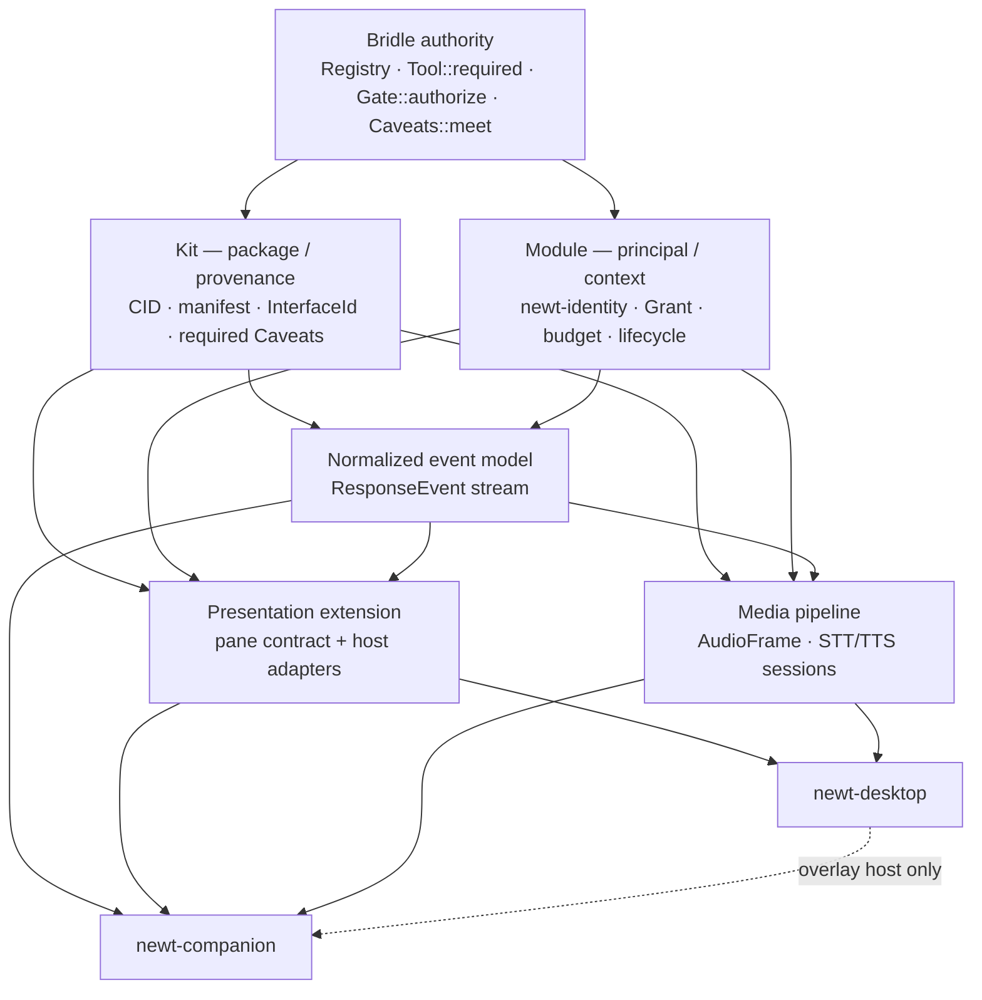

# Companion Feature Roadmap (index)

> **Status:** Draft — proposal, not normative · **Owner:** hartsock · **Last review:** 2026-08-16 · **Builds on:** `docs/decisions/ocap_confinement_model.md`, `agent_bridle_publishing.md`, `agentic_object_capability_security.md`, `plain_scroller_tui.md`, `newt_web_htmx.md`, `newt_web_docking.md`; agent-bridle-core `Registry` / `Tool::required()` / `Gate::authorize`, `newt_core::caveats::Caveats`, `newt_core::kit`, `newt_core::session::OutputStream`, `newt_core::reasoning::ThinkFilter`, `newt-identity` · **Supersedes/Superseded by:** —

This index ties together the seven companion-train proposals plus this index (tracked by EPIC
#1734, milestone v0.10.0). None is normative yet; all are **Draft**. The `exec-mcp-interrupt`
write-up lives in `docs/findings/`; its follow-ups are #1743 (see the issue map).

## Center of the design

| Concept | Answers | Owner |
|---------|---------|-------|
| **Kit** | what code / interfaces are available (package, discovery, provenance) | `newt_core::kit` widened; [kit-system.md](kit-system.md) |
| **Module** | who is running, with what *Grant* (host-minted granted `Caveats`) | [module-scopes.md](module-scopes.md) |
| **Bridle** | what authority exists — the **sole** authority plane | agent-bridle-core `Registry` / `Gate` / `Caveats::meet` |
| **Interface** | what can be composed — base shapes `Action`, `Source`, `Sink`, `Transform`, `Session`, `View`; the pinned ids: `newt.session.response@1 = Source<ResponseEvent>` (items are `ResponseEnvelope`s — the enveloped stream), `newt.speech.stt@1 = Session<AudioFrame, TranscriptEvent>`, `newt.speech.tts@1 = Session<SpeechRequest, TtsEvent>`, `newt.ui.pane@1 = View<PaneModel>`, `newt.companion.view@1 = View<PresenceSnapshot>` | [kit-system.md](kit-system.md) (algebra + id table); shapes owned by the sibling docs |
| **Event** | what happened — `ResponseEvent` / `PresentationHint` (defined once, with the one `OutputStream` projection table, in [streaming-response-categoriser.md](streaming-response-categoriser.md)); `TurnState` (sketched in [tui-panel-system.md](tui-panel-system.md), owned by `newt-core`); `AudioFrame` / `SpeechTimeline` ([speech-pipeline.md](speech-pipeline.md)); `PresenceSnapshot` ([animated-companion.md](animated-companion.md)) | per-event owner as listed |
| **View** | how a host projects it (RichTUI, `newt-web` HTMX, desktop WebView) | [tui-panel-system.md](tui-panel-system.md) |
| **Principal** | who — `PrincipalId`, the `newt-identity` `AgentKey`'s id (`ActorId` is an alias) | [module-scopes.md](module-scopes.md) |

## Proposals

| Document | Feature | Existing owner it widens | Issue | Status |
|----------|---------|--------------------------|-------|--------|
| [streaming-response-categoriser.md](streaming-response-categoriser.md) | Typed `ResponseEvent` stream; tag-parser compatibility adapter | `ThinkFilter` (`newt-core/src/reasoning.rs`), `OutputStream` / `OutputChunk` (`newt-core/src/session.rs:69`), the turn driver's stream paths (`newt-core/src/agentic/mod.rs`), `newt-inference` batch backends (#1506/#1014/#860) | #1735 (A1, A1-b) | Draft |
| [tui-panel-system.md](tui-panel-system.md) | Pane contract: semantic state/events/actions + per-host adapters | the config panel's `PanelOutcome` (`newt-tui/src/config_panel.rs`) and the backend panel's `PanelClose` (`backend_panel.rs`), `TabSet`/`TabSidecar` (`tabs.rs`), `newt_core::tty`; RichTUI feature only; #1673/#1669 | #1736 (A2) | Draft |
| [kit-system.md](kit-system.md) | Kit = package / discovery / provenance (CID, manifest, interfaces, required authority) | `newt_core::kit` (`Axis`, `Tier`, `RegistryEntry`), `Loadout.kit` / `[bundles.*]`, `command_plugin_runtime.md`, plugins-protocol | #1737 (A3) | Draft |
| [module-scopes.md](module-scopes.md) | Module = principal identity + Grant + kit instances + budget + mailbox + lifecycle | `newt-identity` (`session_root` / `attenuate` / `enforced_caveats` / `delegate_for_plugin`), `RoleProfile`, loadouts, `CrewRunner`, `send_budget`, #739 attenuation | #1737 (A3) | Draft |
| [speech-pipeline.md](speech-pipeline.md) | STT / TTS as media sessions over `AudioFrame`; `SpeechTimeline` | net-new `newt-speech` (builds on `ResponseEvent`, `InputSurface` / `SteeringInbox`, `DockScope::allows_inject`); feature `speech` on `newt-tui` / `newt-cli` | #1738 (B1), #1739 (B2/B3), #1740 (B4) | Draft |
| [desktop-shell.md](desktop-shell.md) | Tauri sidecar host for the server-rendered `newt-web` | net-new `newt-desktop` (workspace-excluded crate, own lockfile, independently versioned; builds on `newt-web`, `DockRegistry` in `newt-core/src/dock_registry.rs`, `NewtDockService` in `newt-mesh/src/dock.rs`) | #1741 (C) | Draft |
| [animated-companion.md](animated-companion.md) | Presence projection with actor identity, untrusted `PresentationHint`s | net-new `newt-companion` (builds on `ResponseEvent` + turn state + speech events); feature `companion` on `newt-tui` / `newt-cli` | #1742 (D) | Draft |
| `docs/findings/` exec-mcp-interrupt | Findings write-up (not a proposal); follow-ups | — | #1743 | Findings |
| this file | Index, dependency + acceptance graph | — | #1734 (EPIC) | Draft |

**Issue map (scope per issue):** #1735 (A1) — the typed, normalized `ResponseEvent` stream, with
the tag parser as a compatibility adapter; A1-b is its wire-widening PR. #1736 (A2) — the pane
contract (`PaneOutcome`, per-host adapters). #1737 (A3) — **kit-as-package/provenance**
(kit-system.md) **and module-as-principal/Grant** (module-scopes.md); it carries no permission
system of its own. #1738–#1740 (B1–B4) — the media pipeline. #1741 (C) — `newt-desktop`, a
workspace-excluded crate. #1742 (D) — `newt-companion`. #1743 — the exec/MCP-interrupt follow-ups
from `docs/findings/`, tracked alongside the train but outside its dependency graph.
**Still-stale wording to update on the issues themselves:** #1736's title says "generalise
`PanelOutcome`" (the type is `PaneOutcome`, per the Naming table); #1739's title says "TTS consumer
of `OutputStream`" (TTS reads `ResponseEvent` in-process, never `OutputChunk`); #1741's title says
"feature `desktop`" (the `desktop` feature exists only on the excluded `newt-web` crate — the shell
itself is a workspace-excluded crate, not a feature gate); and the #1738/#1739 bodies predate
speech-pipeline.md's shape (cancel epochs, domain lattice instead of `audio.*` caveats). Read
#1734's children with these meanings.

## Dependency graph (architectural, not scheduled)

The normalized event model is foundational: speech, panes, companion, TUI, desktop, logs,
remote pilot and ACP all consume `ResponseEvent`. The last tier is the *set* {newt-desktop,
newt-companion}: the companion's primary host is a `newt-web` pane (pane contract + `ResponseEvent`,
needing only P and E); the desktop always-on-top overlay is a second, optional host, so #1742 does not
block on #1741. `speech` and `companion` are Cargo features on `newt-tui` / `newt-cli`, absent
from the default feature set and never on the LEAN or wyvern paths; `newt-desktop` (like
`newt-web`) is a workspace-excluded crate, not a feature gate. The plain-scroller rule is
untouched.

## Acceptance graph (merge gates and invariants per node)

| Node | Issue | Merge gates / invariants |
|------|-------|--------------------------|
| Bridle authority | (existing) | No second permission/authority vocabulary anywhere in the train. Kit manifests declare *required* `Caveats`; only the host mints granted `Caveats`. `effective = granted.meet(required)` is the only authorization computation. |
| Kit (package/provenance) | #1737 | No `KitPermissions`, `PermissionEvaluator`, or authorizing registry `call()`. `foo@1.4.2 → manifest CID → artifact CID → signer` resolvable, so "principal P held authority X while executing artifact CID Y" is answerable. No closed `KitKind` enum; interfaces are stable `InterfaceId`s over base shapes. |
| Module (principal/context) | #1737 | `child.grant = parent.grant.meet(requested).meet(host_clamp)` and `child.key = newt_identity::attenuate(&parent.key, &child.grant)` — never larger (cf. #739). Authority / Resources / Scheduling / Accounting / Provenance are separate axes; token and API budgets are not permissions; each module authorizes on its own Bridle `Gate` (per-module call budget). In-process modules give logical scoping + accounting only; hard isolation begins at WASM / process / container. Principal identity is cryptographic (`newt-identity`); display name is a label. |
| Normalized event model | #1735 | **Producers:** provider adapters in the turn driver (`stream_response`, `anthropic_dispatch_round`, the OpenAI-compatible path), the `newt-inference` batch backends, and the tag-parser compatibility adapter for text-only models; **the turn driver is the merger, the sole producer of `ToolResult` (and tool-side `Artifact`), and guarantees exactly one `Done` per `(turn, actor)` — emitting `Done { Cancelled \| Aborted }` itself when a producer does not.** `ResponseEvent { Text, Reasoning, ToolCall, ToolResult, Artifact, PresentationHint, Done }`, `#[non_exhaustive]`; `PresentationHint { kind, value, attrs, span, source: PrincipalId }` defined there once. Handles arbitrary chunk boundaries and nesting; never re-emits accumulated content after deltas. **Fail-closed owner:** the adapter (P1–P11) plus the voice policy stated in that doc — voice speaks `Text` only, uncertain markup is held, unterminated blocks resolve to *not spoken*, no bypass. |
| Presentation extension | #1736 | Pane declares state/events/actions (or a declarative presentation IR); each host owns rendering via an adapter — no `Box<dyn Fn(&mut Frame, Rect)>` "host-neutral" claim. Panes receive scoped subscriptions/publishers/callable handles, not ambient buses or topic permissions. Pane rendering only behind `rich-tui` (ratatui itself is already a non-optional `newt-tui` dependency; the feature gates the inline-viewport surface). |
| Media pipeline | #1738/#1739/#1740 | `MicrophoneCapture`, STT, TTS, `SpeakerPlayback` are separate capability handles (cloud STT needs network, not mic; local whisper on `.wav` needs neither). `AudioFrame {sequence, timestamp, sample_rate, channels, format, samples}`; cancel epochs (not "generations"), backpressure, resampling, device handoff. VAD / voice-turn detection is separate from STT. Visemes are one layer of `SpeechTimeline`. Per-PR tier is fully mocked (fake `AudioFrame` streams, wiremock STT); real-model tests for local providers (#1740) run on the weekly/release tier only. |
| newt-desktop | #1741 | Three responsibilities, three boundaries, named: ① privileged native host (Tauri core), ② sidecar `newt-web` server (Axum + HTMX + SSE, agent side), ③ Tauri WebView (WKWebView/WebView2/WebKitGTK) in the host process, isolated by Tauri capabilities; B1 bridge (Tauri ACL — an IPC boundary, not a process boundary of our making), B2 loopback (launch token), B3 dock seam. Tauri v2 capabilities/ACL guard WebView→native; the Bridle Grant guards agent→resource — never one standing in for the other. OS mic consent is not an ocap: the privileged side owns `MicrophoneCapture` and hands the WebView a scoped session handle. WebView document served from the **one loopback origin** with a per-launch token (the app-scheme origin was rejected in that doc). Workspace-excluded crate, independently versioned. Updater accepts signed updates only. |
| newt-companion | #1742 | `PresenceSnapshot { actor, cognition, input, output, activity, attention, affect }` — orthogonal dimensions, every event carries its actor (`ActorId` = `PrincipalId`). Model `Affect(..)` tags are untrusted `PresentationHint`s mapped by policy/theme to approved `AnimationId`s inside `newt-companion` only. Rigorously downstream of canonical state. |

## Plugin trust matrix

Normative home: [kit-system.md](kit-system.md) (execution / trust matrix); this is a summary.
**Authority enforcement is the same in every row:** Bridle `Gate::authorize(tool, granted)` is
the enforcement point regardless of execution mode (`Registry` has no ambient authority). The rows
differ only in the *isolation boundary* — i.e. whether the floor is enforceable *against* the code.
For in-process native code it is honour-system: nothing stops the code from bypassing the gate.

| Execution mode | Trust | Isolation boundary (floor enforceable against the code?) |
|----------------|-------|-----------------------------------------------------------|
| Built-in Rust | trusted | none (in-process) — Gate applies; floor is honour-system |
| Native dylib (`dlopen`) | trusted-only | none — shares the process's full power; no capability sandbox after load |
| WASM component | constrained | runtime sandbox; the Grant is enforced by the host boundary |
| Subprocess (plugins-protocol) | constrained | process boundary; Bridle enforcement floor holds |
| Remote principal | constrained | network boundary; delegated Grant + `newt-identity` principal |

## Naming

| Term | Use | Avoid |
|------|-----|-------|
| **pane** / dock | UI regions in RichTUI / `newt-web` / desktop; the ephemeral-pane outcome type is `PaneOutcome` (`newt-tui`), folding both existing exit contracts (`config_panel::PanelOutcome`, `backend_panel::PanelClose`) | `PanelOutcome` — exists **twice** already: `newt-scheduler/src/panel.rs` (diversity / verification panel, with `PanelConfig`) and `newt-tui/src/config_panel.rs` (psyche/config panel); never a third |
| **Grant** / Bridle Grant | the host-minted granted `Caveats` a module runs under (`enforced_caveats(&key)`), passed to `Gate::authorize` (no `Grant` struct) | `KitPermissions`, `PermissionEvaluator` |
| **PrincipalId** | the `newt-identity` `AgentKey`'s id (`AgentKey::fingerprint()`); `ActorId` is an alias | a UUID or display name as identity; `newt-core` `AgentIdentity` (that is the git/GitHub-App commit identity) |
| **cancel epoch** | speech / scheduling cancellation counter (`Stamped<T>::epoch`) | "generation" — that is Bridle's revocation counter (`Gate::generation`, `valid_for_generation`) |
| **VoiceTurnEvent** | speech-pipeline's human-turn detection event | `TurnEvent` (collides with agent-turn vocabulary) |
| **TimelineMarker** | `SpeechTimeline.markers` vocabulary (SSML marks are one variant) | bare `Marker` |
| **PresentationHint** | untrusted model hint, shape defined once in streaming-response-categoriser.md | restating the shape elsewhere |
| **PresenceSnapshot** | companion projection | bare "presence" — taken by WebAuthn `PresenceCaveats` |
| **newt-companion** | animated presence crate | conflating with the wyvern sortie responder (#1658) |
| **ResponseEvent** | typed normalized stream | `newt-response-tags` / `newt-stream-tags` |

## Open questions

- Presentation IR vs. pure semantic portability for panes — decide in #1736.
- Open rig format for the companion — Inochi2D (BSD-2) is the leading open candidate; Live2D
  Cubism and Spine runtimes are proprietary and out — #1742.
- CLI subcommands vs. slash commands / panes (#1673); per-crate metrics exporters — deferred.
