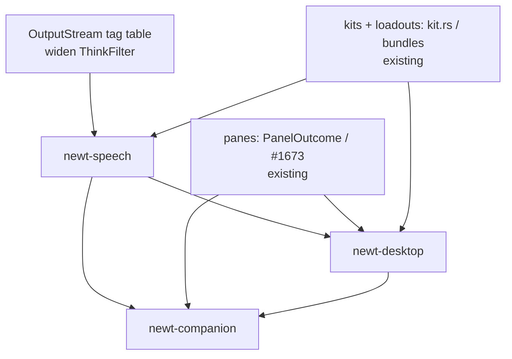

# Companion Feature Roadmap (index)

**Status (2026-08-16): Draft, revised after design review.** This index ties together the
kit / module / panel / categoriser sketches and the speech / desktop / companion proposals.
The proposals are *not* self-contained: they build on code that already exists in the
workspace (see "Reconciliation with existing code"), and several sketches contain
non-compiling pseudocode that is annotated in place. The `exec-mcp-interrupt` write-up moved
to `docs/findings/`.

## Proposals

| Document | Feature | Where it lands (existing owner) | Priority | Status |
|----------|---------|----------------------------------|----------|--------|
| [kit-system.md](kit-system.md) | Capability registry | **Widen existing** `newt_core::kit` (`Axis`, `Tier`, `RegistryEntry`) + `Loadout.kit` / `[bundles.*]` (`config.rs`); permissions = existing `Caveats` / `PermissionGate` / `ExposureProfile` | P1 | Draft — partly superseded |
| [module-scopes.md](module-scopes.md) | Per-agent scoping | **Widen existing** `RoleProfile`, loadouts, `BundleConfig`, `TabSidecar`, `CrewRunner`, `send_budget` | P2 | Draft — sketch is pseudocode |
| [tui-panel-system.md](tui-panel-system.md) | Panes / dock contributions | **Widen existing** `PanelOutcome` (`newt-tui/src/config_panel.rs`), `TabSet` (`tabs.rs`), `newt_core::tty` widgets; RichTUI (`rich-tui` feature) only; `newt-web` is HTMX | P1 | Draft — coordinate with #1673 / #1669 |
| [streaming-response-categoriser.md](streaming-response-categoriser.md) | Response tag table | **Widen existing** `ThinkFilter` (`newt-core/src/reasoning.rs`) + `OutputStream` (`session.rs`); no new crate | P0 | Draft — parser sketch has known defects |
| [speech-pipeline.md](speech-pipeline.md) | STT/TTS | `newt-speech` (new, feature `speech`), consumer of `OutputStream`; caveats `audio.in` / `audio.out` | P2 | Proposal |
| [desktop-shell.md](desktop-shell.md) | Native window/tray host | `newt-desktop` (new, feature `desktop`), dock client of `NewtDockService`, own lockfile like `newt-web` | P2 | Proposal |
| [animated-companion.md](animated-companion.md) | Animated presence | `newt-companion` (new, feature `companion`), state machine over `OutputStream` + turn state | P3 | Proposal |

## Reconciliation with existing code

| Proposal concept | Existing owner |
|------------------|----------------|
| `newt-kit` registry / manifest | `newt-core/src/kit.rs` (`Axis`, `Tier`, `RegistryEntry`, `component()`); `Loadout.kit` naming a `[bundles.*]` (`newt-core/src/config.rs`); `docs/design/loadout-composition.md`, `model-support-kit.md` |
| `KitPermissions` | `newt-core/src/caveats.rs` (`Caveats`), `PermissionGate`, `ExposureProfile` / `ExposureClass` (`docs/design/tool-exposure-controller.md`) |
| Kit / plugin manifests | `docs/design/command_plugin_runtime.md` |
| `newt-module` scopes | `RoleProfile` (`role_profile.rs`), loadouts, `TabSidecar` (`newt-tui/src/tabs.rs`), `CrewRunner`, `send_budget.rs` |
| `newt-response-tags` / `newt-stream-tags` | `ThinkFilter` (incremental, `newt-core/src/reasoning.rs`); `OutputStream` enum (`newt-core/src/session.rs:69`: `Stdout`, `Stderr`, `AgentThought`, `ToolCall`, `Diff`, …); issues #1506 / #1014 / #860 |
| `newt-panel` host + `Panel` type | `PanelOutcome` (`newt-tui/src/config_panel.rs`, `docs/decisions/harness_config_panel.md`); `TabSet`; `newt_core::tty`; ephemeral alt-screen carve-out (`docs/decisions/plan_editor_ephemeral_tui.md`); epic #1673. `Panel` is already a `newt-scheduler` diversity-panel type — UI ADRs say **pane** / **dock** |
| ratatui host in `newt-web` | Wrong premise: `newt-web` is HTMX and workspace-excluded (`docs/decisions/newt_web_htmx.md`, `newt_web_docking.md`); ratatui exists only in `newt-tui` behind `rich-tui` |

## Dependency graph

## Phases

Every step below is **one issue = one PR**, lands in `docs/ROADMAP.md` Backlog first, and
follows the acceptance contract there. Feature gates `speech`, `desktop`, `companion` are
**absent** from the wyvern (headless) and LEAN default builds; the plain-scroller rule
(`docs/decisions/plain_scroller_tui.md`) is unchanged.

**A — Foundation by widening (no new crates)**
- A1. `OutputStream` tag table: make `ThinkFilter` tag-driven config with per-provider
  overrides; fix the sketch defects listed in the categoriser doc; grounds #1506/#1014/#860.
- A2. Generalise `PanelOutcome` into a reusable pane contract; amend the plain-scroller
  ephemeral carve-out ADR if needed; coordinate with #1673 (slash commands → panes) and #1669.
- A3. Kit = `kit.rs` + bundle: extend `BundleConfig` for role / permission scoping (reusing
  `Caveats` / `ExposureProfile`); no separate `newt-kit` crate.

**B — Speech (`newt-speech`, feature `speech`)**
- B1. Provider traits + segmenter + priority/interrupt scheduler, fully mocked; caveats
  `audio.in` / `audio.out`.
- B2. TTS as a consumer of `OutputStream` in RichTUI and `newt-web`.
- B3. STT into `InputSurface` / steering.
- B4. Local providers (whisper.cpp, piper) — weekly / release tier only.

**C — Desktop (`newt-desktop`, feature `desktop`)**
- C1. Dock client of `NewtDockService`, own lockfile (same pattern as `newt-web`).
- C2. Capability-scoped bridge enum.
- C3. Tray + global hotkey wired to `newt-speech`.

**D — Companion (`newt-companion`, feature `companion`)**
- D1. State machine over `OutputStream` + turn state; static sprite driver.
- D2. Decide the open rig format (open question — Live2D is proprietary).
- D3. Web host first (HTMX pane), then desktop overlay window.

## Cross-cutting

| Concern | Approach |
|---------|----------|
| Config | TOML in existing `newt-core` config; per-provider / per-role overrides via loadouts |
| Testing | Unit tier fully mocked (CLAUDE.md); audio/native hosts on the weekly tier |
| Naming | `newt-response-tags` / `newt-stream-tags` unified as "response tag table"; `KitKind::Speech`, `caveats.audio`, `TagEvent::Text` are referenced but undefined until B1/A1 define them |

## Open questions (not in scope until decided)

- CLI subcommands (`newt kit` / `newt module` / `newt panel`) — probably slash commands / panes instead (#1673).
- Metrics / prometheus per crate — deferred; no per-crate exporters.
- Dynamic loading (`dlopen`) of kits — deferred; process/MCP boundaries first.
