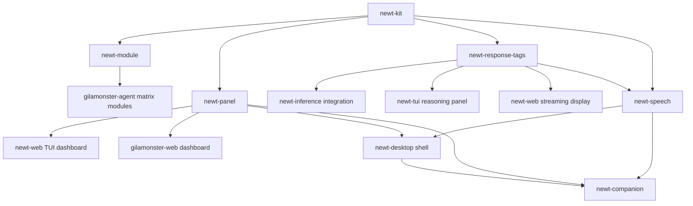

# Feature Proposals Index

This directory contains feature proposals for extending Newt/Gilamonster: a unified extension model (kits, module isolation, dashboard panels), streaming UX, and a voice-and-avatar companion surface (speech I/O, a native desktop shell, an animated on-screen presence). Each proposal is self-contained.

## Proposals

| Document | Feature | Target Crates | Priority |
|----------|---------|---------------|----------|
| [kit-system.md](kit-system.md) | **Unified Capability Registry** — typed registry for skills, tools, MCP, plugins with remote-callable policies | `newt-kit` (new), adapters for `newt-skills`, `newt-tools`, `newt-mcp-*`, `plugins-protocol` | **P0** — Foundation for all others |
| [module-scopes.md](module-scopes.md) | **Agent Module Isolation** — per-agent module boundaries with kit scope, permissions, resource budgets, lifecycle | `newt-module` (new), `gilamonster-agent` integration | **P0** — Enables matrix architecture |
| [tui-panel-system.md](tui-panel-system.md) | **TUI Dashboard Panel System** — plugin UI contributions (tabs, drawers, modals) for `newt-web`/`gilamonster-web` | `newt-panel` (new), `newt-web`, `gilamonster-web` | **P1** — Dashboard extensibility |
| [streaming-response-categoriser.md](streaming-response-categoriser.md) | **Streaming Response Categoriser** — incremental tag extraction, TTS filtering, reasoning/artifact separation | `newt-response-tags` (new), `newt-inference`, `newt-tui`, `newt-web` | **P1** — UX for streaming responses |
| [speech-pipeline.md](speech-pipeline.md) | **Speech Pipeline (STT/TTS)** — provider-agnostic speech synthesis + transcription, intent-based interrupt/queue scheduling | `newt-speech` (new), `newt-inference`, `newt-tui`, `newt-web` | **P2** — Voice I/O, depends on kit + stream-tags |
| [desktop-shell.md](desktop-shell.md) | **Desktop Application Shell** — native window/tray host for the existing panel dashboard, capability-scoped bridge, mic/notification permissions | `newt-desktop` (new), `newt-web`, `newt-speech` | **P2** — Native host for `newt-web`, depends on panel system |
| [animated-companion.md](animated-companion.md) | **Animated Companion** — 2D sprite/Live2D-style character reacting to agent state, lip-synced to TTS output | `newt-companion` (new), `newt-speech`, `newt-desktop`, `newt-web` | **P3** — Presentation layer, depends on speech + desktop/panel hosts |

## Suggested Implementation Order

### Phase 1: Foundation (Weeks 1-4)
1. **`newt-kit`** — Core registry, manifest, permissions, builtin/dynamic loading
2. **Adapters** — Migrate `newt-skills`, `newt-tools`, `newt-mcp-*` to kit adapters

### Phase 2: Module Runtime (Weeks 3-6)
3. **`newt-module`** — ModuleSpec, scoped registry, mailbox, resource accounting
4. **`gilamonster-agent` integration** — AgentSpec → ModuleSpec, matrix role → kit tags

### Phase 3: Streaming UX (Weeks 4-8)
5. **`newt-response-tags`** — Streaming categoriser, TTS filter, artifact extraction
6. **`newt-inference` integration** — `CategorisedStream` wrapper
7. **TUI/Web panels** — Live reasoning display, artifact widgets

### Phase 4: Dashboard (Weeks 6-10)
8. **`newt-panel`** — Panel manifest, message bus, host traits
9. **`newt-web` TUI host** — Ratatui layout, tabs/drawers/modals
10. **`gilamonster-web` host** — Leptos/Solid implementation
11. **Matrix panels** — Agent status, task flow, resource usage

### Phase 5: Voice + Native Host (Weeks 10-15)
12. **`newt-speech`** — Provider traits, segmenter, priority/interrupt scheduling, transcript buffer
13. **Builtin local providers** — whisper.cpp (STT), piper/coqui (TTS)
14. **`newt-tui`/`newt-web` voice integration** — mic input, spoken playback
15. **`newt-desktop`** — Tauri shell hosting the panel dashboard, capability-scoped bridge, tray + hotkey wired to `newt-speech`

### Phase 6: Animated Companion (Weeks 14-18)
16. **`newt-companion`** — State machine + `CompanionDriver` trait, static-sprite fallback driver
17. **Live2D-style rig driver** — feature-gated, configurable asset path
18. **Desktop overlay window + `newt-web` panel hosts**

## Cross-Cutting Concerns

| Concern | Approach |
|---------|----------|
| **Serialization** | All manifests use `serde` + JSON Schema for validation |
| **Testing** | Each crate: unit tests + integration tests with test kits/modules/panels |
| **CLI** | `newt kit`, `newt module`, `newt panel` subcommands |
| **Config** | TOML config with per-provider/per-role overrides |
| **Observability** | Structured logging + metrics (prometheus) in each crate |

## Migration Strategy

- **No breaking changes** to existing crates in Phase 1-2
- **Adapters first** — old APIs delegate to new kit/module system
- **Feature flags** — `kit-system`, `module-scopes`, `panel-system`, `streaming-tags`
- **Gradual rollout** — Enable per-agent, per-kit, per-panel

## Related Work (Internal)

- `newt-core::reasoning::split_reasoning` → replaced by `newt-response-tags`
- `newt-skills` skill registry → becomes kit adapter
- `plugins-protocol` → becomes kit adapter + panel contributor
- `newt-mesh` — transports kit calls, module mailbox, panel bus events
- No existing crate covers voice I/O or a native desktop host — `newt-speech` and `newt-desktop` are net-new additions, not adapters over existing code

## Next Steps

1. **Review & prioritize** — Team discussion on P0 vs P1
2. **RFC process** — Each P0 feature gets RFC in `rfcs/`
3. **Prototype** — Spike `newt-kit` + one adapter in a branch
4. **Benchmarks** — Streaming categoriser throughput vs current
5. **Design review** — Panel system TUI/Web parity assessment