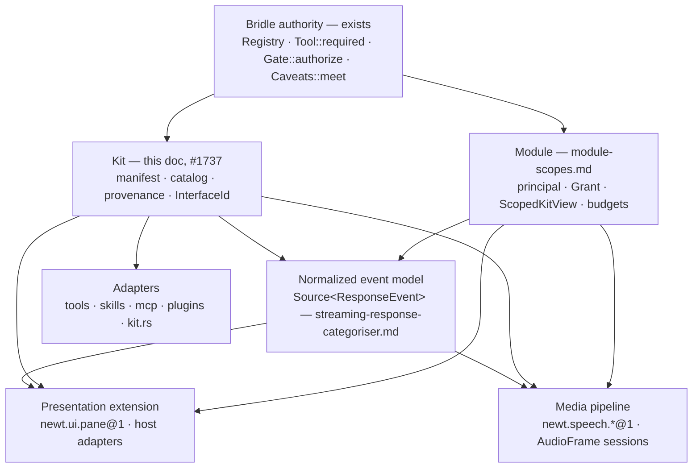

# Feature Proposal: Kit System — package, discovery, provenance

> **Status:** Draft — proposal, not normative · **Owner:** hartsock · **Last review:** 2026-08-16 · **Builds on:** [ocap_confinement_model.md](../decisions/ocap_confinement_model.md), [agent_bridle_publishing.md](../decisions/agent_bridle_publishing.md), [agentic_object_capability_security.md](../decisions/agentic_object_capability_security.md), [1528b3-cid-spill-identity.md](../decisions/1528b3-cid-spill-identity.md), `newt-core/src/kit.rs`, `newt-core/src/caveats.rs`, `newt-core/src/git_caveats.rs`, `newt-skills` (`SkillCaveats`), `plugins-protocol`, `newt-identity` · **Supersedes/Superseded by:** —

Tracking: [#1737](https://github.com/Gilamonster-Foundation/newt-agent/issues/1737) (A3 — Kit = package / discovery / provenance; Module = principal + Grant) under the
[#1734](https://github.com/Gilamonster-Foundation/newt-agent/issues/1734) companion train. Index:
[companion-roadmap.md](companion-roadmap.md). Sibling proposals: [module-scopes.md](module-scopes.md)
(who runs, with what Grant — owns `ScopedKitView`), [streaming-response-categoriser.md](streaming-response-categoriser.md)
(the normalized `ResponseEvent` stream), [tui-panel-system.md](tui-panel-system.md), [speech-pipeline.md](speech-pipeline.md),
[animated-companion.md](animated-companion.md), [desktop-shell.md](desktop-shell.md).

## One-paragraph summary

A **kit** is a *package*: a content-addressed artifact that says which **interfaces** it exports, which
interfaces each export *consumes*, where each implementation lives, and how much authority each export
**needs** to do its job. A kit **never grants** anything, and the kit *catalog* never hands out
anything that can be invoked or subscribed. Authority is minted by the host as the granted `Caveats`
(the *Grant*), and every export runs under the **meet** of granted-and-required — the one attenuation
algebra Agent Bridle already uses (`Gate::authorize(tool, &granted)` ⇒ `granted.meet(tool.required())`).
The kit system is therefore three things and only three: a **manifest** (what is here), a
**catalog** (what is available in this process — the existing `newt_core::kit` widened, not a fifth
registry), and a **provenance chain** (which bytes, signed by whom, produced this behaviour).
Kit = *what code/interface is available*; Module = *who is running with what Grant*; Bridle = *what
authority exists*; Interface = *what can be composed*; Event = *what happened*; View = *how a host
projects it*.

## Motivation

Newt has four parallel extension mechanisms, each with its own registration and discovery. Rows state
what is true on `main` today, not what the adapters below will make true:

| Mechanism | Crate(s) | Today's discovery | Today's authority |
|---|---|---|---|
| Skills — behavioural packages (prompts, hooks, sub-agents) | `newt-skills` | skill loader (frontmatter) | declarative `caveats:` frontmatter block → `SkillCaveats` (attenuation-only, mirrors the `Caveats` axes) — the direct ancestor of this doc's *required authority* |
| Tools — function implementations | Bridle `Registry` built in `newt-core/src/agentic/tools.rs` (`agent_bridle::Registry::builder()`, holds `shell` + `web_fetch`); every other builtin dispatches through the builtin `match` in the same file; `git` gates on its own `GitCaveats` lattice (`newt-core/src/git_caveats.rs`); `newt-tools` is the vi-minimal file surface (read/edit/search/apply_patch), not a Bridle registry | Bridle `Registry` for the two `agent_bridle::Tool`s; the builtin `match` for the rest | `shell`/`web_fetch`: `Tool::required()` ⊓ Grant via `Gate::authorize`; other builtins: `PermissionGate` / `OperatingModeControl` in front, **no per-tool `required()` ceiling**; `git`: `Caveats` ⊓ `GitCaveats` |
| MCP servers | `newt-mcp-server` / `newt-mcp-client` | `newt mcp add/list/probe` config | Bridle enforcement floor on the subprocess (`agent_bridle::ConfinedCommand`, `newt-mcp-client/src/lib.rs`) |
| Plugins — external processes | `plugins-protocol` (`PluginClient` / `PluginServer` / `PluginHandler`); the only in-tree host is the inference-provider plugin (`newt-inference/src/provider_plugin.rs`) | a `[backends]` provider-plugin entry names the command (`PluginClient::spawn_command`). The command-plugin manifest ([command_plugin_runtime.md](command_plugin_runtime.md)) is **proposed**, not implemented — no manifest loader or `~/.newt/commands` reader exists | process boundary + a delegated `AgentKey` cert chain (`newt_identity::delegate_for_plugin`, handed over `AGENT_KEY_ENV`) that the *plugin* verifies — attenuation by delegation, **no host-side Bridle enforcement floor today** (the spawn is a plain `tokio::process::Command`, `plugins-protocol/src/client.rs`; MCP, by contrast, goes through `ConfinedCommand`) |

Plus the *support-part* kit that already exists in code: `newt-core/src/kit.rs` (`Axis`, `Tier`,
`MountKind`, `RegistryEntry`, `COMPONENT_REGISTRY`, `component()`, `is_known()`), assembled by
`[bundles.*]` / `Loadout.kit` ([loadout-composition.md](loadout-composition.md),
[model-support-kit.md](model-support-kit.md)) and pinned to `KNOWN_TECHNIQUES` by a drift test.

What is missing is one **package + discovery + provenance** shape they can all be described in — *not*
a second authority system. This proposal introduces no `KitPermissions`, no
`PermissionEvaluator`, no `RemoteCallablePolicy`, and no registry-level `call()` that authorizes.
Bridle is the sole authority plane; anything that looks like a permission vocabulary in this doc is
declarative *required* authority, expressed in Bridle's own lattice algebra.

## Layer model

```
┌──────────────────────────────────────────────────────────────────────────┐
│ Package / provenance   Kit: manifest CID → artifact CID → signer          │  what bytes, from whom
├──────────────────────────────────────────────────────────────────────────┤
│ Interface              InterfaceId + base shapes; Source<ResponseEvent>   │  what can be composed
├──────────────────────────────────────────────────────────────────────────┤
│ Authority (Bridle)     granted ⊓ required, one lattice algebra → Gate     │  what may happen
├──────────────────────────────────────────────────────────────────────────┤
│ Execution              builtin · subprocess · WASM · remote principal     │  where it runs / trust
└──────────────────────────────────────────────────────────────────────────┘
```

Each layer answers one question and owns no vocabulary from another. The manifest is the only new
data type this proposal introduces — and even it has prior art in the workspace (`SkillCaveats`,
`RegistryEntry`, the proposed command-plugin manifest); every other row already exists in code or in
a sibling ADR.

### Vocabulary (every type this doc uses, defined once)

| Type | Definition | Where it lives / comes from |
|---|---|---|
| `KitId` | Stable package identifier string, e.g. `github.com/org/kit-name` (a label; identity is the manifest CID) | this doc |
| `ExportId` | Local name of one export inside a kit (`stt`, `git_commit`); fully qualified as `<KitId>/<ExportId>`; canonical identity is `(manifest CID, ExportId)` | this doc |
| `InterfaceId` | Namespaced, major-versioned string `<namespace>.<name>@<major>` naming a base shape plus domain semantics (`newt.speech.stt@1`) | this doc, §2 |
| `ContentId` | BLAKE3 CIDv1 over canonical dag-cbor — `content_addressable::ContentId`, the type `SpillCid` wraps per 1528b3 | workspace dep `content-addressable` |
| `ImplRef` | Where an export executes: `Builtin` · `Native { dylib }` · `Wasm { component }` · `Subprocess { cmd, protocol }` · `Remote { principal, endpoint }` | this doc, §4 |
| `Caveats` | The signed Bridle wire lattice (six axes) — `agent_mesh_protocol::Caveats`, re-exported at `newt_core::caveats` | agent-mesh-protocol 0.6.3 |
| `DomainCaveats` | A per-`InterfaceId` lattice obeying the same `top`/`leq`/`meet` laws, composed beside `Caveats` (`GitCaveats` precedent) | the interface's owning crate |
| `RequiredAuthority` | `{ bridle: Caveats, domain: Option<DomainCaveats> }` — the declared **ceiling** for one export | this doc, §1 |
| `PrincipalId` | The id of a `newt-identity` `AgentKey` (`AgentKey::fingerprint()`, an agent-mesh-protocol `Fingerprint`); the "P" in the audit sentence. Defined in [module-scopes.md](module-scopes.md); `ActorId` is an alias | `newt-identity` / agent-mesh-protocol |
| `ProvenanceRecord` | `{ principal: PrincipalId, grant_digest, manifest_cid: ContentId, export_id: ExportId, artifact_cid: ContentId }` — one per authorized invocation / session open | this doc, Provenance |
| `Provenance` | The verified chain for a loaded kit: manifest CID → artifact CID → signer / attestation | this doc, Provenance |

### 1. Package layer — `KitManifest`

```rust
// sketch — illustrative, not compiled
pub struct KitManifest {
    /// Stable identifier, e.g. "github.com/org/kit-name".
    pub id: KitId,
    pub version: semver::Version,
    /// Content identity of the artifact this manifest describes — a reuse of
    /// `content_addressable::ContentId` (BLAKE3 CIDv1 of canonical dag-cbor), the
    /// same type `SpillCid` wraps per 1528b3. See Provenance.
    pub artifact: ContentId,
    pub metadata: KitMetadata,          // name, description, license, tags — display only
    pub exports: Vec<Export>,
}

pub struct Export {
    /// Local name inside the kit ("stt", "git_commit", "companion_view").
    /// Fully qualified as `<kit id>/<export id>`; canonical identity is
    /// (manifest CID, export id) — see Discovery.
    pub id: ExportId,
    /// Which interface this export implements (open world — see Interface layer).
    pub interface: InterfaceId,
    /// Interfaces this export needs handed to it: subscriptions (`Source<_>`),
    /// publishers (`Sink<_>`), callables (`Action<_,_>`). The host mints a scoped
    /// capability handle for each declared import, and ONLY for declared imports,
    /// under `granted.meet(required)`. Nothing here is an ambient bus.
    pub consumes: Vec<InterfaceId>,
    /// Interfaces this export produces beyond `interface` (e.g. `Source<PaneEvent>`).
    pub provides: Vec<InterfaceId>,
    /// Where the implementation lives (see Execution layer).
    pub implementation: ImplRef,
    /// The authority ceiling this export promises to stay under — DECLARATIVE.
    /// Same semantics as `agent_bridle_core::Tool::required()`: the Grant is met
    /// with this; the export runs under the meet. Declaring more than the Grant
    /// allows is not an error — the meet intersects it away.
    pub required: RequiredAuthority,
}

/// One authority algebra, two carriers (see Authority layer).
pub struct RequiredAuthority {
    /// The signed Bridle wire lattice (agent-mesh-protocol `Caveats`:
    /// fs_read / fs_write / exec / net / max_calls / valid_for_generation).
    pub bridle: Caveats,
    /// Optional per-InterfaceId domain lattice obeying the same top/leq/meet laws
    /// (the `GitCaveats` precedent), bounding the handles minted for
    /// Session/Source/Sink/View exports. Absent ⇒ that interface has no domain axes.
    pub domain: Option<DomainCaveats>,
}
```

Rules that keep this a package format and not a permission engine:

* `required` is a **ceiling, not a demand** — identical to the `Tool::required()` doc-comment in
  agent-bridle-core 0.7.15. Effective authority is always `granted.meet(required)`, on each lattice.
  The manifest cannot widen anything; a kit that lists `Caveats::top()` simply runs under exactly the
  Grant.
* There is **no `permissions:` block, no allow-lists, no peer lists.** "Who may call this export from
  the mesh" is a property of the *calling principal's* Grant (a delegated `Caveats`, #739), not of the
  manifest.
* `consumes` is the only way an export receives anything from the host. A pane that does not declare
  `Source<ResponseEvent>` never sees the response stream, whatever its Grant.
* `metadata` is labels for humans; nothing routes on it.
* The manifest carries **no `KitKind` enum**. What an export *is* is stated by its `InterfaceId`.

Mapping onto what exists:

| Existing thing | Becomes / is described as |
|---|---|
| `newt-core/src/kit.rs` `RegistryEntry { id, kind: MountKind, axis, presupposes, tier }` | *is* an `Export` (derived, not mirrored): `InterfaceId` encodes the mount shape (`newt.support.provider@1`, `newt.support.per_turn@1`, …); `axis`/`tier`/`presupposes` stay as interface-level metadata; the builtin workspace kit `newt.core` exports every `COMPONENT_REGISTRY` row |
| `[bundles.*]` / `Loadout.kit` | a *selection* over exports (which are enabled for this loadout) — bundles keep composing; the manifest is what they compose from |
| Bridle `Registry` + `Tool` | the in-process registry for `Action`-shaped exports; `Export.required.bridle` **is** `Tool::required()` for the two Tools that have one today, and *defines* one (declarative data) for every builtin that does not |
| `newt-skills` `caveats:` frontmatter → `SkillCaveats` | `Export.required.bridle` — the block already mirrors the `Caveats` axes and is attenuation-only |
| `git` + `GitCaveats` | `Export.required.domain = GitCaveats` — the precedent for a per-interface domain lattice |
| `plugins-protocol` provider plugins (`[backends]` entries) — and the *proposed* command-plugin manifest ([command_plugin_runtime.md](command_plugin_runtime.md)) once it exists | an `Export` with `ImplRef::Subprocess { .. }` |
| MCP server entries (`newt mcp add`) | an `Export` with `ImplRef::Subprocess`/`ImplRef::Remote`, interface `mcp.server@1` |

### 2. Interface layer — an open algebra

An `InterfaceId` is a stable, namespaced string with a major version: `<namespace>.<name>@<major>`
(`newt.speech.stt@1`). It names a *shape* plus *domain semantics*. Shapes are a small closed set;
the ids are an open world. The `Session<Cmd, Event>` shape carries a control side
(`SessionMsg<Cmd> = Data(Stamped<Cmd>) | Control(SessionControl)`) as part of the shape itself —
one multiplexed stream on the wire; the control vocabulary is fixed in
[speech-pipeline.md](speech-pipeline.md).

| Base shape | Meaning | Existing analogue on `main` |
|---|---|---|
| `Action<Req, Resp>` | request/response, one shot | Bridle `Tool::invoke`; the builtin tool `match` |
| `Source<Event>` | produces events | **canonical: `Source<ResponseEvent>`** ([streaming-response-categoriser.md](streaming-response-categoriser.md)); today's untyped `OutputStream`/`OutputChunk` producers on `OutputSink` (`session.rs`) are what it replaces |
| `Sink<Event>` | consumes events | `OutputSink` consumers; `SteeringInbox` is a Sink *from the host's side* (agent input), not a Source |
| `Transform<In, Out>` | stream in → stream out | `ThinkFilter` lineage (the tag-parser compatibility adapter) |
| `Session<Cmd, Event>` | long-lived, cancellable, bidirectional | STT/TTS sessions |
| `View<State>` | projects a state for a host to render | panes, companion |

Domain semantics live in the id, not in an enum. The domain shapes below are owned by the sibling
docs; this table only fixes the id convention:

| InterfaceId (illustrative) | Shape | Owner |
|---|---|---|
| `newt.session.response@1` | `Source<ResponseEvent>` — the normalized stream every consumer routes on. The `Source` item is the enveloped event, `ResponseEnvelope { turn, seq, actor, origin, event }`; `Source<ResponseEvent>` is that doc's shorthand for the enveloped stream | streaming-response-categoriser.md |
| `newt.speech.stt@1` | `Session<AudioFrame, TranscriptEvent>` | speech-pipeline.md |
| `newt.speech.tts@1` | `Session<SpeechRequest, TtsEvent>` (`TtsEvent::Audio` carries the `AudioFrame`s; alignment and done ride the same stream) | speech-pipeline.md |
| `newt.companion.view@1` | `View<PresenceSnapshot>` | animated-companion.md |
| `newt.ui.pane@1` | `View<PaneModel>` (UI docs say **pane**: `PanelOutcome` already exists twice — `newt-scheduler/src/panel.rs` and `newt-tui/src/config_panel.rs`) | tui-panel-system.md |
| `newt.tool.action@1` | `Action<Json, Json>` — a Bridle `Tool` ≅ `Action<serde_json::Value, serde_json::Value>`: `invoke(args, &ToolContext) -> ToolResult<serde_json::Value>`, request shape given by `Tool::schema()`, errors as `ToolError` | this doc |
| `newt.support.provider@1` etc. | the `MountKind` rows of `kit.rs` | this doc |

Adding a new domain — say `newt.vision.ocr@1` as `Action<ImageRef, Text>` — is a new id and a schema,
not a variant added to a `KitKind` enum in `newt-core`. Hosts that do not know an id ignore that
export (discovery is by id, so unknown ids cost nothing).

### 3. Authority layer — one algebra, Bridle owns it

The kit system adds **no decision points**. It adds *data* (declared ceilings) that the existing
decision points consume. The contract this proposal relies on:

* The host mints the Grant per principal — see [module-scopes.md](module-scopes.md) for the child
  invariant: `child.key = newt_identity::attenuate(&parent.key, &parent.grant.meet(requested).meet(host_clamp))`,
  with a Module's Grant being `newt_identity::enforced_caveats(&key)` (#739).
* `Gate::authorize(tool, &granted)` computes `effective = granted.meet(tool.required())`; `GatePolicy`,
  `Discharge`, `authorize_with_discharge`, `authorize_step_up` are the *only* decision points for
  `Action` exports. `PermissionGate` / `OperatingModeControl` and `ExposureProfile` / `ExposureClass`
  sit in front of the Gate as they do today.
* The `Registry` holds `Tool`s and has **no ambient authority**; the kit catalog inherits that
  property by construction because it holds *descriptors*, not handles or grants.

**Why `required` is not just `Caveats`.** The signed wire `Caveats` has exactly six axes (`fs_read`,
`fs_write`, `exec`, `net`, `max_calls`, `valid_for_generation`). That is the right carrier for
`Action` exports and for the fs/net/exec effects of *any* export (cloud STT declares `net`; local
whisper on a `.wav` declares nothing). It cannot say "microphone capture", "subscribe to session S's
`ResponseEvent`s", or "publish `PaneEvent`s to pane host H" — and `Gate::authorize` takes a
`&dyn Tool`. Today only `shell`/`web_fetch` are in the Bridle `Registry`; the Gate is also reached
directly by the spawn-context tools `ExecSpawnTool` (confined exec, `newt-core/src/confined_exec.rs`)
and `McpSpawnTool` (MCP subprocess, `newt-mcp-client/src/lib.rs`) — every one of them
`Action`-shaped. Streams and sessions have no Gate path at all. The workspace
already solved this once: `GitCaveats` is a *separate small lattice with the same `top`/`leq`/`meet`
laws, composed alongside the signed `Caveats`, never merged into it*, because git authority does not
map onto the wire axes. `SkillCaveats` is the declarative-in-a-manifest form of the same idea.

So the rule is:

| Export shape | Carrier of `required` | Who computes the meet | What the meet bounds |
|---|---|---|---|
| `Action<_,_>` | `required.bridle: Caveats` (= `Tool::required()`) | `Gate::authorize`, as today | the invocation |
| `Session` / `Source` / `Sink` / `View` / `Transform` | `required.bridle` for fs/net/exec effects **and** `required.domain: DomainCaveats` for the interface's own axes (e.g. `SpeechCaveats { mic, speaker }`, `PaneCaveats { subscribe: Scope, publish: Scope }`) | the host that mints the export's capability handles: `granted.meet(required)` on each lattice, computed once at mint time | the handles for declared `consumes`/`provides` — a handle is minted only for a declared import, and only within the meet |

This is **one authority algebra** — lattice element, `top`, `leq`, `meet`, attenuation-only — with
two carriers, not a second vocabulary. A `DomainCaveats` type must (a) implement the same laws —
pinned by a **shared lattice-law test** that #1737 introduces (a `macro_rules!` / `proptest`
strategy over `top` / `leq` / `meet`: reflexivity, antisymmetry, `meet ⊑` both operands, `top` is
the identity) and applies first to `GitCaveats`, whose lattice tests today are example-based
(`meet_attenuates_never_amplifies`, `leq_is_the_attenuation_order`, … in
`newt-core/src/git_caveats.rs`) — (b) live beside the interface that owns it,
and (c) never be merged into the signed `Caveats`. If a domain axis turns out to be universal
(microphone/speaker are candidates), the right move is an upstream axis in agent-mesh-protocol
`Caveats`, filed against that crate — not a newt-side fork of the wire type.

### 4. Execution / trust matrix

`ImplRef` says *where* an export runs. Trust follows the boundary, never the manifest.

| `ImplRef` | Boundary | Trust class | What actually confines it | What `artifact` names |
|---|---|---|---|---|
| `Builtin` — Rust in this workspace | none (same process) | **trusted** | code review + declared `required` ceiling; the process is the TCB | the newt binary: build id / git rev of the workspace, recorded once at startup |
| `Native { dylib }` — `dlopen` | none once loaded | **trusted-only** | nothing: in-process native code has the process's full power; there is no capability sandbox after `dlopen`. Load only artifacts whose signer is on the host's trusted-signer list (config), or not at all | CID of the dylib bytes |
| `Wasm { component }` | WASM component model | **constrained** | imports are exactly the capability handles minted for declared `consumes`; no ambient fs/net/exec | CID of the component bytes |
| `Subprocess { cmd, protocol }` — `plugins-protocol`, MCP servers | process | **constrained** | Bridle enforcement floor (sandbox/rootfs/net_proxy) + protocol surface. Today MCP has the floor (`ConfinedCommand`); provider plugins are spawned unconfined and rely on the delegated `AgentKey` chain the plugin verifies — bringing them under the floor is part of this row, not assumed | CID of the executable / OCI image when we own the bytes; otherwise the resolved path + hash at load |
| `Remote { principal, endpoint }` — mesh peer | network + principal | **constrained** | remote runs under its own delegated Grant (`Caveats::meet`, #739); we see a principal, not code | unknowable locally unless the peer attests a CID; the audit sentence degrades to *principal-only* |

Two consequences:

* In-process modules are **not** an isolation boundary. Builtin/native code gets *logical* scoping and
  *accounting* (which principal, which budget); hard isolation begins at WASM/process/container.
* Hot reload is therefore a property of the WASM/subprocess rows only; a native dylib is neither
  safely unloadable nor confinable and should be treated as part of the binary.

## Discovery / catalog

The catalog is `newt_core::kit` **widened**, not a new index beside it — the reuse doctrine forbids a
fifth registry (Bridle `Registry`, `COMPONENT_REGISTRY`, MCP config, plugin manifests, …). Concretely:
`RegistryEntry` becomes (or derives) an `Export`; `component()` / `is_known()` become catalog lookups
over the builtin `newt.core` kit; the `KNOWN_TECHNIQUES` drift test pins the widened form.

```rust
// sketch — illustrative, not compiled
pub struct KitCatalog { /* manifest CID → LoadedKit */ }
pub struct LoadedKit { pub manifest: KitManifest, pub provenance: Provenance }

/// A DESCRIPTOR. Nothing in it can be invoked or subscribed.
pub struct ExportDescriptor<'a> {
    pub kit: &'a KitId,
    pub manifest_cid: &'a ContentId,
    pub export: &'a Export,          // id, interface, consumes, provides, required, implementation
    pub provenance: &'a Provenance,
}

impl KitCatalog {
    pub fn load(&mut self, source: KitSource) -> Result<KitId, KitError>;   // verify CID + signer, index exports
    pub fn unload(&mut self, id: &KitId) -> Result<(), KitError>;           // WASM/subprocess only
    pub fn exports(&self, iface: &InterfaceId) -> impl Iterator<Item = ExportDescriptor<'_>>;
    pub fn all(&self) -> impl Iterator<Item = ExportDescriptor<'_>>;             // every loaded export (what ScopedKitView filters)
    pub fn resolve(&self, name: &str) -> Result<ExportDescriptor<'_>, KitError>;  // bare or qualified name
    pub fn get(&self, id: &KitId) -> Option<&LoadedKit>;
}
```

There is deliberately **no `call()`, and no handle type in the catalog's API.** An ocap reference *is*
authority, so a catalog that returned invocable handles would be the forbidden authorizing registry
under another name. A Module obtains callable/subscribable handles only from the host that mints them
under `granted.meet(required)` — the Grant-scoped projection module-scopes.md defines as
`ScopedKitView`: `visible()` is the set of catalog exports the module's loadout selection exposes
(data), each annotated with `effective = grant.meet(&export.required.bridle)` — a pure lattice
annotation computed with `Caveats::meet` alone; the view never calls the Gate (`Gate::authorize`
never refuses on authority, and it charges a call). Handles are then minted per interface by the
minting hosts: for actions, **the module's own Gate** (`Gate::with_budget(host_generation,
grant.max_calls)` carrying the host's sandbox kind and strength floor — module-scopes.md, "Module
runtime"; `Module::call` authorizes there and invokes `Tool::invoke(args, &ctx)`), the
session/stream owner for `Session`/`Source`/`Sink`, the pane host for `View`. That is the one
invocation path both docs name; `Registry::dispatch` is *not* it, because it mints a fresh
`Gate::with_budget(registry.generation, granted.max_calls)` per call and so cannot carry a
persistent per-module budget. `KitCatalog` answers
"what is here"; `ScopedKitView` answers "what may *this* module see"; the Gate and the minting hosts
answer "may you". Type-level rule: **no method on `KitCatalog` returns anything that can be invoked or
subscribed without a Grant argument.**

Bridle widening this depends on: agent-bridle-core 0.7.15 `Registry` exposes only `builder()`,
`tool_definitions()`, `tool_names()`, `contains()` and `dispatch*` — no lookup of a `&dyn Tool` by
name and no iteration. Until a `Registry::tool(name)` / `required(name)` accessor lands (filed
against agent-bridle-core), the host keeps its own `Arc<dyn Tool>` table beside the `Registry` (the
builtin `match` in `agentic/tools.rs` already is one) and hands `Module::call` the `&dyn Tool`.

Names and collisions:

* Fully qualified export name: `<kit id>/<export id>` (`github.com/org/speech-kit/stt`). Canonical
  identity — what the audit tuple and the lock carry — is `(manifest CID, export id)`.
* Bare ids (`ambient_prompt_watcher`, what `[bundles.*]` names today) resolve iff exactly **one**
  loaded kit exports that id; two loaded kits exporting the same bare `ExportId` is a
  `Config::validate` error naming both qualified names, never a silent first-wins.
* Drop-in `.toml` masks or adds by qualified name; the builtin `newt.core` kit's exports keep their
  bare ids so existing loadouts parse unchanged.

Composition seams (the three Cs): the catalog is data. `[bundles.*]` selects exports by name, drop-in
`.toml` can add or mask an export, and `Config::validate`'s `presupposes` check keeps working
unchanged for support parts.

## Provenance chain

```
foo@1.4.2  ──►  manifest CID  ──►  artifact CID  ──►  signer (publisher key) / attestation
 (name)         (what it claims)    (the bytes)         (who vouches)
```

* `ContentId` is `content_addressable::ContentId` — BLAKE3 CIDv1 over canonical dag-cbor, exactly the
  derivation 1528b3 fixes for spill records (`StagedSpill::from_record` discipline; workspace dep
  `content-addressable`). A CID proves *these bytes hash here*, never *this agent may*. The manifest
  CID covers the manifest bytes, which include the artifact CID.
* Names (`foo@1.4.2`) are labels that resolve to a manifest CID via a **lock**; the lock is what a
  loadout pins. Today `Loadout.kit` / `[bundles.*]` name bare technique ids and the "lock" is the
  workspace binary itself (every export is `Builtin`); the lock file only appears once a non-builtin
  kit is loaded, and it maps `name → (manifest CID, artifact CID)`.
* **Signers are publisher keys, not the local principal.** `newt-identity` (`UserKey` / `AgentKey`,
  ed25519, attenuation-only via agent-mesh-protocol) is *principal* identity — `PrincipalId`, the
  "P" in the audit sentence below ([module-scopes.md](module-scopes.md)). A kit publisher's signing key is a different party; the host's **trusted-signer
  roots are config data** (three Cs — a `[kits.trust]` table / drop-in `.toml`), never a list in code.
* The point of the chain is one auditable sentence: **"principal P received authority X while
  executing artifact CID Y."** The carrier is a new **`ProvenanceRecord { principal, grant_digest,
  manifest_cid, export_id, artifact_cid }`** emitted once per authorized invocation (actions) or
  once per session/handle open (streams/views), alongside the Bridle `ToolEnvelope` or the session
  log entry. It is *not* the attribution ledger (`AttributionLedger` is the per-commit
  `Co-authored-by` set, written at commit time — never a per-invocation carrier) and *not*
  agent-bridle-core's `EnforcementReport` (per-axis fence strength); those stay what they are.
* Trust decisions (the Native row above; whether to auto-load a subprocess plugin) key on the
  **signer**, never on the name.

## Adapters

Each existing mechanism gets a thin adapter that *derives* manifests from what it already has — no
behaviour moves, and no adapter is a new index:

| Adapter | Produces | Notes |
|---|---|---|
| Bridle `Registry` (`shell`, `web_fetch`) → kit | one `Export` per `Tool`, `required.bridle = tool.required()`, `ImplRef::Builtin` | zero new authority code; the Gate path is untouched |
| builtin tool `match` (`newt-core/src/agentic/tools.rs`) → kit | one `Export` per builtin; `required.bridle` **defined** as declarative data (these tools have no `required()` today); `git` adds `required.domain = GitCaveats` | this is where a ceiling appears for the first time; `PermissionGate` stays in front |
| `newt-skills` → kit | `Export`s with `newt.skill.*` ids; `SkillCaveats → required.bridle` | prompts/hooks are data already; the frontmatter block is the manifest fragment |
| `newt-mcp-*` → kit | `Export` per configured server, `ImplRef::Subprocess`/`Remote` | `newt mcp list` becomes a catalog view |
| `plugins-protocol` → kit | one `Export` per `[backends]` provider-plugin entry, `ImplRef::Subprocess`; when the *proposed* command-plugin manifest ([command_plugin_runtime.md](command_plugin_runtime.md)) lands it maps ↔ `KitManifest` losslessly | `PluginServer` side untouched |
| `kit.rs` support parts | `RegistryEntry` **is** an `Export` (interface from `MountKind`) in the builtin `newt.core` kit | pinned by the same drift test as `KNOWN_TECHNIQUES`; not an adapter — the widening itself |

## Dependency + acceptance graph

No schedule; each box lists what must be true before the next can be reviewed. Ordering matches
[companion-roadmap.md](companion-roadmap.md): Bridle ⇢ {Kit, Module} as siblings ⇢ {normalized event
model, presentation extension, media pipeline} ⇢ {desktop, companion}.



The speech / pane / companion `InterfaceId`s depend on the event model box, not only on the manifest
type: each of them `consumes` `Source<ResponseEvent>`.

Acceptance for #1737 (each item is a test or a mechanical gate in the unit tier, fully mocked):

1. **Types round-trip.** `KitManifest` / `Export` / `RequiredAuthority` / `InterfaceId` / `ImplRef`
   serialize and deserialize losslessly (serde round-trip test per type; `consumes` / `provides`
   present in the fixture and equal after round-trip).
2. **Bridle adapter is transparent.** For `shell` and `web_fetch`, `Export.required.bridle ==
   tool.required()` (assert_eq); for a fixed `(tool, granted)` fixture, `Gate::authorize`'s resulting
   `ToolContext` effective caveats are equal with and without the catalog in the path. For the
   builtin `match`, every builtin name has an `Export` with a declared `required.bridle`
   (exhaustiveness test over the match arms), and `git`'s `required.domain` round-trips to
   `GitCaveats` (assert_eq).
3. **Widened, not mirrored.** `RegistryEntry → Export` is a total function covered by a test over
   `COMPONENT_REGISTRY`; `component()` / `is_known()` are implemented via the catalog (the old
   lookup is deleted — grep gate); the `KNOWN_TECHNIQUES` drift test still passes unchanged.
4. **Catalog holds no authority.** A compile-time assertion (`static_assertions` or a doc-test that
   must fail to compile) shows no `KitCatalog` method returns `dyn Tool`, `ToolContext`, or any
   `Subscription`/`Publisher`/`Session` handle; a grep gate rejects `fn call` on `KitCatalog`. A
   Module's visible set is `ScopedKitView` (module-scopes.md acceptance #3 — a pure function of
   selection data and Grant, zero Gate calls), never the catalog.
5. **Provenance fails closed.** `KitCatalog::load` returns `KitError::CidMismatch` for a fixture whose
   artifact bytes do not hash to the manifest's `artifact` CID; a fixture manifest with
   `ImplRef::Native` and a signer absent from the configured `[kits.trust]` roots returns
   `KitError::UntrustedSigner`, and succeeds when the same signer is added to the config fixture
   (manifest-level rule only — the loader is out of scope). No trusted-signer literal appears in code
   (grep gate).
6. **Audit tuple.** For one authorized `shell` invocation under a mocked identity and a fixture
   manifest, exactly one `ProvenanceRecord { principal, grant_digest, manifest_cid, export_id,
   artifact_cid }` is emitted, and for `ImplRef::Builtin` its `artifact_cid` equals the recorded build
   id.
7. **One authority algebra.** #1737 introduces a shared lattice-law test (a `macro_rules!` /
   `proptest` strategy asserting the `top`/`leq`/`meet` laws in §3) and applies it to `GitCaveats`
   and to every `DomainCaveats` type in the diff (a grep gate asserts each `impl` of the domain-lattice
   trait is named in one invocation of that macro); a grep gate asserts none of
   `KitPermissions`, `PermissionEvaluator`, `RemoteCallablePolicy`, `KitKind`, `ExportHandle` exists.

## Out of scope

* Any authorization logic — lives in Bridle (agent-bridle-core), consumed unchanged. New universal
  axes go upstream to agent-mesh-protocol `Caveats`.
* WASM runtime selection and the dylib loader — deferred until a constrained/native row is actually
  needed; subprocess + builtin cover every current mechanism. #1737 tests only the manifest-level
  refusal rule for `ImplRef::Native` (acceptance #5); the loader's own checks are a follow-on
  criterion filed with the loader.
* Mesh-wide kit *calls* — the mesh sees principals with delegated Grants (#739); kit discovery over
  the mesh is a catalog exchange and belongs with `newt-mesh`.
* The domain shapes of speech / pane / companion interfaces — owned by the sibling docs.

## Open questions

1. Versioning: semver + lock (manifest CID pins) is assumed; is a compatibility matrix per
   `InterfaceId` major needed beyond "same major"?
2. Should `Export.required` be permitted to reference host-defined `Caveats` presets by name (config,
   not code) so kits stay portable across hosts with different scope vocabularies?
3. Where does the catalog live for the headless wyvern tier — same crate behind a feature, or a
   `newt-core` module (`Tier::Headless` must keep working with no TUI)?
4. Which domain axes are universal enough to become upstream `Caveats` axes (microphone/speaker are
   the obvious candidates) versus staying per-interface `DomainCaveats`?

## Related work

* WASI component model (wit) — the constrained-row target.
* VS Code extension manifest — package/discovery shape (explicitly *not* its permission model).
* OCI/Sigstore — content-addressed artifacts + signer provenance.

## Change log

- 2026-08-16: removed the authorizing-registry shape (`KitPermissions`, `PermissionEvaluator`,
  `RemoteCallablePolicy`, `KitKind`, a catalog `call()`); the catalog became descriptor-only, the
  manifest declares *required* authority as a Bridle-lattice ceiling, and interface ids moved to the
  `<namespace>.<name>@<major>` form (`newt.ui.pane@1`).
