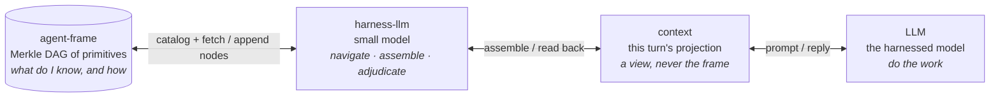
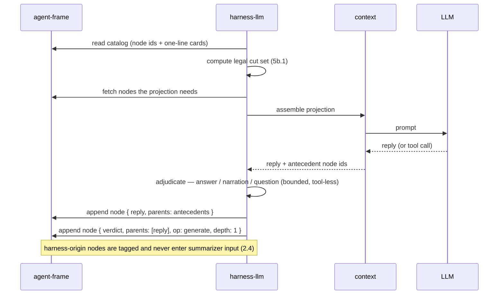
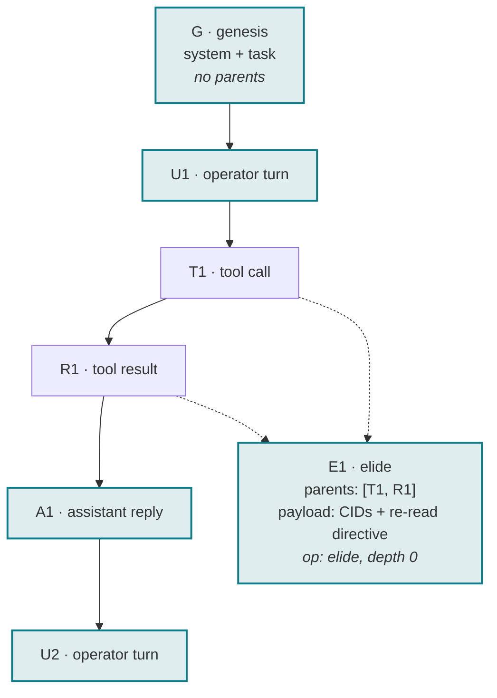
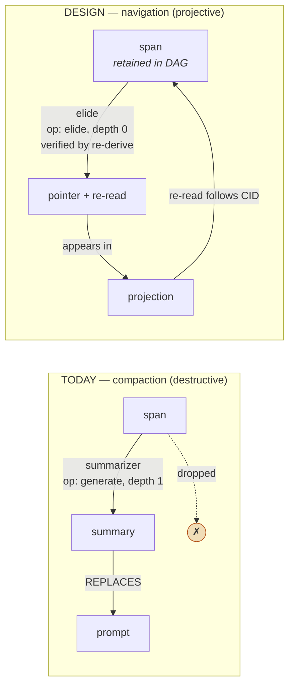
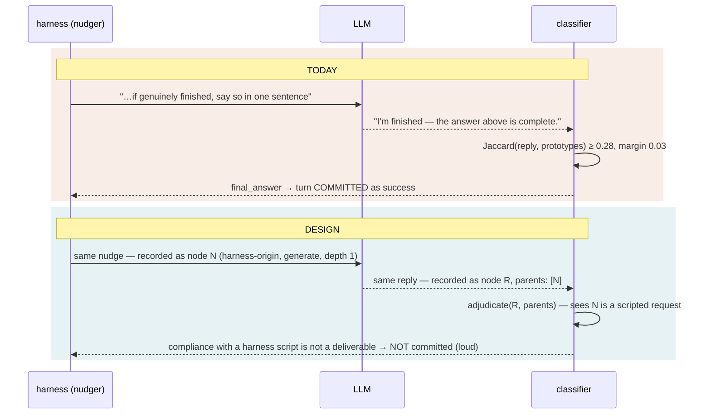
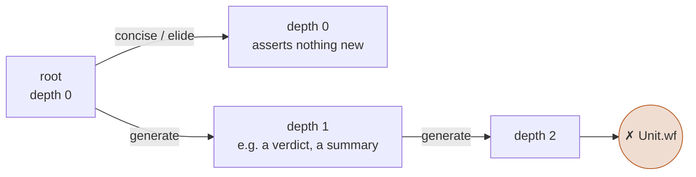

# Smart harness — design record

> **Canonical copy.** Mirrored on the knowledge board as
> `board/newt-agent/2026-09-08_smart-harness-DESIGN-RECORD.md`; on drift, this
> file wins because it is versioned with the code it describes. Prior decisions
> this builds on: `docs/decisions/1528b3-cid-spill-identity.md`,
> `docs/decisions/1528b3-proactive-compaction.md`.

**Status:** DESIGN LOCKED, 2026-09-08. Nothing implemented yet. **All thirteen
decisions are LOCKED** — nine against code or a machine-checked law that already
exists, and D10–D13 by the operator on 2026-09-08. Implementation may begin.

Companion: knowledge board `2026-09-08_harness-as-a-tiny-llm-DESIGN.md` (the
thesis and its recovery). This document is the accounting.

---

## 0. Inventory — what is reused, not designed

Per the provenance-audit rule: enumerate what exists before designing the gap.

| already exists | where | role here |
|---|---|---|
| `MerkleNode<T>` (payload + ordered parent set, id over both), `ContentId`, `NodeStore`, canonical dag-cbor | `content-addressable` 0.1.2, already a workspace dependency | **the node, the id, the store trait.** Hand-rolling any of these is a defect |
| `Op = concise \| elide \| generate`; `depthAfter: generate ⇒ d+1`; `Unit { op, depth, root, life, addressed }`; `Unit.wf: depth ≤ 1` | `agent-frame/formal/ContextOps.lean` — machine-checked | **the derivation laws** |
| invariants §1–§8; ledger newt 29 ✓ / 6 partial / 5 open / 1 rejected | `agent-frame/docs/INVARIANTS.md`, `V0-DECISION.md` | **the obligations** |
| `SpillStore` + `SpillProvenance::CompactionSpan` — content-addressed, redact-on-store, fail-closed on collision | `newt-core` | **storage.** agent-frame v0 defers the session store *"specifically because it already exists in newt"* |
| `adjudicate.rs` — one bounded, tool-less side call; strict reply parse; `AdjudicationFailure` returned so the harness *tells* the operator | `newt-core/src/agentic/adjudicate.rs`, live at `newt-tui/src/chat.rs:6680` | **the harness-llm call shape** |
| `BackendKind::Embedded` (#639), `BackendRef` | `newt-core/src/config.rs` | **the non-contending backend** and its override |

**What is new:** one node payload type, one navigation loop, one classifier
adoption, and the rule that harness output is never evidence. That is the whole
gap.

---

## 1. The four layers

```
agent-frame  <->  harness-llm  <->  context  <->  LLM
```



**The main model never touches the frame.** It sees a projection. The
harness-llm is the only navigator, and everything the main model produces goes
back into the frame *through* the harness-llm, which is where it gets
classified and recorded.

---

## 2. One turn, end to end



Two things the diagram fixes that prose leaves loose: **the cut set is computed
by the harness, not chosen by a caller** (5b.1), and **the verdict is a node with
the reply as its parent** — which is what lets a later reader ask "why was this
turn recorded as done?" and get a CID, not a `⚠` glyph.

---

## 3. The frame is a DAG; context is a projection



Highlighted nodes are **this turn's projection**: `{G, U1, E1, A1, U2}`. The
elided pair `{T1, R1}` is still in the DAG; the projection carries `E1`, a
pointer to them with a re-read directive. **Nothing was deleted.** That is the
entire difference from compaction, and it is what invariant 3.4 already asks
for: *name what was compacted with a re-read directive*. Content-addressing
makes the name verifiable.

A genesis node has no parents. `--hermetic` therefore reduces to "start at
genesis"; `--resume <cid>` starts at a node that has one. The flag and the data
structure say the same thing from two directions.

---

## 4. Compaction vs navigation — the one edge that changes



Left: the span is replaced by a `generate` (depth 1) and then dropped — the
9/10-silently-wrong failure recorded under invariant 3.1. Right: the span is
retained; the projection carries an `elide` (depth 0, `checkOf .elide =
.rederive`, so it asserts nothing and is verified by deterministic recompute —
exactly what agent-frame v0 mints and nothing more); and the arrow back is the
re-read. **The summarizer is not made smarter. It is demoted to one navigation
strategy among several.**

---

## 5. The #2239 fix, structurally



The classifier does not get smarter prototypes. It gets **the antecedent**: the
reply's parent is the nudge node, tagged harness-origin. A reply whose only
parent is a harness script is not evidence of completion, by rule. This is
invariant 2.4 — *harness process-corrections must not enter the summarizer
input; a small model echoes loop guidance back* — enforced by the DAG instead
of hoped for.

---

## 6. The depth bound



`Unit.wf: depth ≤ 1`. A harness verdict over a reply is depth 1. A summary of a
summary is depth 2 and is **illegal by construction** — which is the
derivation-depth bound this line has already concluded is the only novel claim
in the context-management literature it surveyed. The frame makes it a type
error rather than a policy.

---

## 7. Decisions

| # | decision | grounded in | status |
|---|---|---|---|
| **D1** | A frame primitive is `MerkleNode<Primitive>`; `Primitive` carries agent-frame's `Unit` fields (`op`, `depth`, `root`, `life`, `addressed`) plus the typed payload. No hand-rolled id, chain, or manifest. | `content-addressable::merkle`, `ContextOps.lean` | **LOCKED** |
| **D2** | Context is a projection of the frame — a selected node set rendered for one turn. Compaction is replaced by elision + re-read. The DAG is never pruned within a session. | invariants 3.1, 3.4 | **LOCKED** |
| **D3** | The harness-llm is the only navigator. It is a bounded, tool-less side call in the `adjudicate.rs` shape. | `adjudicate.rs` (#1749), live | **LOCKED** |
| **D4** | Harness-origin nodes (nudges, adjudications, verdicts) are tagged in `life`/`root` and are **never** summarizer input and **never** evidence of model completion. | invariant 2.4 | **LOCKED** |
| **D5** | `depth ≤ 1`. A verdict over a reply is depth 1; a summary of a summary is rejected at construction. | `Unit.wf` | **LOCKED** |
| **D6** | `--hermetic` ⇔ session starts at genesis; `--resume <cid>` ⇔ starts at a node with a parent. Mutually exclusive, enforced at parse time. | operator ruling 2026-09-08 | **LOCKED** |
| **D7** | Adjudicator unavailable ⇒ `AdjudicationFailure` surfaced to the operator and recorded as a node. **Never** a silent fallback to Jaccard. A re-read whose CID is absent fails closed — absence is a finding. | `AdjudicationFailure`, invariant §8 | **LOCKED** |
| **D8** | The legal cut set is computed (tool-pair atomicity, unseen results never elided, last operator message pinned), not a caller responsibility. | invariants 5b.1, 2.3, 3.2 | **LOCKED** |
| **D9** | Storage is newt's `SpillStore` now; `agent-store`'s opaque `Entry.payload` later. agent-frame v0 stays a library that mints elision. | `V0-DECISION.md` §3 | **LOCKED** |
| **D10** | The narration adjudicator runs on the **auxiliary / CPU-local backend** (`BackendKind::Embedded`, or the summarizer's CPU-local default), with a `BackendRef` override, and the run manifest records which adjudicator judged the turn. It never contends with the primary model or the round budget. The reason `config/shell.rs:113` gives for keeping *intake* adjudication on the steering model — *"adjudication reads operator intent, which is the steering model's own job"* — does not transfer: narration classification is mechanical classification of model output, which is the summarizer's kind of work. | `config/shell.rs:113`, `BackendKind::Embedded` (#639), `BackendRef` | **LOCKED** 2026-09-08 |
| **D11** | The main LLM **gets one `re_read(cid)` tool**. Retrieval is not harness-only: invariant 3.4's *re-read directive* is addressed to the model, so the model needs the affordance to act on it. Results are appended to the frame as nodes whose parent is the pointer that was followed, so a retrieval is itself provenanced and a later reader can see what the model chose to re-read. | invariant 3.4 | **LOCKED** 2026-09-08 |
| **D12** | The adjudication side call **does not count against the round budget** — it is harness work, not model work, and charging it would penalise an arm for harness overhead and make round-cap comparisons across harnesses unfair. It **must** be declared in the run configuration and recorded in the contract record, or two runs are not comparable. This is #2227's "verify the instrument" applied to the classifier. | #2227 | **LOCKED** 2026-09-08 |
| **D13** | The **`question` class ships** as a third verdict alongside answer / narration: a reply that asks the operator something is nudged to *ask*, not to *do*. This is #1020's original complaint (the model offered "Option A, B, or C?" and was nudged to act). It is also a class the Jaccard matcher structurally cannot carry — a third class crowds a margin that is already 0.03 — so it lands with the adjudicator, not before it. | #1020 | **LOCKED** 2026-09-08 |

---

## 8. What this is NOT

- **Not a new store.** `SpillStore` and `MerkleNode` exist.
- **Not a smarter summarizer.** The summarizer is demoted, not improved.
- **Not a 0.8.0 item.** agent-frame is pre-implementation and its 0.0.1 is the
  gate. This is the 0.9.0 stream. What it *does* change for 0.8.0: fix #979 so
  a turn cannot hang, fix #2239 so the harness stops reading its own script as
  evidence, and **spend nothing further on the compaction pipeline**.
- **Not a rewrite.** Every LOCKED row names the thing it reuses.

---

## 9. What "properly accounted" means here

Every node has a CID. Every derived thing names its source and its depth. Every
harness intervention is a node, so the question *"why did the harness do that?"*
has an address. The bench record (#2227) names which adjudicator judged which
turn. A cold reader with the DAG can re-derive every `elide` and check every
`generate` against its root. **That is the property: nothing the harness does
is undocumented, because the documentation is the data structure.**

