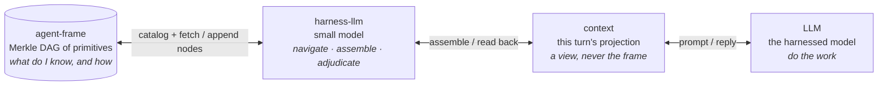
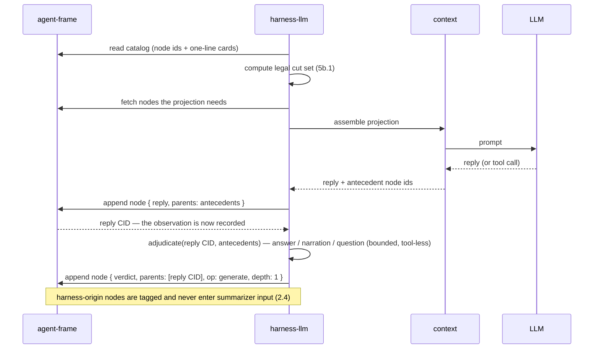
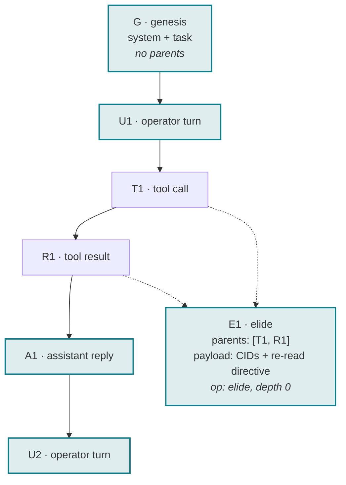
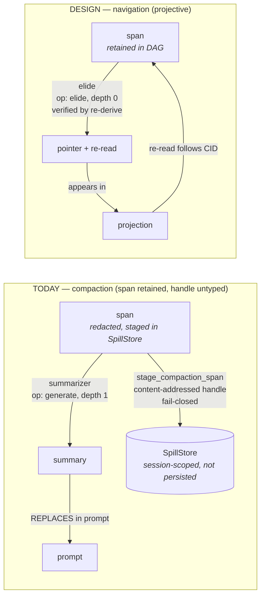
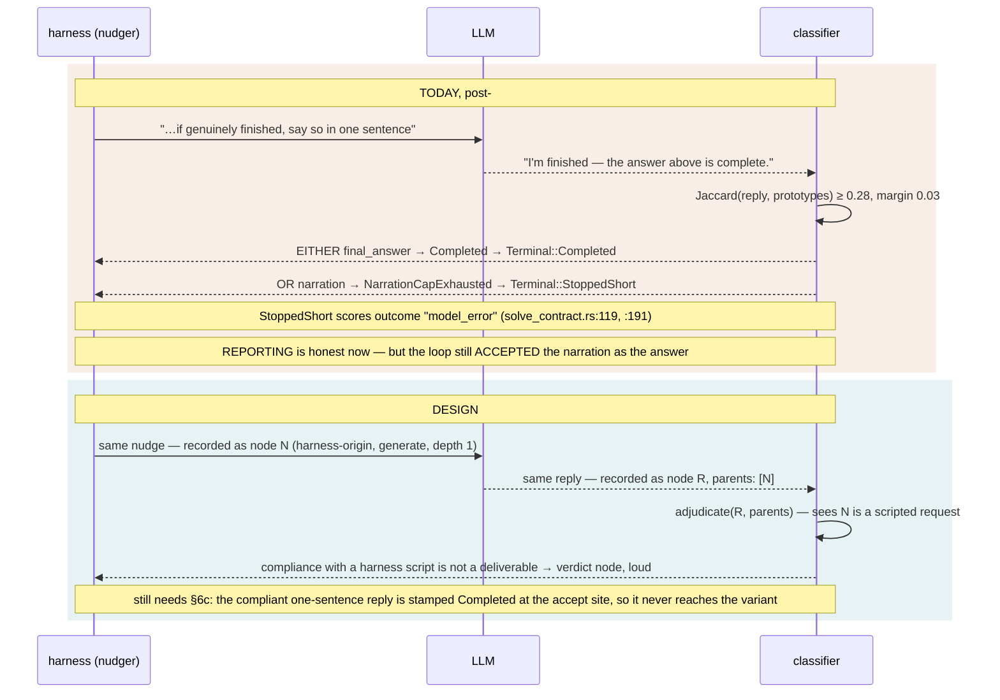
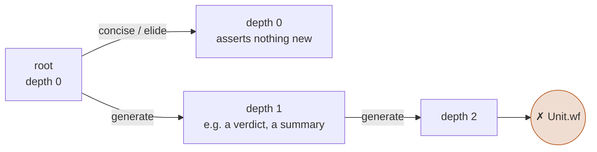

# Smart harness — design record

> **Canonical copy.** Mirrored on the knowledge board as
> `board/newt-agent/2026-09-08_smart-harness-DESIGN-RECORD.md`; on drift, this
> file wins because it is versioned with the code it describes. Prior decisions
> this builds on: `docs/decisions/1528b3-cid-spill-identity.md`,
> `docs/decisions/1528b3-proactive-compaction.md`.

**Status:** DESIGN UNDER REVISION. Revised 2026-09-08, made self-consistent
2026-09-09. Nothing implemented.

An earlier revision of this file marked all thirteen decisions **LOCKED** and
said implementation could begin. **That status was not supported by the
evidence** and is withdrawn. A design review checked the claims against source
and found seven that are false or overclaimed, one of which inverts the central
before/after argument.

**The body of this document now says what the code actually does.** The first
revision recorded the corrections in §6b but left the original claims standing
in the inventory, the diagrams and the prose above it — so the document
asserted and denied the same things in one file, and a reader who stopped
before §6b was misled by every one of them. That is fixed: the inventory, the
§3 and §4 diagrams, and §5 have been rewritten to the verified behaviour, and
§6b is now a **retrospective** of what the failed revision claimed. Nothing is
lost by making the present tense accurate — git history holds the revision that
got it wrong, and §6b holds the accounting of how.

D10–D13 remain the operator's decisions and stand as *choices*. What does not
stand is my characterisation of what the code already does, and several
"grounded in existing law" claims that the law does not actually support.

**Implementation of the frame does not begin from this document in its current
state.** The separately-shippable half of the #2239 fix (§6c) never depended on
it and has already shipped: **#2251 merged 2026-09-09 (`44ff61c8`)**, so an
exhausted narration rescue is no longer reported as a completion. **#2239 itself
remains OPEN** — the accept site, the `NarrationFinalRound` decision and TUI
behaviour are all outside what #2251 did (§6c residuals 1-3), and they continue
independently of this document too.

Companion: knowledge board `2026-09-08_harness-as-a-tiny-llm-DESIGN.md` (the
thesis and its recovery). This document is the accounting.

---

## 0. Inventory — what is reused, not designed

Per the provenance-audit rule: enumerate what exists before designing the gap.

| already exists | where | role here |
|---|---|---|
| `MerkleNode<T>` (payload + ordered parent set, id over both), `ContentId`, `NodeStore`, canonical dag-cbor | `content-addressable` 0.1.2, already a workspace dependency | **the node, the id, the store trait.** Hand-rolling any of these is a defect |
| `Op = concise \| elide \| generate`; `depthAfter: generate ⇒ d+1`; `Unit { op, depth, root, life, addressed }`; `Unit.wf: depth ≤ 1` | `agent-frame/formal/ContextOps.lean` — machine-checked | **the derivation laws** |
| invariants §1–§8; ledger newt 29 ✓ / 6 partial / 5 open / 1 rejected | `agent-frame/docs/INVARIANTS.md`, `V0-DECISION.md` | **the obligations** |
| `SpillStore` + `SpillProvenance::CompactionSpan` — content-addressed, redact-on-store, fail-closed on collision | `newt-core/src/agentic/content_spill.rs` | **storage, for a live session only.** `SessionSpillStore` is a `Mutex<HashMap<String, SpillRecordV1>>`; its own module doc (`:29`) says it is "session-scoped, and discarded at `/new`; it was NEVER persisted, so an old handle could not survive a process/session restart". agent-frame v0 defers the session store *"specifically because it already exists in newt"* — but a durable frame needs a durable path this does not provide (C2) |
| `adjudicate.rs` — one bounded, tool-less side call; `AdjudicationFailure` returned so the harness *tells* the operator | `newt-core/src/agentic/adjudicate.rs`, live at `newt-tui/src/chat.rs:6680` | **the harness-llm call shape.** The *call shape* is what is reused. The parse is **not** strict: `parse_adjudication_reply` strips a fence, then takes `find('[')`..`rfind(']')`, so prose on either side of the array is accepted. The "does NOT hunt for a decision inside prose" assurance is a doc comment the code does not implement (C3) — an explicit parser contract is owed |
| `BackendKind::Embedded` (#639), `BackendRef` | `newt-core/src/config.rs`; device selector at `newt-inference/src/embedded.rs:9` | **a separately addressable backend** and its override. Not automatically a *non-contending* one: it is CPU **by default**, not CPU-only — `NEWT_EMBEDDED_DEVICE = cpu\|metal\|cuda\|auto`, plus `embedded-metal` / `embedded-cuda` features — so "never contends with the primary" is a constraint D10 must specify and enforce, not a property inherited from the enum (C4) |

**What is new:** one node payload type, one navigation loop, one classifier
adoption, and the rule that harness output is never evidence. That is the whole
gap.

---

## 1. The four layers

```
agent-frame  <->  harness-llm  <->  context  <->  LLM
```



**The main model never touches the frame.** It sees a projection. The
harness-llm is the only navigator, and everything the main model produces goes
back into the frame *through* the harness-llm, which is where it gets
classified and recorded.

---

## 2. One turn, end to end



Three things the diagram fixes that prose leaves loose.

**The cut set is computed by the harness, not chosen by a caller** (5b.1).

**The verdict is a node with the reply as its parent** — which is what lets a
later reader ask "why was this turn recorded as done?" and get a CID, not a
`⚠` glyph.

**Record before adjudicate.** The reply is an *observation*. It is appended
before the adjudicator is called, and the adjudicator is handed the recorded
CID plus the antecedents it needs — it is not the operation that decides
whether the reply deserves to exist in the frame. Order the other way round and
an adjudicator that fails, times out, is cancelled, or returns unparseable
output takes the observation with it: the reply existed, influenced nothing
durable, and is absent from the accounted history. That is a provenance hole,
and it is the one an implementation agent would dig by following a diagram
literally. The failure behaviour that follows from the ordering:

| what fails | consequence |
|---|---|
| appending the reply node | a **storage/integrity** failure. The turn does not proceed, and it is reported as storage failure — never as an adjudication outcome |
| adjudicator unavailable, timeout, cancellation, unparseable output | the reply node **stands**. The failure is itself surfaced and recorded per **D7** (`AdjudicationFailure`), never a silent fallback |
| — | there is no path that yields a verdict about an unrecorded observation: every verdict is parented by an already-recorded reply CID |

This is the designed lifecycle, not a description of live code; the residual
implementation obligations (interruption mid-turn, and the limits of replay over
redacted content) are in §6b.

---

## 3. The frame is a DAG; context is a projection



Highlighted nodes are **this turn's projection**: `{G, U1, E1, A1, U2}`. The
elided pair `{T1, R1}` is still in the DAG; the projection carries `E1`, a
pointer to them with a re-read directive. Nothing was deleted — which satisfies
invariant 3.4's *name what was compacted with a re-read directive*.

**Retention is not the difference from compaction.** Today's compaction already
retains the span and already advertises a resolvable content-addressed handle
(§4, C1). What this picture adds over that is narrower, and it is worth stating
without inflation:

- **one typed node shape for every derived thing**, instead of one bespoke
  record for compaction spans and nothing for the rest;
- **a derivation constraint** (`op`, `depth`, parent set) that is *to be*
  checked at construction and at decode, so an elision cannot silently become a
  generation. The law is machine-checked in Lean (`Unit.wf`); the Rust
  construction and decode validation is owed, not present — D5 is **OPEN**;
- **an auditable projection**: the cut is a named set of CIDs a cold reader can
  re-derive, rather than a prompt string nobody can reconstruct.

A genesis node has no parents, so a **fresh** graph and a **resumed** graph are
distinguishable at the data structure: one starts at a node with no parents, the
other at a node with one. That is a statement about **graph origin only**, and it
is the whole of what parentage tells you. Hermeticity is a different and stronger
property — which inputs are admitted, and what ambient state the run may read —
and no arrangement of parents establishes it (C7). So `--hermetic` is not a claim
about where the graph starts; it is an execution policy that a run at genesis may
or may not be honouring. D6 states the two separately, and the admitted-input
contract it needs is still unwritten.

---

## 4. Compaction vs navigation — what actually changes

**Both sides retain the span.** The difference is in the *type system around the
handle*, not in whether the bytes survive.



`newt-core/src/agentic/compress.rs:2398` `stage_compaction_span` stages the
**redacted** verbatim span into a `SpillStore` under
`SpillProvenance::CompactionSpan`, returns a content-addressed handle, and is
fail-closed: *"A failed store must never name a handle that resolves to nothing
(BHV-SPILL-001)."* Its own doc calls it "the one minting site" and says a second
encoding "would be a content-addressable law violation".

So **retention and re-read references are not what this design contributes** —
they exist. Rebuilding them under another name is the mistake this line has
already made once (#1786). What actually changes across the two panels:

| | today | design |
|---|---|---|
| span survives | yes, redacted, in `SpillStore` | yes, in the DAG |
| handle | content-addressed, one bespoke provenance variant | `MerkleNode` id, uniform across every derived thing |
| derivation recorded | implicit — the summary does not name its `op` or depth | explicit `op`/`depth`/parent set, checked at construction **and** decode |
| durability | session-scoped; discarded at `/new`, gone at restart (C2) | owed — D9 is **OPEN** for exactly this reason |
| projection auditable | no — the prompt string is not reconstructible | yes — a named CID set a cold reader re-derives |

The honest incremental contribution is those four rows, not the first one.

---

## 5. What the frame contributes to #2239 (necessary, not sufficient)



The classifier does not get smarter prototypes. It gets **the antecedent**: the
reply's parent is the nudge node, tagged harness-origin. A reply whose only
parent is a harness script is not evidence of completion, by rule. This is
invariant 2.4 — *harness process-corrections must not enter the summarizer
input; a small model echoes loop guidance back* — enforced by the DAG instead
of hoped for.

**This does not, on its own, fix #2239 (C6) — and #2239 is still OPEN.** The
reasoning has to be restated, because the half the frame was contrasted against
has since landed. When this section was first written, `terminal()` put
`NarrationCapExhausted` in the same bucket as `Completed`, so a perfect
classifier still yielded a scored success. **That is no longer the code.** PR
**#2251** merged 2026-09-09 (`44ff61c8`) and moved `NarrationCapExhausted` in
with `RoundCap` / `Empty` / `Cancelled` → `Terminal::StoppedShort`
(`solve_contract.rs:119`), scored as `model_error` (`:191`). Reporting is honest
now.

What #2251 did **not** do is the reason #2239 remains open, and it is the part
the frame speaks to: **the loop still accepts the rescue nudge's narration as
the turn's answer.** `NarrationCapExhausted` is still produced at four accept
sites in `newt-core/src/agentic/mod.rs` (3048, 4816, 7051, 9025 on
`origin/main`) — #2251 changed how that outcome is *reported*, not whether it
happens. So the split is no longer "evidence half vs outcome half"; it is:

| half | state |
|---|---|
| **reporting** — an exhausted rescue is not filed as a completion | **landed**, #2251 |
| **accept site** — the harness stops scoring text it dictated as the answer | **open**, and the frame is what makes it decidable (§6c) |

The frame improves the **evidence** available at the accept site. It does not,
and never did, fix the reporting; that was independent and shipped first.

One constraint the frame must respect, stated here because it is easy to get
backwards: **ancestry is evidence about causality, not a completion oracle.** A
genuine answer that happens to follow a nudge stays deliverable. "Parent is a
harness node" is an input to adjudication, never by itself a verdict of
incompleteness.

---

## 6. The depth bound



`Unit.wf: depth ≤ 1`. A harness verdict over a reply is depth 1. A summary of a
summary is depth 2 and is **illegal by the design law** — which is the
derivation-depth bound this line has already concluded is the only novel claim
in the context-management literature it surveyed.

Keep two things apart here, because collapsing them is how a design law gets
mistaken for a shipped guarantee. The **law** is machine-checked: `Unit.wf` is a
Lean invariant, and it holds. **Runtime enforcement does not exist yet** — Rust
owes validation at construction *and* at decode, and specifically across
retrieval edges, where observing that a retrieval happened must not reset the
retrieved artifact's origin or depth (§6b, "depth laundering"). The intent is
that the frame makes depth 2 a type error rather than a policy; today it is a
proved law with the enforcement outstanding (D5, **OPEN**).

---

## 6b. RETROSPECTIVE — claims the failed revision made that source does not support

**These claims are no longer live anywhere in this document.** The body above
has been rewritten to the verified behaviour; this section is kept as the
accounting of how a revision of this file came to assert seven things the code
does not do, and as the standing list of what an implementation still owes.

Each row was checked against `origin/main` by opening the file, and re-verified
on 2026-09-09 during the consistency pass. "Obligation" is what an
implementation still owes. The "corrected in" column names where the live text
now says the right thing, so a reader can check that the retraction actually
took.

**One row's evidence has since been superseded by a merge, not by a rewrite.**
C6's cited mapping was accurate when observed and is now historical — #2251
landed later the same day. It is dated in place rather than deleted, because the
distinction matters to a reader: a claim withdrawn *because the code was fixed*
is not the same as a claim withdrawn *because it was never true*. C6 is the
second kind, with evidence of the first kind attached; the row says so
explicitly. No other row's evidence has changed.

| # | The claim the failed revision made | What source says | Corrected in | Obligation |
|---|---|---|---|---|
| C1 | Today's compaction **drops** the span; navigation would retain it | `compress.rs:2398` `stage_compaction_span` already stages the redacted span into `SpillStore` and advertises a content-addressed handle, fail-closed (BHV-SPILL-001) | §3 (contribution restated), §4 (diagram + table) | Restate the contribution as typed provenance + derivation constraints + auditable projection, **not** retention. Do not rebuild recovery infrastructure that exists |
| C2 | `SpillStore` is the frame's storage; `--resume <cid>` resumes a session | `SessionSpillStore` is `Mutex<HashMap<String, SpillRecordV1>>`; the module doc states the store "was NEVER persisted, so an old handle could not survive a process/session restart" | §0 inventory (`SpillStore` row), §4 table (durability row) | Either name a durable path that restores the graph closure, schema **and** authorization context after restart, or scope resume/navigation **explicitly to a live session**. Do not promise cross-process resume on ephemeral state |
| C3 | The adjudication side call has a **strict** parse | `adjudicate.rs:58` does `find('[')` / `rfind(']')`, so prose on either side is accepted. The "does NOT hunt inside prose" assurance is a *comment*, not the code | §0 inventory (`adjudicate.rs` row) | State the parser's actual accepted language and choose an explicit contract. Any production parser change is a **separate** PR with its own tests |
| C4 | Route the adjudicator to an "auxiliary / CPU-local" backend so it never contends with the primary | `newt-inference/src/embedded.rs:9` is **CPU by default, not CPU-only** — `NEWT_EMBEDDED_DEVICE = cpu\|metal\|cuda\|auto`, with `embedded-metal` / `embedded-cuda` features | §0 inventory (`BackendKind::Embedded` row) | D10 must specify placement constraints, timeout ownership, cancellation propagation, unavailable-at-startup behaviour, and an explicit fallback. An override must not silently violate placement |
| C5 | A third class "cannot be carried" by the Jaccard matcher because the margin is 0.03 | A winner/runner-up margin does not bound how many classes a classifier can represent. The reasoning is invalid | not present in live text; D13 rationale withdrawn | Remove the impossibility claim. Justify model-backed classification as an **empirical hypothesis** about discrimination and context-sensitivity, with a comparison plan against the deterministic baseline |
| C6 | Fixing the classifier (or adding causal parentage) fixes #2239 | **Evidence as observed, pre-#2251 (`origin/main` at `e3f42a36`, 2026-09-09):** `solve_contract.rs:106-115` mapped `NarrationCapExhausted` into `Terminal::Completed` — the same bucket as a genuine completion, so a correct classifier still yielded a scored success. **That mapping is HISTORICAL:** `44ff61c8` (#2251, merged 2026-09-09T14:26:41Z) moved it to `Terminal::StoppedShort` / `model_error`. **The claim in column 2 is still false**, and was withdrawn because it was *wrong*, not because it was *fixed* — the classifier was never the whole defect, and the accept site is still open (§6c residual 1) | §5 (restated for the post-#2251 code), §6c | Reporting half **landed** in #2251. Still owed: the accept site (§6c residual 1), the `NarrationFinalRound` decision (residual 2), TUI behaviour (residual 3). #2239 remains **OPEN** |
| C7 | `--hermetic` "reduces to always genesis" | A genesis node establishes a graph **origin**. It says nothing about admitted inputs or ambient state | §3 (genesis ≠ hermetic) | Narrow the claim: specify admitted inputs and ambient-state assumptions separately from parentage |

**Not yet addressed at all** — named here so they are visible rather than
implied-solved:

- **Bounded navigation as a workflow** (not just a bounded call): per-request
  catalog size, fetched bytes, dereference count, auxiliary calls, retries,
  total time, and a deterministic no-progress condition. A catalog that emits
  one card per historical node does not survive history growth.
- **Oversized unseen results.** Following a pointer can yield more than fits
  while unseen-result protection forbids eviction. Needs bounded slices or
  continuation with truthful completeness metadata — never a silent truncation
  presented as a complete reread.
- **Depth laundering through retrieval.** Observing that a retrieval happened
  must not reset the retrieved artifact's origin or depth. The depth-one rule
  needs a stated edge relation and validation at **both** construction and
  decode.
- **Record-before-adjudicate: ordering settled, edges owed.** The *ordering* is
  now stated normatively in §2 — the observation is appended first, the
  adjudicator is handed the recorded CID, and adjudicator failure cannot erase
  the reply. What an implementation still owes: behaviour when the turn is
  **interrupted or cancelled between the append and the verdict** (the reply
  node stands with no verdict — a reader must be able to tell that state from
  "adjudicated as an answer"), and the limits of replay: **no claim of
  byte-perfect replay over redacted content** survives, because the span the
  handle points at is redacted (C1).

## 6c. The real defect behind #2239 — the reporting half has landed, the accept site has not

**The reporting half is fixed.** PR **#2251** merged **2026-09-09T14:26:41Z** as
`44ff61c8`, verified present on `origin/main`. **Issue #2239 is still OPEN**, and
this section is the accounting of why.

What the code does **now**, `newt-cli/src/solve_contract.rs:106-119`:

```rust
match end_reason {
    Some(
        reason @ (TurnEndReason::RoundCap
        | TurnEndReason::Empty
        | TurnEndReason::Cancelled
        | TurnEndReason::NarrationCapExhausted),
    ) => Terminal::StoppedShort(reason),
```

and at `:191`:

```rust
Terminal::StoppedShort(TurnEndReason::NarrationCapExhausted) => "model_error",
```

So an exhausted narration rescue is **`Terminal::StoppedShort`, scored
`model_error`** — no longer in the same bucket as a genuine completion, and
`status_label` puts every `StoppedShort` in `"incomplete"` (`:213`).

**What it used to do, and when.** Before `44ff61c8` — that is, on `origin/main`
up to and including `e3f42a36`, observed 2026-09-09 — the same site read:

```rust
Some(
    TurnEndReason::Completed
    | TurnEndReason::NarrationCapExhausted
    | TurnEndReason::NarrationFinalRound,
)
| None => Terminal::Completed,
```

Exhausted narration was classified as an ordinary successful completion. That is
kept here dated rather than deleted, because it is the observation the correction
was built on and a later reader needs to be able to tell a claim withdrawn
*because it was fixed* from one withdrawn *because it was wrong*.

**Three things #2251 explicitly did not do.** Each is a reason #2239 stays open,
and none is closed by this design document either.

1. **The accept site.** The loop still accepts the rescue nudge's narration as
   the turn's answer. `NarrationCapExhausted` is still produced at four sites in
   `newt-core/src/agentic/mod.rs` (3048, 4816, 7051, 9025 on `origin/main`).
   #2251 changed how that outcome is **reported**, not whether it happens. This
   is issue ask #4, a separate change in `newt-core`, and it is the half this
   frame exists to make decidable.
2. **`NarrationFinalRound` was deliberately not moved with it.** It still maps to
   `Terminal::Completed` (`solve_contract.rs:126-127`). The comment at `:120-125`
   states why: it is "a different exit — the round limit arrived while the model
   happened to be narrating — and no report stands behind reclassifying it… a
   separate decision with its own bench-row consequences, not a wildcard to sweep
   along with this one." Do not treat that arm as an oversight; it is an open
   decision with a bench-row cost.
3. **TUI behaviour is outside #2251's scope.** The fix is in `newt-cli`'s
   contract mapping. What the interactive surface shows for an exhausted rescue
   was not touched and is not settled here.

The remaining fix is in completion semantics and needs three concepts kept
apart:
**response classification** (is this text an answer, narration, or a question),
**control outcome** (continue, await operator, deliver, terminate incomplete,
cancel, fail), and **task-success evidence** (did the claimed external actions
actually happen). Delivering a response is not evidence that a claimed
repository modification occurred.

Two constraints on that fix:

- A genuine answer that follows a nudge **stays deliverable**. Ancestry is
  evidence about causality, not a completion oracle.
- Exhausted rescue must **preserve prior observations** and surface the actual
  incomplete outcome, rather than discarding content or asserting completion.

**Why residual 1 is the larger half — measured, and reported in #2251 itself.**
Probing the OpenAI loop with a scripted reply to the rescue nudge, the recorded
`end_reason` is:

```
Completed              <- "Yes, I am finished."
Completed              <- "I am genuinely finished."
Completed              <- "I'm finished."
Completed              <- "Done."
Completed              <- "Yes — finished. The answer is three."
NarrationCapExhausted  <- "I'm finished — the answer above is the complete
                           deliverable; there is nothing to edit or run."
```

The nudge asks the model to "say so explicitly in one sentence"; the compliant
one-sentence replies never reach `NarrationCapExhausted` at all — they are
stamped `Completed` at the core accept site. #2239's transcript was the *verbose*
phrasing, the only one that trips the bag-of-words matcher into the warning.

The consequence, stated in #2251's own body: the landed mapping **"makes the
reported failure honest, but reaches a minority of the affected turns."** The
majority of exhausted-rescue turns are still stamped `Completed` before the
mapping ever sees them, which is exactly residual 1. Both halves are downstream
of one mistake: **scoring text the harness itself dictated.**

Note the lockstep hazard: PR #2242 (merged 2026-09-08) pins emitted outcome
values against `newt-cli/contract/bench_outcome_values_v1.txt`. A change to an
emitted outcome string must update that permitted set in the same PR.

## 7. Decisions

Statuses below were revised after the review in §6b. **CHOSEN** means the
operator picked the option and it stands; it does not mean the semantics,
failure behaviour and verification obligations are all specified. **SETTLED**
means those are specified. **RESTATED** means the decision stands but its
*claim* was rewritten because the original was not supported. **NARROW** means
an over-broad claim was withdrawn and the decision now says less than it did.
**OPEN** means work is owed before implementation. A corrected wording never by
itself moves a decision to a stronger status.


| # | decision | grounded in | status |
|---|---|---|---|
| **D1** | A frame primitive is `MerkleNode<Primitive>`; `Primitive` carries agent-frame's `Unit` fields (`op`, `depth`, `root`, `life`, `addressed`) plus the typed payload. No hand-rolled id, chain, or manifest. | `content-addressable::merkle`, `ContextOps.lean` | **SETTLED** (type) — storage unresolved, see C2 |
| **D2** | Context is a projection of the frame — a selected node set rendered for one turn, auditable as a named CID set. Compaction is replaced by elision + re-read. The DAG is never pruned within a session. **The contribution is typed provenance, a construction-and-decode derivation constraint, and an auditable projection — not retention**, which already exists (§4). | invariants 3.1, 3.4 | **RESTATED** in §3/§4 per C1 — durability still owed, see D9 |
| **D3** | The harness-llm is the only navigator: it is the only party that traverses the frame. It is a bounded, tool-less side call in the `adjudicate.rs` shape. This is not contradicted by D11 — the main LLM's `re_read` is a *mediated request*, not traversal authority (see D11). | `adjudicate.rs` (#1749), live | **SETTLED** (shape) — parser contract owed, C3 |
| **D4** | Harness-origin nodes (nudges, adjudications, verdicts) are tagged in `life`/`root` and are **never** summarizer input and **never** evidence of model completion. | invariant 2.4 | **SETTLED** — but does not fix #2239 alone, C6 |
| **D5** | `depth ≤ 1`. A verdict over a reply is depth 1; a summary of a summary is rejected at construction. | `Unit.wf` | **OPEN** — edge relation + decode check owed |
| **D6** | **Graph origin and execution policy are two different things.** A fresh execution begins at genesis (a node with no parents); `--resume <cid>` begins from an existing frame node — the root of the restored reachable state. `--hermetic` is an **execution policy orthogonal to graph origin**: it constrains which inputs are admitted and what ambient state the run may read. A hermetic run may begin at genesis, but **genesis alone does not prove hermeticity** and parentage cannot be used to decide it. That `--hermetic` and `--resume` are mutually exclusive, enforced at parse time, stands as a **product constraint for the first implementation** (operator ruling 2026-09-08) — it is not derived from Merkle parentage, and a later implementation could relax it without touching the data structure. **The hermetic-input contract itself is unresolved**: the set of admitted inputs and the ambient-state assumptions are not specified anywhere in this document. | operator ruling 2026-09-08 (mutual exclusion); C7 (the correction) | **NARROW** — the false equivalence is withdrawn; the hermetic-input contract is still owed and remains **OPEN** |
| **D7** | Adjudicator unavailable ⇒ `AdjudicationFailure` surfaced to the operator and recorded as a node. **Never** a silent fallback to Jaccard. A re-read whose CID is absent fails closed — absence is a finding. | `AdjudicationFailure`, invariant §8 | **SETTLED** — failure path owed for storage |
| **D8** | The legal cut set is computed (tool-pair atomicity, unseen results never elided, last operator message pinned), not a caller responsibility. | invariants 5b.1, 2.3, 3.2 | **SETTLED** |
| **D9** | Storage is newt's `SpillStore` now; `agent-store`'s opaque `Entry.payload` later. agent-frame v0 stays a library that mints elision. | `V0-DECISION.md` §3 | **OPEN** — SpillStore is ephemeral, C2 |
| **D10** | The narration adjudicator runs on the **auxiliary / CPU-local backend** (`BackendKind::Embedded`, or the summarizer's CPU-local default), with a `BackendRef` override, and the run manifest records which adjudicator judged the turn. It never contends with the primary model or the round budget. The reason `config/shell.rs:113` gives for keeping *intake* adjudication on the steering model — *"adjudication reads operator intent, which is the steering model's own job"* — does not transfer: narration classification is mechanical classification of model output, which is the summarizer's kind of work. | `config/shell.rs:113`, `BackendKind::Embedded` (#639), `BackendRef` | **CHOSEN** — placement/fallback owed, C4 |
| **D11** | The main LLM **gets one `re_read(cid)` tool**. Retrieval is not harness-only: invariant 3.4's *re-read directive* is addressed to the model, so the model needs the affordance to act on it. **It is a mediated capability, not frame-traversal authority**: the model *requests* a CID, the harness validates and bounds the request, the access happens through harness-owned machinery, and the result is recorded and projected back. The model never gets to walk the graph, and an absent CID fails closed (D7). Results are appended to the frame as nodes whose parent is the pointer that was followed, so a retrieval is itself provenanced and a later reader can see what the model chose to re-read. | invariant 3.4 | **CHOSEN** — bounds owed (§6b) |
| **D12** | The adjudication side call **does not count against the round budget** — it is harness work, not model work, and charging it would penalise an arm for harness overhead and make round-cap comparisons across harnesses unfair. It **must** be declared in the run configuration and recorded in the contract record, or two runs are not comparable. This is #2227's "verify the instrument" applied to the classifier. | #2227 | **CHOSEN** — separate enforced budget owed |
| **D13** | The **`question` class ships** as a third verdict alongside answer / narration: a reply that asks the operator something is nudged to *ask*, not to *do*. This is #1020's original complaint (the model offered "Option A, B, or C?" and was nudged to act). The earlier rationale — that a Jaccard matcher "structurally cannot carry" a third class because its margin is 0.03 — is **withdrawn**: a winner/runner-up margin does not bound how many classes a classifier can represent (C5). Whether a model-backed classifier discriminates better is an empirical question, and it needs a comparison against the deterministic baseline rather than an impossibility claim. | #1020 | **CHOSEN** — C5 rationale withdrawn |

---

## 8. What this is NOT

- **Not a new node type or id scheme.** `MerkleNode` and `ContentId` exist and
  hand-rolling either is a defect. A **durable** store, on the other hand, is
  genuinely absent: `SessionSpillStore` is an in-memory map discarded at `/new`
  (C2), so D9 is open and "not a new store" must not be read as "storage is
  solved".
- **Not a smarter summarizer.** The summarizer is demoted, not improved.
- **Not a 0.8.0 item.** agent-frame is pre-implementation and its 0.0.1 is the
  gate. This is the 0.9.0 stream. What it *does* change for 0.8.0: fix #979 so
  a turn cannot hang, fix #2239 so the harness stops reading its own script as
  evidence, and **spend nothing further on the compaction pipeline**.
- **Not a rewrite.** Every settled row names the thing it reuses — and §6b
  records, as a retrospective, where that reuse claim was wrong.

---

## 9. What "properly accounted" means here

Every node has a CID. Every derived thing names its source and its depth. Every
harness intervention is a node, so the question *"why did the harness do that?"*
has an address. The bench record (#2227) names which adjudicator judged which
turn. A cold reader with the DAG can re-derive every `elide` and check every
`generate` against its root. **That is the property: nothing the harness does
is undocumented, because the documentation is the data structure.**

