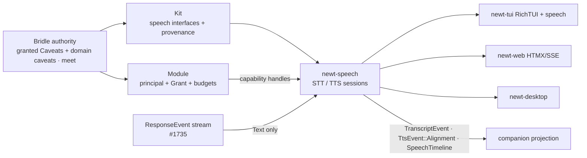

# Feature Proposal: Speech Pipeline (STT / TTS)

> **Status:** Draft — proposal, not normative · **Owner:** hartsock · **Last review:** 2026-08-16 · **Builds on:** `docs/decisions/agentic_object_capability_security.md`, `docs/decisions/ocap_confinement_model.md`, `docs/decisions/plain_scroller_tui.md`, `docs/decisions/newt_web_htmx.md`, [kit-system.md](kit-system.md) (manifest / `Export` / `InterfaceId` / trust matrix — subsumes `newt_core::kit`, #1737), [module-scopes.md](module-scopes.md), [streaming-response-categoriser.md](streaming-response-categoriser.md); `Caveats` (agent-mesh-protocol, re-exported at `newt-core/src/caveats.rs:28`; axes `fs_read`/`fs_write`/`exec`/`net`/`max_calls`/`valid_for_generation`), `CaveatsExt::{permits_net, permits_fs_read}` (`newt-core/src/caveats.rs`), agent-bridle-core `Gate::authorize` / `net_proxy`, `newt_core::session::{OutputStream, OutputChunk, OutputSink}`, `newt_core::reasoning::ThinkFilter`, `newt_core::agentic::steering::SteeringInbox`, `newt_tui::chat::InputSurface`, `DockScope::allows_inject` (`newt-web/src/dock.rs`) · **Supersedes/Superseded by:** —

Tracking: [#1738](https://github.com/Gilamonster-Foundation/newt-agent/issues/1738)
(B1 `newt-speech` crate), [#1739](https://github.com/Gilamonster-Foundation/newt-agent/issues/1739)
(B2/B3 host wiring), [#1740](https://github.com/Gilamonster-Foundation/newt-agent/issues/1740)
(B4 local providers); epic [#1734](https://github.com/Gilamonster-Foundation/newt-agent/issues/1734).
Index: [companion-roadmap.md](companion-roadmap.md).

> The bodies of #1738 and #1739 predate this shape (they speak of `audio.in` /
> `audio.out` caveat kinds, of "generations" for cancellation, and of a
> WebSocket mic path); they will be updated to match this document. `Caveats`
> is a signed wire type owned by agent-mesh-protocol and has no audio axis;
> microphone / speaker authority is a per-interface domain lattice composed
> *beside* `Caveats` (see [Capability handles](#capability-handles-bridle-side)).

## Overview

A provider-agnostic **speech pipeline** crate, `newt-speech`, that turns the
agent's normalized response stream into scheduled, interruptible audio
playback (TTS) and turns a captured audio stream into transcript events
(STT). Speech is **session- and media-oriented**: the unit of work is a
session over a stream of `AudioFrame`s, not a request/response call, because
audio has to be cancelled mid-frame, resampled, and re-homed when a device
disappears.

Providers (local whisper.cpp / piper, cloud STT/TTS APIs) are **kits** that
export stable speech interfaces ([kit-system.md](kit-system.md)); the
pipeline crate never names a backend. Authority to touch a microphone, a
speaker, a file or the network is **Bridle** authority — the module running
the pipeline holds host-minted granted `Caveats` (the *Grant*) plus the
domain caveats composed beside them, and receives *capability handles*
minted from that Grant; there is no second, feature-shaped permission
vocabulary in this crate.

**Feature gate: `speech`** — a Cargo feature on `newt-tui` and `newt-cli`, absent from the
default feature set and never on the LEAN or wyvern paths. `newt-web` and `newt-desktop` are
workspace-excluded crates with their own lockfiles; they enable `newt-speech` in their own
`Cargo.toml`, not through a workspace feature. Precisely:

| Build | Speech |
|-------|--------|
| wyvern / headless | never compiled |
| LEAN surface (default build, or `rich-tui` off) | none — nothing links, nothing renders; the plain-scroller rule (`plain_scroller_tui.md`) is untouched. A LEAN push-to-talk line is *not* proposed here; it would need its own decision |
| RichTUI (`rich-tui` + `speech`) | the host wiring (#1739) |
| `newt-web` / `newt-desktop` | server-side sessions; see Host wiring |

### Where it sits



Speech is downstream of three foundations and depends on nothing else:
Bridle for authority, the kit layer for provider discovery, and the typed
`ResponseEvent` stream for what to say. It never reads raw model text.

## Motivation

Voice input/output is the highest-friction feature to bolt on later if the
core isn't designed for it: TTS must consume the reply as it streams (not
after the turn ends), must be interruptible mid-sentence, and must never
read reasoning, tool-call markup, or code aloud. STT must handle streaming
audio, voice-activity boundaries, and partial/final transcript revisions.
Both need cancellation that outruns the audio already in flight.

Design goals:

- **Sessions over frames.** STT and TTS are long-lived sessions exchanging
  `AudioFrame`s and events, with explicit **cancel epochs** for cancellation,
  bounded queues for backpressure, and format negotiation for resampling.
  ("Cancel epoch" is this doc's word on purpose: *generation* is Bridle's
  authority-revocation counter — `Gate::generation`,
  `Caveats::valid_for_generation` — and the two must never be confused.)
- **Capabilities, not features.** "May this module hear the mic?" and
  "may it reach `api.example.com`?" are separate Bridle questions answered
  by separate handles. Cloud STT needs network, not the microphone; local
  whisper over a `.wav` needs neither.
- **One text source.** TTS speaks `ResponseEvent::Text` and nothing else
  unless a host explicitly routes more. Voice fails *closed* on uncertain
  markup.
- **A timeline, not a viseme field.** Word / phoneme / viseme / marker
  alignment is one `SpeechTimeline` with layers a provider may leave empty
  and an aligner may fill.

## Design

### Crate layout

```
newt-speech/                     # B1 (#1738) — pipeline only; names no provider
├── Cargo.toml                   # feature `speech` in the hosts turns this on
└── src/
    ├── lib.rs                   # session builders, pipeline wiring
    ├── frame.rs                 # AudioFrame, AudioFormat, Stamped<T>, negotiation
    ├── session.rs               # SessionControl, SessionMsg<Cmd> (Session<Cmd,Event> plumbing)
    ├── stt.rs                   # STT session: Session<AudioFrame, TranscriptEvent>
    ├── tts.rs                   # TTS session: Session<SpeechRequest, TtsEvent>
    ├── vad.rs                   # VAD / voice-turn-detection transforms (separate from STT)
    ├── timeline.rs              # SpeechTimeline {words, phonemes, visemes, markers: TimelineMarker} + Aligner
    ├── segmenter.rs             # ResponseEvent::Text deltas → speakable segments
    ├── intent.rs                # SpeakIntent priority + Queue/Interrupt/Replace
    └── playback.rs              # epoch-stamped scheduling toward a Sink<Stamped<AudioFrame>> (newt.audio.playback@1)

newt-speech-local/               # B4 (#1740) — trusted-builtin kits, feature `speech-local`
└── src/
    ├── whisper.rs               # whisper.cpp FFI → exports newt.speech.stt@1
    └── piper.rs                 # piper FFI      → exports newt.speech.tts@1
```

Two placement rules keep B1 and B4 severable and keep the reuse discipline:

- **Capability-handle types are not defined here.** `MicrophoneCapture`,
  `SpeakerPlayback`, the scoped network client and the file-read handle live
  in the Bridle-facing capability-handle vocabulary of newt-core / the kit
  system ([kit-system.md](kit-system.md) §3, "the host that mints the
  export's capability handles"). `newt-speech` consumes them through interface
  ids — `newt.audio.capture@1 = Source<Stamped<AudioFrame>>` (what
  `MicrophoneCapture` yields) and `newt.audio.playback@1 = Sink<Stamped<AudioFrame>>`
  (what `SpeakerPlayback` takes); ids illustrative, to be added to kit-system.md's
  id table — plus callable traits, and never mints or defines one. In particular there is **no speech-owned `NetworkEgress`**:
  network confinement is Bridle's `net` axis (`CaveatsExt::permits_net`) and,
  for subprocess children, the agent-bridle-core loopback forward proxy
  (`net_proxy.rs`, `ProxyHandle`, allow-listed hosts, `*_PROXY` env).
- **FFI engines are not in the pipeline crate.** whisper.cpp / piper
  bindings link only when `speech-local` is on, from `newt-speech-local`,
  which registers them as trusted-builtin kits exporting the speech
  `InterfaceId`s. A `speech` build without `speech-local` links no engine
  and has no provider name in it.

### Media model: `AudioFrame`

Every audio hop in the pipeline — mic → VAD → STT, TTS → resampler →
speaker — carries the same frame type. Its shape is the one shared with
[desktop-shell.md](desktop-shell.md) and [companion-roadmap.md](companion-roadmap.md);
it is media only, with **no cancel-epoch field**; [desktop-shell.md](desktop-shell.md)
and [animated-companion.md](animated-companion.md) cite this definition rather than restating it.

```rust
// sketch — illustrative, not compiled
pub struct AudioFrame {
    pub sequence: u64,          // monotonic within a session; gaps = drops
    pub timestamp: Duration,    // media time from session start
    pub sample_rate: u32,
    pub channels: u8,
    pub format: SampleFormat,   // I16 | F32 | …
    pub samples: Bytes,         // interleaved
}

/// Everything a *session* carries is epoch-stamped by its producer:
/// capture epoch for mic frames, playback epoch for TTS frames,
/// utterance epoch for transcript events. The stamp lives on the
/// envelope so the media type stays identical across every host.
pub struct Stamped<T> { pub epoch: CancelEpoch /* u32 */, pub inner: T }
```

| Concern | Rule |
|---------|------|
| Resampling | Session open negotiates a target `AudioFormat` through `SessionControl::Negotiate` (below); a `Transform<AudioFrame, AudioFrame>` resampler is inserted when provider and device disagree. Providers never assume the device format. |
| Backpressure | Every hop is a bounded channel. Capture side is real-time: on overrun the mic source drops the *oldest* frames and emits a `TimelineMarker::Overrun` so STT can mark the gap. Synthesis side is bounded by look-ahead (N segments / M ms of unplayed audio); the sink reports `Full` and synthesis pauses. |
| Device handoff | The mic / speaker handles emit `DeviceChanged` (headset unplugged, Bluetooth switch). The session re-opens the handle, renegotiates format, and resumes from the last unplayed `sequence`; the timeline is unaffected because it is media-time based. |

### The `Session<Cmd, Event>` shape and its control channel

`Session<Cmd, Event>` ([kit-system.md](kit-system.md) base shapes) is
"long-lived, cancellable, bidirectional". Cancellable means the shape has a
control side beyond `Cmd`. This doc fixes it as **one multiplexed stream**
so a subprocess / WASM / remote provider sees exactly one declared type on
the wire; kit-system.md's base-shape row must record the same.

```rust
// sketch — illustrative, not compiled
pub enum SessionMsg<Cmd> {
    Data(Stamped<Cmd>),                 // the interface's Cmd, epoch-stamped
    Control(SessionControl),
}

pub enum SessionControl {
    Negotiate(AudioFormat),             // request/confirm the media format
    EndSegment(SegmentId),              // STT: end_utterance; TTS: end of a request's text
    Abandon(SegmentId),                 // STT: abandon_utterance; TTS: drop one request
    Cancel { epoch: CancelEpoch },      // bump the producer's cancel epoch; drop older
    Close,
}
```

The `InterfaceId` shapes are therefore exactly `newt.speech.stt@1 =
Session<AudioFrame, TranscriptEvent>` and `newt.speech.tts@1 =
Session<SpeechRequest, TtsEvent>` — the same spelling as
[kit-system.md](kit-system.md)'s interface table and
[companion-roadmap.md](companion-roadmap.md). `Cmd` names the *data* type;
control is part of the `Session` shape itself, not a second interface.

### Capability handles (Bridle-side)

Code in `newt-speech` never evaluates a permission. It is *given* — or not
given — a handle by the host. Handles are minted from the module's authority,
which has **two carriers, one algebra** ([kit-system.md](kit-system.md) §3):
the signed `Caveats` — the *Grant*, `enforced_caveats(&key)`, six axes:
`fs_read`, `fs_write`, `exec`, `net`, `max_calls`, `valid_for_generation` — and
per-interface `DomainCaveats` **host-held beside the Grant** in `Module.domain`
([module-scopes.md](module-scopes.md), "The domain carrier"), never merged into
the signed chain. There is **no audio axis in `Caveats`**, so microphone /
speaker authority is a domain lattice:

```rust
// sketch — illustrative, not compiled — lives beside newt.speech.* in the kit layer, not in Caveats
pub struct SpeechCaveats { pub mic: Scope<DeviceId>, pub speaker: Scope<DeviceId> }
// obeys top / leq / meet, attenuation-only — pinned by the shared lattice-law test #1737 introduces
// (kit-system.md §3), applied to GitCaveats and every DomainCaveats alike
```

| Handle (newt-core capability vocabulary) | Yields to `newt-speech` | Authority carrier | Status | Needed by |
|------------------------------------------|-------------------------|-------------------|--------|-----------|
| `MicrophoneCapture` (`newt.audio.capture@1`) | `Source<Stamped<AudioFrame>>` (capture epoch) | `SpeechCaveats.mic` — domain lattice; **host-held beside the Module's Grant** (`Module.domain`, module-scopes.md "The domain carrier" — not in the signed cert chain), never in a provider manifest's `required` | proposed (kit layer, #1737) | live STT from a device |
| `SpeakerPlayback` (`newt.audio.playback@1`) | `Sink<Stamped<AudioFrame>>` (playback epoch) | `SpeechCaveats.speaker` — same | proposed | audible TTS |
| scoped network client | HTTP / WebSocket to allow-listed hosts | `Caveats.net` — existing axis, `CaveatsExt::permits_net`; subprocess children get the net proxy | existing axis, handle proposed | cloud STT / TTS providers |
| file-read handle | `Source<AudioFrame>` via decoder (stamped by the session on entry) | `Caveats.fs_read` — existing axis, `CaveatsExt::permits_fs_read` (`permits_path`) | existing axis; today a dispatch-site check, handle proposed | transcribing a `.wav`, playing a cached utterance |

If microphone / speaker prove universal across the mesh, the right move is
an **upstream axis** in agent-mesh-protocol `Caveats` (release chain
agent-mesh-protocol → agent-bridle-core → newt) — that path is its own row
in [Dependencies](#dependencies-and-acceptance) and is *not* required for
any slice here. Under either path the spelling is the field name (`net`,
`fs_read`, `mic`, `speaker`); there is no `audio.in` / `net:<host>` string
DSL anywhere in Bridle and this doc does not introduce one.

#### Session authorization lifecycle

`Gate::authorize(tool, granted)` (agent-bridle-core 0.7.15) authorizes one
`Action` invocation: `effective = granted.meet(tool.required())`, checks
`valid_for_generation`, charges `max_calls` once, and yields a
`ToolContext`. A speech session is long-lived, so the mapping is:

| Moment | What happens |
|--------|--------------|
| session open | the host mints the handles **once**: `effective = granted.meet(required)` on each carrier (`Caveats` via the Gate; `SpeechCaveats` via the host's `meet` over `Module.domain`). If the session is opened through a Bridle `Tool` (an `Action`-shaped "open STT session"), that is exactly one `Gate::authorize` call and **one `max_calls` charge**; the `ToolContext`'s effective `Caveats` bound the handles. Frames are never charged — per-frame cost is a *resource/accounting* axis (module-scopes.md), not authority |
| every frame | no authority check; the handle *is* the authority (ocap). Backpressure and budgets act here |
| Bridle **generation** advances (authority revocation — distinct from the cancel epoch) / Grant attenuated mid-utterance | the host **revokes** the handle. The session emits `TranscriptEvent::Error { error: SpeechError::Revoked }` (STT) / `TtsEvent::Error { …Revoked }` (TTS) plus `TimelineMarker::Revoked` on the timeline, drops every queued and in-flight frame, and closes. Nothing partially spoken or heard survives revocation |
| **Resources / accounting** (module-scopes.md axes; not authority) | Cloud STT/TTS is metered per second of audio or per character; local engines cost CPU/GPU time. Per-frame and per-request cost is charged to the module's `ResourceBudget` (spend) and recorded in its usage ledger keyed by `PrincipalId` — after the fact, like inference tokens. Exhaustion is `Ready → Draining` for the module (the session receives `SessionControl::Close`), never a `Gate` denial; a child's speech spend rolls up to its parent |
| child / crew module | receives handles minted under `parent.grant.meet(requested).meet(host_clamp)` (#739) for the `Caveats` carrier — checked **and signed** by `newt_identity::attenuate`, which refuses amplification — and under `parent.domain.meet(requested.domain).meet(host_clamp.domain)` for the host-held `SpeechCaveats` carrier, checked by the host's `meet` (property-tested, unsigned; module-scopes.md). Because `meet` is monotone a child's handles are ⊑ its parent's on both carriers by construction |

Consequences the design relies on:

- **Local whisper transcribing a `.wav`** holds a file-read handle only —
  no mic, no network. **Cloud STT from the mic** holds `MicrophoneCapture`
  and a network client scoped to one host. **TTS to a file** holds no
  `SpeakerPlayback`.
- OS-level consent (macOS/Windows microphone prompts, browser
  `getUserMedia`) is *not* an ocap: the privileged host owns the device and
  hands the module a scoped session/stream. See
  [desktop-shell.md](desktop-shell.md) for the WebView case.

### STT session

```
InterfaceId  newt.speech.stt@1  =  Session<AudioFrame, TranscriptEvent>
             (wire: SessionMsg<AudioFrame> in, Stamped<TranscriptEvent> out)
```

```rust
// sketch — illustrative, not compiled
pub enum TranscriptEvent {
    Partial { utterance: UtteranceId, text: String, stable_prefix: usize },
    Final   { utterance: UtteranceId, text: String, timeline: Option<SpeechTimeline> },
    Marker  { at: Duration, kind: TimelineMarker },   // Overrun, DeviceChanged, ProviderNotice, Revoked
    Error   { utterance: Option<UtteranceId>, error: SpeechError },
}
```

- `Partial` may be revised; `stable_prefix` says how many bytes will not
  change, so hosts can commit that much to `InputSurface` /
  `SteeringInbox` early.
- The session owns no VAD. Utterance boundaries come from the VAD /
  turn-detection stage below, which sends
  `SessionControl::EndSegment(utterance)`; providers with built-in
  endpointing may *also* finalize, and the session reconciles by
  `UtteranceId`. `SessionControl::Abandon(utterance)` bumps the utterance
  epoch so late partials from a slow provider are dropped.
- The companion's `input` dimension ([animated-companion.md](animated-companion.md))
  is fed by `TranscriptEvent::Partial` / `TranscriptEvent::Final` — those
  names are the ones both docs use.

### VAD and voice-turn detection (separate stage)

```
InterfaceId  newt.speech.vad@1   =  Transform<AudioFrame, VadEvent>       // SpeechStart | SpeechEnd | Silence(dur)
             newt.speech.turn@1  =  Transform<(VadEvent | TranscriptEvent), VoiceTurnEvent>  // EndOfUtterance | Continue
```

`VoiceTurnEvent` is named to stay clear of the agent-turn vocabulary
(`TurnState`, sketched in tui-panel-system.md; `TurnSummary` in
streaming-response-categoriser.md; the companion's turn inputs): it is about
the *human's spoken* turn only. VAD
decides *is someone speaking*; voice-turn detection decides *is the user
done* (silence hangover, filler-word tolerance, push-to-talk override). Both
are pluggable kits with thresholds in config (three Cs), and neither is
inside the STT provider — so swapping cloud STT for local whisper never
changes how the pipeline decides an utterance ended.

### TTS session

```
InterfaceId  newt.speech.tts@1  =  Session<SpeechRequest, TtsEvent>
             (wire: SessionMsg<SpeechRequest> in, Stamped<TtsEvent> out)
```

This is the one shape for this id, spelled identically in
[kit-system.md](kit-system.md) and [companion-roadmap.md](companion-roadmap.md):
alignment and done events ride the same stream as the audio, so the event
type is `TtsEvent`, of which `Audio(AudioFrame)` carries the frames.

```rust
// sketch — illustrative, not compiled
pub struct SpeechRequest {
    pub request_id: RequestId,        // the SegmentId used by SessionControl::{EndSegment, Abandon}
    pub text: String,                 // one segment from the segmenter
    pub voice: VoiceId,
    pub prosody: Option<ProsodyHint>, // derived from an approved PresentationHint, never raw model text
}
// (the playback epoch is on the Stamped<_> envelope, not the request)

pub enum TtsEvent {
    Audio(AudioFrame),
    Alignment(AlignmentEvent),        // incremental SpeechTimeline layer updates
    Done { request_id: RequestId, timeline: SpeechTimeline },
    Error { request_id: RequestId, error: SpeechError },
}
```

Playback is `TtsEvent::Audio` → (resampler) → `SpeakerPlayback`. Alignment
events are forwarded, epoch-stamped, to whoever subscribed (companion,
captions).

### `SpeechTimeline`

Visemes are **one layer** of a timeline, not a field on an audio chunk.

```rust
// sketch — illustrative, not compiled
pub struct SpeechTimeline {
    pub words:    Vec<Span<WordId>>,      // text offset ↔ media time
    pub phonemes: Vec<Span<Phoneme>>,
    pub visemes:  Vec<Span<VisemeId>>,
    pub markers:  Vec<Span<TimelineMarker>>,
}

/// The one marker vocabulary. Qualified on purpose: "marker" alone is overloaded.
pub enum TimelineMarker {
    Boundary(BoundaryKind),      // Sentence | Clause | Pause — from the segmenter
    SsmlMark(String),            // provider-reported <mark name="…"/> (an SSML mark, not a timeline concept of its own)
    Overrun,                     // capture dropped frames here
    DeviceChanged,               // handoff; media time continues
    ProviderNotice(String),
    Revoked,                     // Bridle revocation closed the session here
}
```

| Layer | Who fills it |
|-------|--------------|
| words | most cloud TTS (word boundaries), whisper STT (word timestamps) |
| phonemes | local engines (piper, espeak-ng front-ends); rarely cloud |
| visemes | derived from phonemes by a phoneme→viseme table (pure data, per-rig overridable) |
| markers | segmenter (`Boundary`), pipeline (`Overrun` / `DeviceChanged` / `Revoked`), provider (`SsmlMark`) |

```
InterfaceId  newt.speech.aligner@1  =  Transform<(SpeechTimeline, Source<AudioFrame>), SpeechTimeline>
```

An **aligner** fills missing layers — forced alignment for words from
audio+text, phoneme lookup from words, viseme mapping from phonemes.
Consumers ask for the layers they need and get the best available.

**What the companion consumes from this crate**
([animated-companion.md](animated-companion.md)) — stated once so the two
docs cannot drift:

| Companion dimension | Source in this crate |
|---------------------|----------------------|
| `input` (`UserSpeaking { partial }`) | `TranscriptEvent::Partial` / `TranscriptEvent::Final` |
| `output` (`Speaking { epoch, media_time }`) | `TtsEvent::Alignment(AlignmentEvent)` / `TtsEvent::Done`, with the `Stamped` epoch |
| lip-sync | `SpeechTimeline.visemes` + `SpeechTimeline.markers`, epoch-stamped |

### Cancel epochs

The reply changed, the user interrupted, or a higher-priority intent
arrived: audio already synthesized and queued must not play. Cancel epochs
are **per producing session** and ride the `Stamped<_>` envelope. (Not
"generation": that word is Bridle's revocation counter and the two are
unrelated mechanisms.)

| Producer | Cancel epoch | Bumped by |
|----------|--------------|-----------|
| TTS scheduler → `SpeakerPlayback` | playback epoch | `SessionControl::Cancel` (interrupt, reply changed, higher-priority intent); `ResponseEvent::Done { stop: Cancelled }` from the turn driver |
| `MicrophoneCapture` → STT | capture epoch (the one [desktop-shell.md](desktop-shell.md) stamps on push-to-talk) | host re-arm / push-to-talk release |
| STT utterance | utterance epoch | `SessionControl::EndSegment` / `Abandon` |

- `Cancel` increments the epoch and cancels in-flight provider work via a
  cancellation token (dependency TBD — `tokio-util` is not a workspace
  dependency today).
- Every `SpeechRequest`, `AudioFrame`, `TtsEvent`, `TranscriptEvent` and
  alignment update carries the epoch it was issued under.
- `SpeakerPlayback` and every downstream subscriber **drop anything whose
  epoch is older than current** — a stale mouth shape is as wrong as a
  stale sentence. Because the check is per frame, cancellation latency is
  one frame, not one utterance.

### Text ingress: `ResponseEvent::Text` only

The pipeline is a consumer of the typed normalized response stream
([streaming-response-categoriser.md](streaming-response-categoriser.md),
#1735) — the same stream every UI, log, and remote pilot routes on.

**Relation to session fan-out.** `OutputStream` / `OutputChunk`
(`newt-core/src/session.rs:69`) is the session's projection of that stream
to attached surfaces and the mesh wire; the mapping between the two is the
table in streaming-response-categoriser.md and is not restated here. TTS
reads `ResponseEvent` **in-process**, upstream of that projection, so it
never depends on the lossy wire and is never an `OutputChunk` consumer.
Speech's own events (`TranscriptEvent`, `TtsEvent`) are *not* `OutputStream`
variants either: a final transcript enters the session as **input**
(`SteeringInbox` / `InputSurface`, or `DockScope::allows_inject` from
`newt-web`), and TTS audio leaves through `SpeakerPlayback`, not through the
session's output fan-out. Out of process there are **two cases**, and the rule
holds in both because the speech session always lives where the
`ResponseEvent` stream is in-process:

- **Sessions `newt-web` drives itself** ("owned agents", `newt-web/src/agents.rs`:
  a `TurnDriver` in the newt-web process) — the STT/TTS sessions run in the
  newt-web process beside that driver and read `ResponseEvent` in-process.
- **Docked / mirrored sessions** (`newt_web_htmx.md` D2, `newt_web_docking.md`
  K1: newt-web attaches over the dock seam and sees only the `OutputChunk`
  projection) — the STT/TTS sessions live in the **agent process** beside the
  session they serve (where desktop-shell.md's diagram places them), and the
  audio legs — `Stamped<AudioFrame>` in, `TtsEvent` / streamed audio out,
  transcript injection via `DockScope::allows_inject` — would have to cross the
  dock seam. That speech leg of the dock seam is designed nowhere yet: it is
  an **open question for #1739** (A1-b widens `OutputChunk`, but audio is not an
  `OutputStream`). Until it exists, voice for a docked session is **unavailable**
  — never approximated by speaking `OutputChunk` text.

| `ResponseEvent` variant | Speech pipeline behaviour |
|-------------------------|---------------------------|
| `Text(TextDelta)` | segmented and spoken |
| `Reasoning(ReasoningDelta)` | **never spoken** unless a host explicitly routes it (opt-in config, off by default) |
| `ToolCall`, `ToolResult` | not spoken; a host may map them to a short `SpeakIntent` (e.g. "running tests") — that text is host-authored, not model markup |
| `Artifact` | not spoken by default; spoken only under the explicit per-kind opt-in of streaming-response-categoriser.md's voice rule 1 (e.g. a short citation) |
| `PresentationHint` | *untrusted*; may become a `ProsodyHint` only through the host's approved mapping |
| `Done(TurnSummary)` | flushes the segmenter; drops any still-uncertain buffered text from voice |

**Fail closed for voice.** Text-only models reach `ResponseEvent` through
the tag-parser compatibility adapter (the `ThinkFilter` lineage,
`newt-core/src/reasoning.rs`). The pipeline relies on three of the
adapter's contract rules rather than defending downstream:

| Adapter rule | What voice relies on |
|------------------|----------------------|
| P1/P5 — bounded hold-back across chunk boundaries | while a candidate tag prefix is held, no `Text` is released from that region; a prefix released **unresolved at end of stream** arrives as `Text { held_markup: true }` and the segmenter **drops it** (voice rule 2) — consoles may show those bytes, voice never speaks them |
| P6 — unterminated blocks | stream ends inside an open tag → remainder is `Reasoning` and `Done.truncated_markup == true`; voice drops the uncertain span even if a UI renders it |
| P3 — no duplicate re-emit | every byte arrives exactly once, as exactly one kind. A consumer **cannot** tell a re-emitted accumulation from fresh `Text`, so there is no downstream defence: P3 is the contract, enforced by the adapter's property test |

Leading-reasoning cards (`emits_leading_reasoning`, the
`ThinkFilter::with_leading_reasoning` lineage) get no special case here: under
A1 a leading block that never closes stays `Reasoning` and the turn ends with
`Done { unclosed_leading_block: true }` — nothing provisional is ever released
as `Text`, so voice speaks nothing from that region and there is no
`speak_provisional` opt-in. Voice has no bypass of any kind
(streaming-response-categoriser.md, "Fail-closed voice policy", rule 4).

**Segmenter** — decides *how to chunk* what it is given (sentence / clause
boundaries, pause hints, maximum utterance length, `TimelineMarker::Boundary`
entries for the timeline), and drops `Text { held_markup: true }` deltas on
entry (the one filter it applies, per voice rule 2). It never re-classifies
content; if code is being read aloud, the fix belongs in the response-event
adapter or tag data, not here.

### Intent-priority scheduling and interrupts

Multiple sources want the speaker: the streaming reply, a tool-status
narration, a host notification, an accessibility read-back. Each is a
`SpeakIntent`.

```rust
// sketch — illustrative, not compiled
pub struct SpeakIntent {
    pub intent_id: IntentId,
    pub actor: PrincipalId,             // which principal is speaking (multi-agent); module-scopes.md
    pub turn_id: Option<TurnId>,
    pub priority: u8,
    pub behavior: InterruptBehavior,    // Queue | Interrupt | Replace
}
```

**Replace / interrupt key.** Intents are keyed by `(actor, turn_id)`. A
`Replace` targets every queued or playing intent with the **same `actor` and
an older `turn_id`** (a new reply supersedes the previous reply from that
principal) and, when `turn_id` is `None`, only the intent with the same
`intent_id` (a re-issued narration). It never touches another actor's
intents. An `Interrupt` is keyed by priority alone — it pre-empts whatever
is playing regardless of actor.

| Arriving intent vs. playing | Queue | Interrupt | Replace |
|-----------------------------|-------|-----------|---------|
| lower priority | queued after current | queued after current | queued; replaces only its key `(actor, older turn_id)` / same `intent_id` in the queue |
| equal priority | queued | plays after current segment boundary | bumps the playback epoch, current dropped, new plays |
| higher priority | queued ahead | bumps the playback epoch immediately | bumps the playback epoch immediately |

User interruption (barge-in from VAD `SpeechStart` while TTS is playing,
push-to-talk, `Esc`) is a host-issued `Interrupt` at maximum priority; a
new turn from the same actor is a `Replace` keyed as above.
Rejected/superseded intents receive `Rejected { reason }` so hosts can
show why a narration was skipped.

### Kit registration and execution class

Speech providers register **via the kit manifest / `Export` model of
[kit-system.md](kit-system.md)** (#1737), which subsumes today's
`newt-core/src/kit.rs`. That file's `COMPONENT_REGISTRY` is the
model-support catalogue (`MountKind`, `Axis { Reasoning, Structure,
Grounding, GatingRepair }`) and has no mount for a `Session<…>` export; at
most `Tier::TuiOnly` carries over as interface metadata. Selection stays
`Loadout.kit` (`newt-core/src/config/loadout.rs`) / `[bundles.*]`
(`newt-core/src/config/profile.rs`). A speech manifest declares:

| Manifest field | Speech example |
|----------------|----------------|
| exported interfaces | `newt.speech.stt@1`, `newt.speech.tts@1`, `newt.speech.vad@1`, `newt.speech.aligner@1` |
| `consumes` (a `Vec<InterfaceId>`, kit-system.md) | `newt.audio.capture@1` (= `Source<Stamped<AudioFrame>>`, STT), `newt.audio.playback@1` (= `Sink<Stamped<AudioFrame>>`, TTS) — the host mints a handle for each declared import and only for those |
| `required.bridle` (declarative `Caveats`) | cloud TTS: `net = {api.vendor.example}`; local whisper: `fs_read = {<model-dir>}` |
| `required.domain` | **never** `SpeechCaveats.mic` / `.speaker` — a *provider* never requires a device; those axes appear only in the Grant of the host module that owns the device, which hands frames in through the consumed `Source`/`Sink` |
| execution class (`ImplRef`) | see the trust matrix |
| provenance | `whisper-local@1.4.2` → manifest CID → artifact CID → signer, so the audit sentence "principal P received `SpeechCaveats.mic` while executing artifact CID Y" is answerable |

**Trust matrix** (the kit-system.md matrix, specialised for media). Trust
follows the boundary, never the manifest. Mic and speaker handles are
**host-side endpoints**: a constrained provider never touches a device; it
receives frames and returns frames.

| `ImplRef` | Trust class | What confines it | How frames / handles cross |
|-----------|-------------|------------------|----------------------------|
| `Builtin` — Rust in this workspace (`newt-speech`, cloud adapters) | **trusted** | code review + declared `required` ceiling; the process is the TCB | in-process `Source`/`Sink` traits; the network client is the host's `net`-scoped client |
| `Native { dylib }` / FFI engine (whisper.cpp, piper in `newt-speech-local`) | **trusted-only** | nothing after load — in-process native code has the process's full power; load only signer-trusted artifacts (config), or not at all | same as builtin; the engine is treated as part of the binary, not hot-reloadable |
| `Wasm { component }` | **constrained** | imports are exactly the handles minted for declared `consumes`; no ambient fs/net/exec | frames as host-import calls (`Source.next` / `Sink.push` imports); the component never sees a device or socket |
| `Subprocess { cmd, protocol }` (`plugins-protocol`, MCP-style) | **constrained** | Bridle enforcement floor: sandbox / rootfs / `net_proxy` + the protocol surface | frames over the protocol pipe (or shared memory for real-time), `SessionMsg` framed on the wire; egress only through the proxy's allow-list |
| `Remote { principal, endpoint }` (mesh peer) | **constrained** | the peer's own delegated Grant (`Caveats::meet`, #739); we see a principal, not code | a delegated Grant + the `SessionMsg`/`Stamped<Event>` stream over the mesh; the mic stays local, only frames travel |

### Host wiring (#1739)

| Host | STT ingress | TTS egress |
|------|-------------|------------|
| `newt-tui` (`rich-tui` + `speech`; RichTUI only, #1739) | `MicrophoneCapture` owned by the terminal process; `Final` transcript → `SteeringInbox` (`newt-core/src/agentic/steering.rs`) mid-turn, `InputSurface` (`newt-tui/src/chat.rs`) at the prompt; `Partial.stable_prefix` shown as a live "listening…" line via `newt_core::tty` in the inline viewport (no alt-screen) | `SpeakerPlayback` owned by the terminal process |
| `newt-web` (Axum + HTMX + SSE; **no browser-JS build and no WebSocket route exist today**) | for a session newt-web drives itself the newt-web process holds the STT session and any `net`/`fs_read` handles; for a docked / mirrored session the STT session lives in the agent process and the frame leg across the dock seam is #1739's open question (see "Relation to session fan-out"). Either way the question here is only who holds the mic. Two capture owners: **(a) a browser tab** — needs a *minimal* inline, nonce/SRI-pinned capture script for `getUserMedia` plus an audio-ingress route (a WebSocket or chunked-`POST` upload, TBD in #1739) — both additive to HTMX+SSE, behind `speech`, and an explicit deviation to record against `docs/decisions/newt_web_htmx.md` ("no JS toolchain"); **(b) a WebView-owned capture** — the desktop shell's privileged host captures and posts frames to the same ingress route, so the page runs no capture script at all ([desktop-shell.md](desktop-shell.md)). Transcript injection into a session goes through the existing dock scope: it requires `DockScope::allows_inject` (`newt-web/src/dock.rs`), same as any other injected input | streamed audio endpoint → `<audio>`; alignment over the existing SSE |
| `newt-desktop` (Tauri sidecar around `newt-web`) | privileged side owns capture and hands the WebView a scoped session (id + capture epoch) ([desktop-shell.md](desktop-shell.md)) | native playback on the privileged side |
| wyvern / headless | not compiled | not compiled |

## Testing tiers

| Tier | What | How |
|------|------|-----|
| Unit + regression (every PR, fully mocked) | segmenter, intent table and replace key, epoch dropping, backpressure policy, resampler math, timeline/aligner merge, revocation → drop-and-close, `SessionMsg` framing | fake `Session`s over synthetic `AudioFrame`s, injected clock, `mockall` for handle traits; no device, no network, no fs |
| BAT / UAT (simulated integration) | "reply streams → spoken → user barges in → new turn"; "cloud STT loses network mid-utterance"; "Grant attenuated mid-utterance"; text-only model with unclosed `<think>` never reaches voice; leading-reasoning card with no closer produces no voice | replay `ResponseEvent` fixtures (#1506 streaming fixtures) and canned frame streams against fake providers behind the real kit catalog |
| Real integration (weekly / release, `--test-threads=1`) | real whisper.cpp / piper (`newt-speech-local`), real device enumeration and handoff | grounds the mocked device/format negotiation; doc comment on each names the mocked behaviour it grounds |

## Dependencies and acceptance

No schedule; the order is architectural.

| Depends on | Acceptance for this doc's slice |
|------------|--------------------------------|
| Bridle handle minting from the Grant (`granted.meet(required)` per carrier; `Gate::authorize` when opened as an `Action`) with the **existing** axes `net` / `fs_read` (`CaveatsExt`) | a module whose Grant lacks `net = {host}` cannot open a cloud session to `host`; a module without `fs_read` over the model dir cannot run local whisper |
| `SpeechCaveats { mic, speaker }` domain lattice beside `newt.speech.*` (kit-system.md §3, #1737) | a module without `mic` in its host-held `SpeechCaveats` cannot obtain `MicrophoneCapture`; a child's handles are ⊑ its parent's by `meet`; the shared lattice-law test from #1737 (kit-system.md §3, acceptance #7) is applied to `SpeechCaveats` |
| *(optional, only if mic/speaker prove universal)* upstream audio axes in agent-mesh-protocol `Caveats` → agent-bridle-core → newt | a released agent-mesh-protocol with the axes and `meet` laws; newt swaps `SpeechCaveats` for the wire axes with no change to handle consumers. Not required by any slice below |
| Kit interfaces `newt.speech.*@1`, `Export.consumes`, `SessionMsg`/`SessionControl` recorded on the `Session` base shape ([kit-system.md](kit-system.md), #1737) | a provider swaps by config only; the pipeline crate has no provider names; the same `SessionMsg` framing serves builtin, WASM, subprocess and remote |
| Typed `ResponseEvent` stream + tag compatibility adapter with P3/P6 (#1735) | `Reasoning` never reaches TTS by default; unclosed-tag turns produce no voice for the uncertain span; a leading block with no closer produces no voice |
| B1 `newt-speech` (#1738) | sessions, cancel epochs, backpressure, timeline, intents, revocation unit-tested with fake providers; `cargo build` without `speech` unaffected; no handle *types* and no engine FFI in the crate |
| B2/B3 host wiring (#1739) | RichTUI push-to-talk and spoken reply; newt-web audio-ingress route + streamed audio behind the recorded ADR deviation and `DockScope::allows_inject`, with the browser capture script minimal and pinned (or absent, when the desktop host captures); barge-in latency ≤ one frame after `SpeechStart` |
| B4 local providers (#1740) `newt-speech-local` | whisper.cpp STT and piper TTS as trusted-builtin kits behind `speech-local`, provenance recorded (manifest CID → artifact CID → signer) |
| Companion consumption ([animated-companion.md](animated-companion.md), #1742) | consumes `TranscriptEvent::{Partial, Final}`, `TtsEvent::Alignment`/`Done` with their cancel epoch, and `SpeechTimeline.visemes`/`markers` — the table in [`SpeechTimeline`](#speechtimeline) — nothing else from this crate |

## Out of scope

- On-device wake-word detection (separate proposal if needed; it would be
  another `Transform<AudioFrame, _>` kit ahead of VAD).
- Rendering an animated presence — [animated-companion.md](animated-companion.md).
- Provider network authority beyond declaring it: how Bridle grants the
  `net` axis is [kit-system.md](kit-system.md) / [module-scopes.md](module-scopes.md).
- Speaker/voice cloning, diarization of multiple human speakers.

## Change log

- 2026-08-16: cancellation counters renamed **cancel epochs** (Bridle owns "generation");
  `TurnEvent` → `VoiceTurnEvent`; `Marker` → `TimelineMarker` (SSML marks are one variant);
  the TTS shape fixed as `Session<SpeechRequest, TtsEvent>`; the `speak_provisional` opt-in
  removed (voice has no bypass); microphone/speaker authority moved from proposed `Caveats`
  axes to a domain lattice beside `Caveats`.
