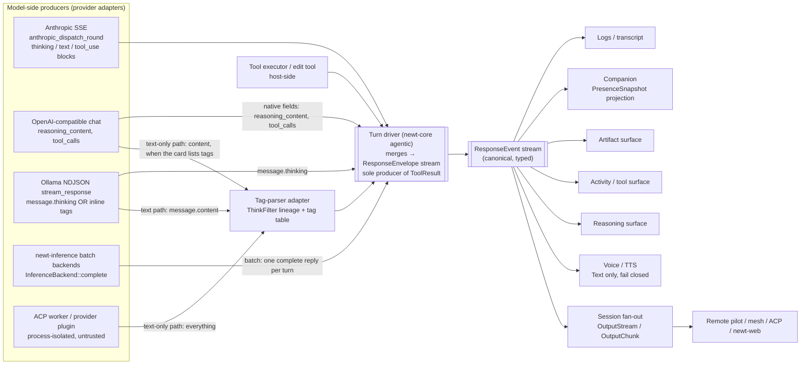
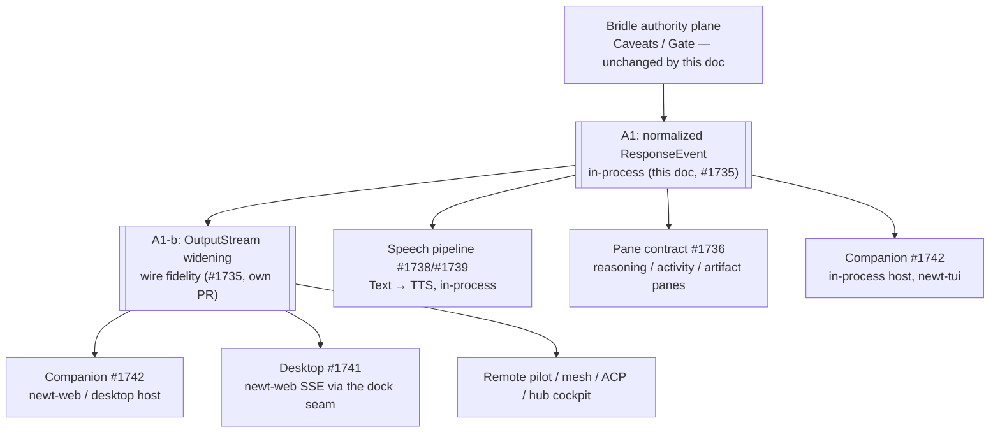

# Normalized response events (and the tag-parser adapter)

> **Status:** Draft — proposal, not normative · **Owner:** hartsock · **Last review:** 2026-08-16 · **Builds on:** `newt_core::reasoning::{ThinkFilter, split_reasoning, emits_leading_reasoning}` (`newt-core/src/reasoning.rs`), the agentic turn driver's live stream paths (`newt-core/src/agentic/mod.rs`: `stream_response` — Ollama NDJSON, `anthropic_dispatch_round` — Anthropic SSE), `OutputStream` / `OutputChunk` / `AttachRole` (`newt-core/src/session.rs:69`), model cards `Capability { emits_leading_reasoning, thinking_default, reasoning_content_field, … }` (`newt-core/src/model_card.rs`), provider presets (`newt-core/src/provider_preset.rs`), batch backends `InferenceBackend::complete` in `newt-inference` (`anthropic.rs`, `responses.rs`, `local.rs`, `provider_plugin.rs`), `docs/decisions/plain_scroller_tui.md`, `docs/decisions/newt_web_docking.md` · **Supersedes/Superseded by:** —

Tracking: **#1735** (A1 — normalized `ResponseEvent` stream; the tag parser is the compatibility adapter) under the companion train epic #1734. Related:
#1506 (output-based model behaviour detection, streaming fixtures), #1014 (gemma `<state>`
leak), #860, #384 (retire the `reasoning.rs` name-match), #528 (lone-leading closer).
Index: [companion-roadmap.md](companion-roadmap.md).

## Summary

The centre of this design is a typed stream, not a parser. A tag parser that decides, per
byte, whether text is speech, reasoning or artifact would put markup at the centre; here it
is one adapter feeding a canonical event model:

| Layer | What it is | Who owns it |
|-------|------------|-------------|
| **Canonical** | A typed, normalized **`ResponseEvent` stream** — the single in-process description of "what happened" during a turn: model output *and* the host's tool-side events, merged into one ordered sequence. | Two producer classes. **Provider adapters** turn provider wire formats into model-side events; today those live in the agentic turn driver's stream paths (`stream_response`, `anthropic_dispatch_round` in `newt-core/src/agentic/mod.rs`) with `newt-inference`'s batch backends as a secondary, non-streaming producer. **The turn driver** (`newt-core` `agentic`) is the merger and the *only* producer of `ToolResult` and tool-side `Artifact`s. Everything downstream consumes it. |
| **Compatibility** | A **tag-parser adapter** (the `ThinkFilter` lineage) that turns the raw text of *text-only* models — those that inline `<think>…</think>`, `<state>`, `<tool_call>` etc. into content — into the same model-side events. | `newt_core::reasoning`, driven by a per-model / per-provider **tag table** carried by model cards and provider presets (config, not code). |
| **Projection** | `OutputStream` / `OutputChunk` (session fan-out to attachments and the mesh wire), TTS, panes, the companion, logs, remote pilot, ACP. | Each consumer routes on `ResponseEvent` variants; none of them re-parses text. |

The parser is *demoted*, not deleted: for the local/GGUF/Ollama models newt is built for it is
often the only source of structure. But it is an adapter with a contract, not the type
system. Consumers must never see raw model markup and must never need to know whether a
`Reasoning` event came from an Anthropic `thinking` block, an OpenAI `reasoning_content`
field, an Ollama `message.thinking` field, or a `<think>` tag the adapter closed.

No new crate: this lands in `newt-core` (types, adapter, turn-driver merge) with the
provider adapters wherever the wire decoding already lives (`agentic/mod.rs` today;
`newt-inference` for the batch backends). The names `newt-response-tags` /
`newt-stream-tags` / `StreamingCategoriser` are not used.

**This document is authoritative** for the `ResponseEvent` / `ResponseEnvelope` shapes, the
`PresentationHint` payload, and the `ResponseEvent` → `OutputStream` projection table. The
sibling docs ([speech-pipeline.md](speech-pipeline.md), [tui-panel-system.md](tui-panel-system.md),
[animated-companion.md](animated-companion.md), [desktop-shell.md](desktop-shell.md)) cite these
tables and do not restate them. The kit interface id for the stream is
`newt.session.response@1 = Source<ResponseEvent>` ([kit-system.md](kit-system.md)). **The
`Source` item is the enveloped event, `ResponseEnvelope`** (below) — `Source<ResponseEvent>` is
shorthand for the enveloped stream, used because consumers route on the `event`; a subscriber
always receives `turn` / `seq` / `actor` / `origin` with it, which is what the per-actor folds in
[animated-companion.md](animated-companion.md) rely on.

## Where it sits



The **only** place model text is parsed for markup is the tag-parser adapter. If a consumer
finds itself matching on `<think>` it is a bug.

**Batch and stream are exclusive per turn.** A turn is produced either by a live stream path
(`stream_response`, `anthropic_dispatch_round`) or by a batch backend
(`InferenceBackend::complete`, which yields one complete reply); the driver never merges both
for the same `(session, turn, actor)`. A batch reply is fed through the same adapter and
merger and produces the same `ResponseEvent` sequence, just delivered at once.

## The canonical layer: `ResponseEvent`

```rust
// sketch — illustrative, not compiled
// home: newt-core (reasoning/session neighbourhood)

#[non_exhaustive]                 // newt-web is a separate crate and will match on this
pub enum ResponseEvent {
    /// User-facing text delta. The only variant voice speaks (see policy below).
    Text(TextDelta),
    /// Model reasoning / chain-of-thought delta. Voice never speaks it; the sole
    /// opt-in is the host-side per-session accessibility setting in "Fail-closed
    /// voice policy" — never a parser mode, never a card or model decision.
    Reasoning(ReasoningDelta),
    /// Incremental tool invocation (call id, name, argument fragment).
    ToolCall(ToolCallDelta),
    /// A tool's result, correlated to its call id. Host-produced only.
    ToolResult(ToolResult),
    /// Structured artifact (diff, file reference, citation, …) — begin / delta / end.
    Artifact(ArtifactEvent),
    /// UNTRUSTED presentation hint the model emitted (e.g. an expression tag).
    /// Policy/theme maps it to an approved animation or style; renderers never
    /// act on the raw hint. See animated-companion.md.
    PresentationHint(PresentationHint),
    /// End of turn for this actor: usage, stop reason, provider, model, flags.
    Done(TurnSummary),
}

/// Every event is delivered inside an envelope that names the source principal
/// (multi-agent sessions, crews, remote pilots) and orders it within the turn.
pub struct ResponseEnvelope {
    pub turn: u64,
    /// Single total order over the *merged* stream of one (session, turn),
    /// across every actor — assigned by the turn driver at merge time.
    pub seq: u64,
    /// The emitting principal: `PrincipalId` is the newt-identity `AgentKey`'s id
    /// (`AgentKey::fingerprint()`; see module-scopes.md). A display label is not identity.
    /// `ActorId` is an alias of `PrincipalId` where "actor" reads better (companion).
    pub actor: PrincipalId,
    /// For events re-enveloped from a delegated child's own session: the child's
    /// (turn, seq) in *its* stream, so a cockpit can correlate the two.
    pub origin: Option<(u64, u64)>,
    pub event: ResponseEvent,
}
```

### Payloads (shapes the sibling docs agree on)

All payload structs are `#[non_exhaustive]`; new fields are additive.

| Payload | Shape (sketch — illustrative, not compiled) | Notes |
|---------|----------------------------------------------|-------|
| `TextDelta` | `{ text: String, held_markup: bool }` | `held_markup = true` only for bytes that were a *held-back candidate tag prefix* released unresolved at end of stream (≤ the tag-length cap, P5). Consoles show them; voice drops them (rule 2). |
| `ReasoningDelta` | `{ text: String, source: ReasoningSource }` | `source ∈ { NativeField, NativeBlock, InlineTag, LeadingBlock }` — for logs/tests only; consumers must not branch on it for routing. |
| `ToolCallDelta` | `{ call_id: String, name: Option<String>, args_fragment: String, last: bool }` | Argument *assembly* stays with the agentic loop's existing tool-call parsing (out of scope). |
| `ToolResult` | `{ call_id: String, ok: bool, content: String, artifacts: Vec<ArtifactId> }` | Host-produced only. |
| `ArtifactEvent` | `Begin { id: ArtifactId, kind: ArtifactKind, meta } \| Delta { id, bytes } \| End { id, ok: bool }` | `ArtifactKind` is data (`"diff"`, `"file"`, `"citation"`, …), not an enum — a new artifact kind is config. |
| `PresentationHint` | **Defined here, once:** `{ kind: HintKind, value: String, attrs: BTreeMap<String,String>, span: HintSpan, source: PrincipalId }` with `#[non_exhaustive] enum HintKind { Affect, Gesture, Prosody, Other(String) }` and `HintSpan ∈ { Point, Begin(SpanId), End(SpanId) }`. `source` is the emitting principal, copied from `ResponseEnvelope.actor` so the hint stays attributable when it is projected onto the wire (`OutputChunk`) without its envelope. | The shorthand `PresentationHint::Affect("happy")` in [animated-companion.md](animated-companion.md) means `{ kind: Affect, value: "happy", … }`. [speech-pipeline.md](speech-pipeline.md)'s `ProsodyHint` is *derived* from an approved hint by host policy, never from the raw payload. |
| `TurnSummary` | `{ stop: StopReason, usage: Option<Usage>, provider: String, model: String, truncated_markup: bool, unclosed_leading_block: bool }` with `StopReason ∈ { EndTurn, MaxTokens, ToolUse, Cancelled, Error(String), Aborted }` | `Cancelled` = user/driver cancel (the signal on which TTS bumps its **cancel epoch** — speech-pipeline.md — and the companion resets); `Aborted` = the driver synthesised `Done` because the producer ended without one. |

### Ordering, identity, termination

- **`seq` is a total order over the merged (session, turn) stream**, across actors. A
  delegated crew child runs its *own* session with its own `(turn, seq)` space; when the
  parent surfaces child events into its turn the driver re-envelopes them (`actor` = child
  principal, `seq` from the parent's counter, `origin` = the child's coordinates).
- **`seq` is not `OutputChunk.seq`.** `SessionState::emit` keeps assigning the wire counter
  per turn (attachments use it for `replay_from`); the projection is lossy (below), so
  reusing envelope `seq` on the wire would leave gaps. When `OutputStream` is widened the
  chunk carries `envelope_seq` alongside its own counter.
- **Exactly one `Done` per `(turn, actor)`.** A cancelled turn ends with
  `Done { stop: Cancelled }`; a producer that ends its stream without `Done` (crash, socket
  drop) is closed by the driver with `Done { stop: Aborted }`. Consumers may rely on
  `Done` always arriving; a stream that simply stops is a driver bug.

Design rules for the enum:

- **Deltas are deltas.** `Text`/`Reasoning`/`ToolCall`/`Artifact` carry *increments*. A
  producer must not, at end of stream, re-emit the accumulated full content as one more
  delta. `Done` carries a summary, not content.
- **Closed-but-extensible set of variants, open payloads.** New *kinds of thing that can
  happen in a turn* are rare and warrant an enum variant (hence `#[non_exhaustive]`); new
  *shapes within a kind* (a new artifact kind, a new hint name) are data inside the payload,
  so a new model family is config, not code.
- **No `Unknown`.** Text the adapter cannot classify is `Text`; markup it cannot close is
  buffered or resolved by the fail-closed rules — never surfaced as a half-typed event.
- **`PresentationHint` is untrusted input**, on the same footing as any other model output.
  It is data for a policy layer, never a command.

### Producers

Today there is no typed stream anywhere. The live token streams that need normalising are
in the **agentic turn driver** (`newt-core/src/agentic/mod.rs`): `stream_response`
(Ollama NDJSON; runs `ThinkFilter::feed_split` on `message.content` and reads the separate
`message.thinking` field into the spinner detail) and `anthropic_dispatch_round` (Anthropic
SSE; thinking deltas already go to the spinner detail, text deltas print live). The
OpenAI-compatible Chat Completions path in the same driver reads `reasoning_content` and runs
`split_reasoning` over `content` on the decoded reply. `newt-inference`'s `InferenceBackend`
exposes only `complete()` — its backends are **batch** producers (`newt-inference/src/`:
`anthropic.rs`, `responses.rs`, `local.rs`, `provider_plugin.rs`); `local.rs` already runs
`split_reasoning` over `message.content`, `anthropic.rs` ignores `thinking` blocks, and
`responses.rs` maps content only. `newt_inference::stream::ChatChunk` / `collect_stream` have
no producer or consumer outside `stream.rs`'s own tests and are not a migration source for
A1. `newt-acp-worker` and `provider_plugin.rs` do not stream deltas at all today.

| Producer | Native structure available | What A1 does | May emit |
|----------|----------------------------|--------------|----------|
| Anthropic SSE (`anthropic_dispatch_round`) | `thinking` / `text` / `tool_use` blocks and their deltas | Map 1:1 → `Reasoning` / `Text` / `ToolCall`. The agentic path already *separates* thinking deltas (untyped, spinner-only); A1 types them. The batch `newt-inference` backend (`anthropic.rs`) currently *ignores* thinking blocks (`ignores_thinking_blocks_in_content` test) and gains the same mapping. | `Text`, `Reasoning`, `ToolCall`, `PresentationHint` (only via the tag table on `text` blocks, off by default), `Done` |
| OpenAI-compatible Chat Completions (`agentic` path) and the Responses API batch backend (`newt-inference/src/responses.rs`) | Chat Completions: `reasoning_content`, `tool_calls` deltas; Responses: content only today (no reasoning handling to migrate) | Native fields → variants. `content` is `Text` **unless** the card's `response_tags` is non-empty, in which case `content` goes through the tag-parser adapter (P9). | as above |
| Ollama / llama.cpp / Nemotron (`stream_response`; `newt-inference/src/local.rs` batch, which already calls `split_reasoning` on `message.content`) | `message.thinking` sometimes; inline `<think>` often (DeepSeek-R1, Qwen3, Nemotron `detailed thinking on`) | `message.thinking` → `Reasoning` directly; `message.content` → tag-parser adapter. Both may be present; the adapter is idempotent over already-separated reasoning (P9). | as above |
| **Turn driver** (`newt-core` `agentic`) | tool executor results, edit-tool diffs, delegation events, cancellation | **Merges** model-side events with host-side events into one enveloped, `seq`-ordered stream; assigns `actor`; closes every stream with `Done`. | **Only** producer of `ToolResult`, of tool-side `Artifact` (diff/file), and of `Done { Cancelled / Aborted }` |
| ACP worker (`newt-acp-worker`), provider plugins (`provider_plugin.rs`) | Whatever the remote emits | Text goes through the tag-parser adapter like any text-only model until the plugins-protocol carries typed events natively (out of scope). Output is **untrusted**: the driver rejects `ToolResult` from this class and re-envelopes everything under the plugin's own `PrincipalId` (the attenuated key minted by `newt_identity::delegate_for_plugin`). | `Text`, `Reasoning`, `ToolCall`, `PresentationHint`, `Done` — never `ToolResult` |

**How `Artifact` is produced.** In A1, `Artifact` events are **tool-side only** (the edit
tool's diff, file references from tool results) — produced by the turn driver, never by the
tag-parser adapter. Markdown code fences in model text remain `Text` (the markdown stream
writer renders them); a fence-detection stage that promotes them to `Artifact { kind:
"code" }` is a later, opt-in adapter stage and is not part of #1735. The tag table
therefore has no `kind = "artifact"` today.

### Relation to `OutputStream` (`newt-core/src/session.rs`)

`OutputStream { Stdout, Stderr, AgentThought, ToolCall, Diff }` (`newt-core/src/session.rs:69`)
tags an `OutputChunk` fanned out by `SessionRegistry` to every attachment (local console,
mesh peer, test collector). It is a **projection for the attach/mesh wire**, and it stays.
`ResponseEvent` sits *upstream* of it inside the turn; the session projects each event onto
a stream. **This is the one mapping table** — sibling docs cite it, they do not restate it:

| `ResponseEvent` | `OutputStream` today | Note |
|-----------------|----------------------|------|
| `Text` | `Stdout` | 1:1 (`held_markup` bytes included — the wire is a console) |
| `Reasoning` | `AgentThought` | 1:1 — `AgentThought` already exists for exactly this |
| `ToolCall` / `ToolResult` | `ToolCall` | Both fold onto one stream today; the wire loses the call/result distinction until widened |
| `Artifact` (diff) | `Diff` | Other artifact kinds have no stream today → `Stdout` (lossy) |
| `PresentationHint` | — | **Dropped** on the wire until a `Hint` stream exists (A1-b). Until then a `newt-web` / dock-hosted pane or companion cannot see hints at all — see tui-panel-system.md |
| `Done { stop: EndTurn \| MaxTokens \| ToolUse \| Cancelled }` | `OutputChunk.last` + turn completion | Stop reason / usage not on the wire today |
| `Done { stop: Error(msg) \| Aborted }` | `Stderr` (one chunk carrying `msg` / "producer aborted") + `last` | `Stderr` is otherwise **host-side diagnostics** written by the driver/tools directly; no model-side `ResponseEvent` maps to it, and A1 does not add an error variant — errors terminate a turn, so they ride `Done` |

So: **`ResponseEvent` extends, and does not replace, `OutputStream`.** The projection is
lossy in the places marked, and that lossiness is explicit and tested rather than
accidental.

**Consequence for out-of-process consumers.** Everything that reaches a consumer through
the dock/mesh seam — `newt-web` (excluded crate; mirrors sessions over the dock,
`docs/decisions/newt_web_docking.md`), and therefore the desktop tray/WebView, the mobile
pilot, and a hub cockpit — sees **only the `OutputChunk` projection**. Until `OutputStream`
is widened those consumers get no `PresentationHint`, no call/result distinction, no
stop reason, and no actor — a dock/mesh-hosted companion projector runs single-actor until A1-b.
In-process consumers (LEAN scroller, RichTUI panes, a companion hosted in
`newt-tui`, TTS in the same process, logs) read `ResponseEvent` directly. **Widening
`OutputStream`** (`ToolResult`, `Artifact` kinds, `Hint`, `Done` metadata, `envelope_seq`, and
the envelope's **`actor: PrincipalId`** on every chunk — today `OutputChunk { turn, stream, seq,
data, last }` has no principal field, so only a `PresentationHint.source` would carry one)
is therefore **in scope for #1735 as its second PR (A1-b)** — a protocol change with its
own PR because the mesh wire `OutputChunk` maps 1:1 onto the in-process one — and it is a
**dependency** of every out-of-process consumer in #1741 (desktop) and #1742 (companion in
`newt-web`), not a follow-up.

## The compatibility adapter: the tag parser

`ThinkFilter` (`newt-core/src/reasoning.rs`) already does the hard part for one tag: it holds
back a partial `<thi` across token boundaries and never prints a fragment of a tag. A1
widens it from *one hardcoded tag pair* to a **tag table**, from *(clean, reasoning)
strings* to `ResponseEvent`s, and **retires its provisional lone-leading-closer contract**
(below). `split_reasoning` remains the batch twin (same table, same rules) for
non-streaming completion paths.

### Leading reasoning is definitive, not provisional

Today `ThinkFilter::with_leading_reasoning` — enabled by the hardcoded name-match
`emits_leading_reasoning(model)` (`["nemotron", "deepseek-r1", "qwen3"]`, the #384 stopgap)
— buffers the whole implicit block for the whole turn and, if no `</think>` arrives,
`finish()` flushes it as clean text so a non-thinking reply is never lost. For a console
that is a kind default; for voice it is **fail-open** on exactly the models newt targets: a
turn truncated mid-reasoning (`max_tokens`, no closer) would emit the entire chain of
thought as one `Text` delta at end of turn and the voice route would speak it.

A1 therefore changes the contract for the adapter (both twins):

| | Today (`ThinkFilter`) | A1 adapter |
|-|------------------------|------------|
| Entering leading mode | card/name-match says `emits_leading_reasoning` | `emits_leading_reasoning` **and** thinking is on for this turn (`Capability::thinking_default` / the per-turn thinking toggle — state the harness already tracks). Thinking off → the adapter starts *outside*; nothing is provisional. |
| Content before the first closer | buffered whole-turn, kind unknown | `Reasoning` deltas emitted live (P5 holds; the reasoning surface streams it) |
| No closer ever arrives | flushed as clean `Text` (fail-open) | stays `Reasoning`; `Done { unclosed_leading_block: true }` so consoles can show "reply may be in the reasoning surface". Voice fails closed. |

The residual case — thinking on, model chose not to reason, no closer — misfiles a reply
into the reasoning surface (visible, logged, flagged) rather than speaking chain-of-thought.
That trade is the point of the policy.

### Parser requirements

Each requirement is a test in the A1 PR (fixtures per #1506).

| # | Requirement | Defect it rules out |
|---|-------------|----------------------------|
| P1 | **Arbitrary chunk boundaries.** A tag may be split at any byte: `<`, `<thi`, `nk>`, `</th` + `ink>`. The parser is a resumable state machine; the *only* held-back text is the shortest suffix that could still be a table token (or an in-progress attribute open, P8). | "`<` at a chunk boundary is lost" |
| P2 | **Nesting.** Same-name and mixed nesting (`<think><analysis>…</analysis></think>`) is tracked with a depth stack; content classification is that of the *outermost* table tag; a closing tag must name the tag on top of the stack or it is treated as text (P4). | "closing tag name not validated"; depth counter without names |
| P3 | **Every byte exactly once.** The in-order concatenation of every event payload **plus every consumed table token plus every `drop`-kind span** equals the raw stream; no payload byte appears in two events. `finish()` flushes only what is still buffered — never the accumulated turn. | `finalize()` re-emitting `speech`/`reasoning` totals |
| P4 | **Unknown markup is text.** Only tags in the active table change classification. `Vec<T>`, `<div>`, `<3`, `a < b` pass through as `Text` unchanged. There is no "unknown tag → reasoning" default. | "unknown tag defaults to reasoning" |
| P5 | **Bounded buffering.** Held-back text is bounded by the longest fixed table token, or by `max_tag_len` (default 256 bytes, config) for attribute-bearing opens; exceeding the cap resolves the whole prefix to `Text` immediately. Content *inside* an open reasoning tag — including a leading block — is emitted as `Reasoning` deltas immediately, never accumulated to close. | `max_buffer_size` / whole-block buffering |
| P6 | **Unterminated blocks.** Stream ends inside an open table tag → remaining content is emitted as the open tag's kind (`reasoning` → `Reasoning`; `tool_call` → `ToolCall { last: true }`; `drop` → dropped; a `hint` span → synthesised `HintSpan::End`) and `Done { truncated_markup: true }`. A held-back *prefix* (≤ cap) at end of stream is emitted as `Text { held_markup: true }`. There is no provisional flush-as-clean mode. | "unclosed tags: treat as speech" (wrong for voice) |
| P7 | **Special-token forms.** `<\|thinking\|>…<\|end\|>`, `[THINK]…[/THINK]` and friends are table entries with explicit open/close strings; there is no separate "preprocessor". Control tokens that carry no content (`<\|im_end\|>`, `<\|eot_id\|>`) are `kind = "drop"` entries. | open question 3 |
| P8 | **Attributes and hints.** An entry with `attrs` has an open token that ends at the first `>` after `open` (`<expr name="happy">`); it matches only if `open` is followed by whitespace or `>` (so `<expression>`, `<expr_1>` are text, P4); the scan is capped by P5. `close` present → span hint (`Begin`/`End`), body is ordinary `Text`; `close` absent → point hint. The parser copies `attrs` verbatim into `PresentationHint` and never interprets a value. | — |
| P9 | **Idempotent over separated reasoning.** If the producer already split reasoning into a native field, the adapter runs on `content` only and must not double-classify. | — |
| P10 | **Byte-exact no-op.** Content with no table token is emitted unchanged, not trimmed (the `split_reasoning` fast path, kept). | — |
| P11 | **Table-driven, no code per model.** Adding a model family that tags differently is a card/preset change; the parser code has no tag literals except as test fixtures. Concretely A1 retires the hardcoded `emits_leading_reasoning(model)` name-match in `reasoning.rs` into the cards that already carry `Capability::emits_leading_reasoning`. | hardcoded `OPEN`/`CLOSE`; hardcoded family list |

The events referenced by [speech-pipeline.md](speech-pipeline.md) are the `ResponseEvent`
variants above; the adapter emits no event type of its own.

### The tag table (three Cs: knowledge in data)

The table is pure data carried by the **existing** model-card `Capability` block
(`newt-core/src/model_card.rs`, `deny_unknown_fields`, merged field-wise by
`Capability::merge`) and by provider presets — no parallel `[response_tags]` table, and no
second copy of a flag that already exists. `reasoning_content_field` already states "server
returns CoT in a separate field; `None` = inline `<think>` inside `content`", so it is the
inline/native switch; `emits_leading_reasoning` already exists; A1 adds `response_tags`:

```toml
# sketch — shape only; the exact key names land with A1

# newt-core built-in defaults (overridable / droppable like a language pack):
# the smallest set that covers the model families newt ships cards for.
[[capability.response_tags]]
kind  = "reasoning"
open  = "<think>"
close = "</think>"

[[capability.response_tags]]
kind  = "reasoning"
open  = "<thinking>"
close = "</thinking>"

[[capability.response_tags]]
kind  = "tool_call"
open  = "<tool_call>"
close = "</tool_call>"

[[capability.response_tags]]
kind  = "drop"            # control token, no content; accounted for in P3, never emitted
open  = "<|im_end|>"

[[capability.response_tags]]
kind  = "hint"            # → ResponseEvent::PresentationHint (untrusted)
open  = "<expr"
close = "</expr>"
attrs = ["name"]
hint  = "affect"          # HintKind; attrs["name"] → value

# ---- a model card (newt-core/src/cards/*.toml): extends the EXISTING [capability] ----
[capability]
emits_leading_reasoning = true          # already exists (retires the reasoning.rs name-match)
thinking_default        = true          # already exists (gates leading mode per turn)
response_tags = [
  { kind = "reasoning", open = "<|thinking|>", close = "<|end|>" },
]

# gemma-3 card — #1014: the card decides whether <state> is reasoning or junk
[capability]
response_tags = [
  { kind = "reasoning", open = "<state>", close = "</state>" },   # or kind = "drop"
  { open = "<tool_call>", drop = true },                          # remove a default entry
]

# ---- a provider preset (newt-core/src/provider_preset.rs) ----
[capability]
reasoning_content_field = "reasoning_content"   # already exists: native field → content is not scanned for reasoning tags
response_tags = []                              # native structured blocks (Anthropic): adapter bypassed for text
```

Rules:

- Entries **merge by `open` string**; the override wins; `drop = true` removes an entry.
- **Precedence:** built-in defaults ⇢ provider preset ⇢ model card ⇢ per-loadout override
  (the same layering `Capability::merge` uses today; the more specific layer wins per
  field, and per `open` string inside `response_tags`).
- **Bypass is data, not code.** `reasoning_content_field = "…"` means `content` is not
  scanned for `reasoning`-kind tags (P9); `response_tags = []` means the adapter is
  bypassed entirely. Producers with native structured blocks (Anthropic) ship
  `response_tags = []` in their preset.
- The default table is a starting point, not an allowlist of "known good tags".

## Routing and consumers

| Consumer | Routes on | Rule |
|----------|-----------|------|
| Session fan-out (`OutputChunk`) | all | Projection table above; lossy variants documented; widened in A1-b |
| Voice / TTS ([speech-pipeline.md](speech-pipeline.md)) | `Text` only | Never `Reasoning` (sole opt-in below); `Artifact` (code) only if the speech policy opts in; **fail closed** (below) |
| Reasoning surface (LEAN scroller spinner today; RichTUI pane later) | `Reasoning` | Live deltas — including leading blocks |
| Activity / tool surface | `ToolCall`, `ToolResult` | Correlate by call id |
| Artifact surface (diff, file, citation panes) | `Artifact` | Begin/delta/end lifecycle |
| Companion ([animated-companion.md](animated-companion.md)) | all, but only as *inputs* to a `PresenceSnapshot` projection | `PresentationHint` passes through policy → approved animation id; the companion never renders a raw hint. In-process hosts read `ResponseEvent`; `newt-web`/desktop hosts read the widened wire (A1-b) |
| Logs / transcript (`newt-core/src/agentic/transcript.rs`) | all | Records the typed event, not re-parsed text |
| Remote pilot / mesh / ACP / `newt-web` | wire only | `OutputChunk` projection; typed fidelity arrives with A1-b |

### Fail-closed voice policy

Voice is the one consumer where a misroute is unrecoverable (you cannot un-say reasoning), so
the policy is stated here rather than in each speech backend:

1. **Voice speaks `Text` only.** `Reasoning`, `ToolCall`, `ToolResult`, `PresentationHint`
   are never spoken. `Artifact` is spoken only under an explicit per-kind opt-in (e.g. a
   short citation) — default off. **The one opt-in for `Reasoning`** is a host-side,
   per-session accessibility setting ("read thoughts aloud") set by the human driver in
   session/host config; it is not a parser mode, not a card field, and nothing a model or
   plugin can set. Until that setting exists there is no route at all.
2. **Uncertain markup is held, not spoken.** While the adapter is holding back a possible
   tag prefix (P1/P8) *no* `Text` is released from that region; a prefix released
   unresolved at end of stream arrives as `Text { held_markup: true }` and voice drops it.
   Buffer, then classify, then emit. Latency is the acceptable cost.
3. **Malformed or unterminated blocks resolve to *not spoken*.** P6 resolves an unterminated
   table tag to its open kind, never to `Text`; a leading block with no closer stays
   `Reasoning` (no provisional flush-as-clean). There is no exception for any model family.
4. **Voice does not get a bypass.** There is no "speak raw stream" path. If a provider is
   misconfigured (`response_tags` / `reasoning_content_field` wrong), the failure mode is
   silence plus a log line, not leaked reasoning.

Consumers other than voice (the reasoning pane, logs) may prefer to *show* uncertain text
early; that is a per-consumer choice on the same event stream, not a parser mode.

## Acceptance criteria (#1735)

- [ ] `ResponseEvent` / `ResponseEnvelope` and the payload shapes above exist in `newt-core`, `#[non_exhaustive]`.
- [ ] `stream_response` and `anthropic_dispatch_round` produce typed events; the turn driver merges tool-side events, assigns `seq`/`actor`, and closes every `(turn, actor)` with exactly one `Done` (incl. `Cancelled` / `Aborted`).
- [ ] Only the turn driver can construct `ToolResult`; a plugin/ACP producer emitting one is rejected (unit test).
- [ ] Tag-parser adapter satisfies P1–P11 with fully mocked unit tests (chunk-boundary fuzz over fixture streams from #1506; nested / mismatched-close / unterminated / special-token / attribute-open / over-cap cases; byte-exact no-op).
- [ ] Property test for P3: in-order concat of every payload + consumed table tokens + dropped spans == raw stream, and no payload byte appears twice.
- [ ] Leading-reasoning tests: thinking on + no closer → all `Reasoning`, `unclosed_leading_block = true`, no `Text`; thinking off → adapter starts outside; the `["nemotron","deepseek-r1","qwen3"]` name-match is deleted and the cards carry `emits_leading_reasoning`.
- [ ] Anthropic SSE + batch surface thinking as `Reasoning`; OpenAI/Ollama map native fields; a preset with `response_tags = []` bypasses the parser.
- [ ] Session projection to `OutputStream` is table-driven and the lossy cells are covered by tests (A1); A1-b widens the wire and removes the lossy cells.
- [ ] Voice fail-closed policy has a test per rule (1–4) against a mocked TTS sink, including a truncated Nemotron leading-block fixture.
- [ ] `#1014` (`<state>` leak) closes via a card entry, not a code change.
- [ ] Zero warnings, coverage floor held (`just check`, `just cov-ci`).

## Dependencies



The normalized event model is foundational; A1-b is the gate for every consumer that lives
outside the newt process.

This document has **no authority content**: it neither grants nor checks anything. Whether a
consumer may *receive* a stream at all is the session/attachment question
(`AttachRole`, driver caveats) already answered in `session.rs`, and any new consumer
(voice, companion) obtains its subscription through the Bridle-governed seams described in
[kit-system.md](kit-system.md) / [module-scopes.md](module-scopes.md).

## Out of scope / open questions

- **Structured tool-call parsing** of `<tool_call>` *bodies* (JSON args) — the adapter emits
  `ToolCall` deltas; argument assembly stays with the agentic loop's existing tool-call
  parsing.
- **Code-fence → `Artifact` promotion** for model text — a later opt-in adapter stage; A1
  keeps fences as `Text`.
- **Performance.** A resumable byte-oriented state machine over a small tag table is
  O(chunk); benchmark against the current `ThinkFilter` before A1 merges, but no regex
  engine is planned.
- **Provider plugin / ACP protocol carrying `ResponseEvent` natively** — depends on the
  plugins-protocol crate; until then plugins are text-only producers through the adapter and
  are confined to the model-side variants.
- **`newt_inference::stream::ChatChunk`** — unused outside its own tests; delete or retype
  as the batch view once A1 lands (housekeeping, not a migration).

## Change log

- 2026-08-16: replaced the "categoriser" framing (a byte-level tag parser as the centre) with
  the canonical `ResponseEvent` stream; the parser became the compatibility adapter. Retired
  names: `newt-response-tags`, `newt-stream-tags`, `StreamingCategoriser`, `TagEvent`.
