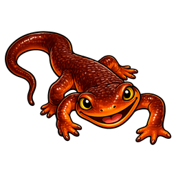
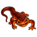
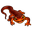
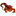

# Newt-Agent Logos

All logo assets live in this directory. The source file is the high-resolution
master; the numbered variants are pre-rendered for common use cases.

## Assets

| Size | File | Use case |
|------|------|----------|
| Source (1536×1024) | [newt-agent-logo_source.png](newt-agent-logo_source.png) | Master — edit/re-export from this |
| 256×256 | [newt-agent-logo_256.png](newt-agent-logo_256.png) | README header, docs |
| 128×128 | [newt-agent-logo_128.png](newt-agent-logo_128.png) | App icon, sidebar |
| 64×64 | [newt-agent-logo_64.png](newt-agent-logo_64.png) | Toolbar, avatar |
| 32×32 | [newt-agent-logo_32.png](newt-agent-logo_32.png) | Favicon, small icon |
| 16×16 | [newt-agent-logo_16.png](newt-agent-logo_16.png) | Browser tab favicon |

## Preview

<p align="center">
  
  &nbsp;&nbsp;
  
  &nbsp;&nbsp;
  
  &nbsp;&nbsp;
  
  &nbsp;&nbsp;
  
</p>

## Regenerating

```bash
# Requires Pillow in ~/venv
~/venv/bin/python - <<'EOF'
from PIL import Image, os

src = "docs/logos/newt-agent-logo_source.png"
out = "docs/logos"

img = Image.open(src).convert("RGBA")
w, h = img.size
side = max(w, h)
square = Image.new("RGBA", (side, side), (0, 0, 0, 0))
square.paste(img, ((side - w) // 2, (side - h) // 2))

for size in [256, 128, 64, 32, 16]:
    square.resize((size, size), Image.LANCZOS).save(f"{out}/newt-agent-logo_{size}.png")
EOF
```
