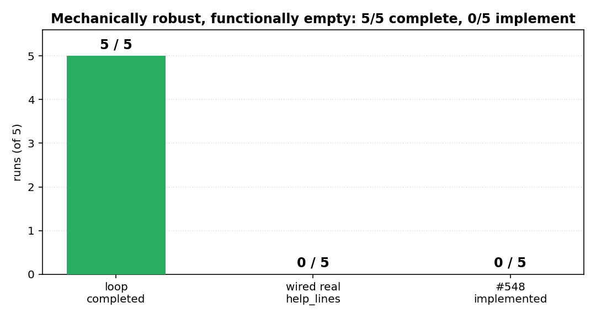
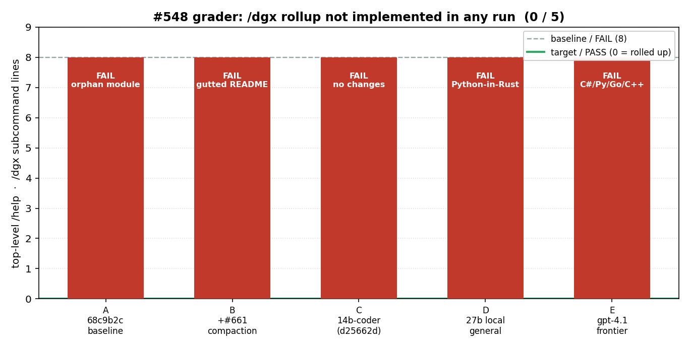
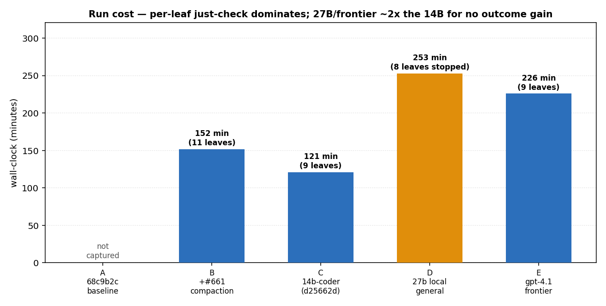

# Autonomous #548 evaluator — experiment log

Measuring whether the autonomous `newt plan --one-shot` loop can actually
implement issue #548 (roll up the verbose `/dgx` help into one top-level line +
keep `/dgx help` as the progressive-disclosure detail page), and isolating the
effect of features landed on `main`.

> Full **how/why**, calibration, and threats-to-validity: [`../METHODOLOGY.md`](../METHODOLOGY.md).

## At a glance



Across **five runs** spanning two landed-feature versions and three executor
models (a 14B coder, a 27B general local model, and frontier gpt-4.1), the loop
is **mechanically robust** — every run completes and consolidates — but
**implements #548 in zero of five**. Neither context features nor a stronger
executor moved the outcome; the frontier model produced the *worst* result (a
five-language polyglot hallucination). **The ceiling is the harness, not the
model.** The charts below show the same story by the grader metric and by cost.

## Method

- **Instrument (fixed):** `scripts/eval/grade-548.sh` — a *behavioral* grader. It
  drives a built `newt` (lean/pipe mode) and inspects the real `/help` output:
  - `top_dgx_subs` — `/dgx <sub>` lines at the top-level `/help` (rolled up ⇒ **≤1**)
  - `dgx_help_subs` — same under `/dgx help` (disclosure ⇒ **≥5**)
  - **PASS** ⇔ rolled up **and** disclosure kept.
  Why behavioral, not `just check`: run A produced a module that *compiled and
  passed* `just check` but was an orphan (never wired into `help_lines`) — the
  feature did not exist. `just check` is necessary, not sufficient.

- **Variable:** the codebase under test. Each run rebases the (fixed) grader onto
  a different commit, runs the identical `--one-shot` eval against a throwaway
  checkout, grades the result.

Two sub-experiments share the one fixed grader:

- **Experiment 1 — codebase as the variable** (does a landed feature move the
  needle?). Crew held constant (default `[crews.home]`).
  - **A** — `68c9b2c` (baseline).
  - **B** — `41cb1de` = A + the **#661 compaction/summarizer series** (#666
    progressive-disclosure compaction, #667 summarizer→embedded-engine, #668
    knowledge-base compaction test).
  - **C** — `d25662d` = B + **#669** (inject the workspace API surface as a
    knowledge base).

- **Experiment 2 — executor model as the variable** (does a stronger crew help?).
  Codebase held constant at `d25662d`; planner (`nemotron-3-nano:30b`) + triage
  held constant; only the **navigator** (the role that edits code) changes.
  - **C** — navigator `qwen2.5-coder:14b` (the shared point with Exp. 1).
  - **D** — navigator `qwen3.6:27b` (stronger *local*, general).
  - **E** — navigator `gpt-4.1` (frontier, external).

- **Constants:** prompt (the #548 URL + "come up with a plan to implement it"),
  authoring model `nemotron-3-nano:30b`, crew `[crews.home]` (planner dgx1,
  navigator/triage gnuc), `--max-leaves 12`, warm `CARGO_TARGET_DIR`.

> **Stochasticity caveat (read this).** The planner + crew are LLM-driven and
> non-deterministic. With **one trial per condition**, the *process* differences
> between runs (leaf counts, which files got touched) are within run-to-run
> noise and CANNOT be attributed to the features. The robust signal is the
> **grader outcome**; the deterministic regression check (below) is noise-free.
> Statistical attribution of a feature's effect needs multiple trials per cell.

## Results

### Deterministic regression check (noise-free)
Grading each codebase's *own* binary (no eval, no LLM) — does the codebase itself
change the #548 surface?

| Codebase | `top_dgx_subs` | `pass` |
|---|---|---|
| A `68c9b2c` | 8 | false |
| B `41cb1de` (+#661) | 8 | false |
| C `d25662d` (+#669) | 8 | false |

➡ **No regression in any.** Neither the #661 series nor #669 touched the `/dgx`
help output; all three correctly FAIL (the rollup is implemented in none).

### Autonomous eval — Experiment 1 (codebase variable: A/B/C)

| | **A** (`68c9b2c`) | **B** (`+#661`) | **C** (`+#669`) |
|---|---|---|---|
| Loop completed | ✅ "✓ complete" | ✅ "✓ complete" | ✅ "✓ complete" |
| Leaves (planned = done) | 9 | 11 | 9 |
| Wall-clock | not captured | **9103 s (~2.5 h)** | **7266 s (~2.0 h)** |
| Net change produced | `+66` orphan `dgx_help.rs` | README `−211` + Cargo tweak | **nothing** (9/9 no-op) |
| Touched real `help_lines`? | ❌ (0 lines) | ❌ (0 lines) | ❌ (0 lines) |
| **Grader `top_dgx_subs`** | **8** | **8** | **8** |
| **Grader `pass`** | **false** | **false** | **false** |

### Autonomous eval — Experiment 2 (executor variable: C/D/E, codebase `d25662d`)

| | **C** `qwen2.5-coder:14b` | **D** `qwen3.6:27b` (local) | **E** `gpt-4.1` (frontier) |
|---|---|---|---|
| Loop completed | ✅ "✓ complete" | ⚠ 8/9 (final leaf killed) | ✅ "✓ complete" |
| Wall-clock | **7266 s (~2.0 h)** | **~15170 s (~4.2 h)** | **13558 s (~3.8 h)** |
| Net change produced | **nothing** (no-op) | C#/**Python**-in-Rust + loose root `.rs` | **C#/Python/Go/C++** + loose `src/*.rs` |
| Languages hallucinated | — (none) | Python | **5: C#, Python, Go, C++, Rust** |
| Touched real `help_lines`? | ❌ (0 lines) | ❌ (0 lines) | ❌ (0 lines) |
| **Grader `top_dgx_subs`** | **8** | **8** | **8** |
| **Grader `pass`** | **false** | **false** | **false** |

➡ **Capability does not correlate with success.** The *frontier* model (E) made
the *worst* mess. A stronger executor is not the lever.

**Grader metric — flat at the FAIL baseline across all five runs:**



**Cost — per-leaf `just check` dominates; the 27B/frontier runs cost ~2× the 14B:**



```
top_dgx_subs   (lower is better; 0 = rolled up / PASS, 8 = baseline / FAIL)
  A  ████████  8   FAIL   (orphan Rust module)
  B  ████████  8   FAIL   (gutted README)
  C  ████████  8   FAIL   (no changes at all)
  D  ████████  8   FAIL   (Python-in-Rust hallucination)
  E  ████████  8   FAIL   (C#/Python/Go/C++ polyglot)
  ▏  0  ← target (PASS)

implemented #548 (pass)?     A ✗  B ✗  C ✗  D ✗  E ✗     (0 / 5)
```
*(ASCII fallback of the grader chart, for terminal/diff viewing.)*

Charts are regenerated from the recorded run data by `scripts/eval/charts.py`.

## Learnings (A–E)

1. **No landed feature moved the needle (Exp. 1).** A, B, C grade **identically**.
   Neither the #661 compaction/summarizer series nor #669's workspace-API
   knowledge base changed the autonomous #548 outcome — they manage *context*,
   and #548 is too small to lean on it / they don't touch the bottleneck.
2. **A stronger executor did not help — the frontier model was WORST (Exp. 2).**
   Swapping the navigator 14b-coder → 27b-general (D) → frontier gpt-4.1 (E) kept
   `pass=false` and made the *code quality* worse: C no-op'd, D hallucinated
   Python, **E hallucinated five languages (C#/Python/Go/C++/Rust)**. Capability
   does not correlate with success. *(Hypothesis refuted: "the ceiling is the
   model.")*
3. **Therefore the ceiling is the HARNESS, not the model.** Five runs, five
   distinct non-implementations, none touching the real `help_lines`. The common
   mechanism: the (weak, unchanged) planner mis-grounds the leaf → the per-leaf
   worker creates **new files in a vacuum** from abstract leaf text (wrong
   language, wrong location) instead of editing the real seam → isolated worktrees
   never cohere → `just check` passes because nothing it wrote is in the build
   graph.
4. **`just check` hides non-implementations — proven 5×.** Orphan module, README
   gut, no-op, Python-in-Rust, polyglot — all "pass." The behavioral grader is the
   only thing that separates "loop completed" from "feature exists."
   `✓ plan complete` ≠ `#548 done`.
5. **Cost:** per-leaf `just check` (full `cargo test --workspace`) dominates
   wall-clock; bigger/remote executors cost ~2× (D ~4.2 h, E ~3.8 h vs C ~2.0 h)
   for *no* outcome gain. Spend compute on the mechanism, not the model.

## Bottom line
Five runs, two landed-feature versions, three executor models from 14B-local to
frontier. The autonomous loop is **mechanically robust** (every run completes +
consolidates) but **0 / 5 on actually implementing #548** — and **model capability
does not correlate with success** (frontier gpt-4.1 produced the worst result).
**The ceiling is the harness, not the model.** The levers are mechanism-level, in
priority order:

1. **Behavioral gate inside the per-leaf verify** — promote the grader's
   "did behavior change?" check into the crew loop so a leaf that writes inert
   vacuum files can't report success.
2. **Ground the worker in the real repo** — feed it the actual target file path +
   language so it EDITS the existing seam instead of inventing new files.
3. **Fix the planner's file grounding** — it mis-located `help_lines`
   (`crew.rs`/`newt-cli`) every time; it lives in `newt-tui/src/lib.rs`.

The behavioral grader makes all three measurable: re-run and watch `top_dgx_subs`
finally move off 8.

## Reproduce
```
./scripts/eval/grade-548.sh <newt-binary>                 # behavioral grade
newt plan --goal "<#548 url> … implement it" --one-shot --dir <throwaway>  # eval
```
Raw per-run logs + diffs: `scripts/eval/results/`.
